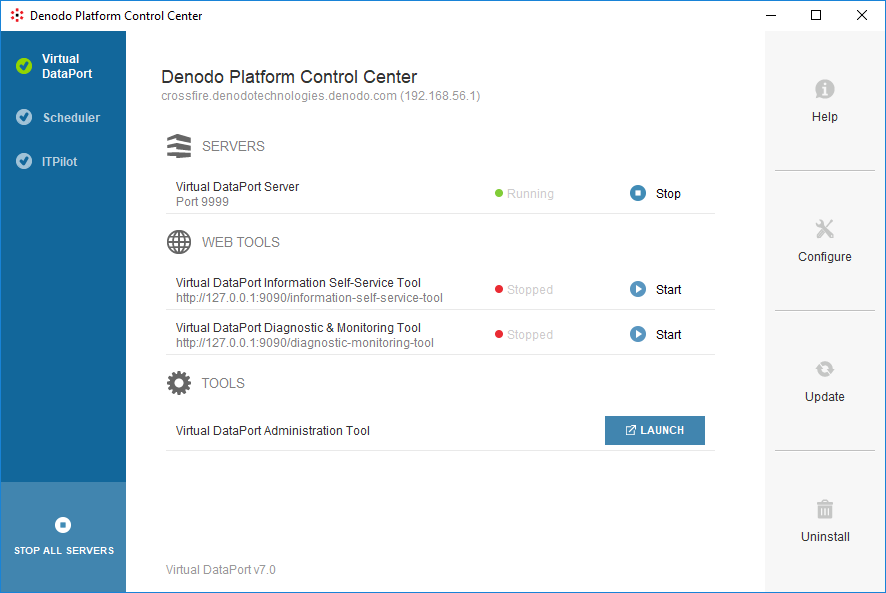

===================================
Starting Platform Servers and Tools
===================================

The buttons on the left side of the Control Center show the dialog of each module.

Each one of these dialogs allows you to start/stop the servers and
graphical tools of the module and display their status.

   Denodo Platform Control Center

In the dialog of each module, there are several sections:
   
#. Servers.
#. Web Tools: web administration tools.
#. Tools: desktop tools.
   
To start a server or web tool, click the button |image0| next to its name.
   
To stop a running server or web tool, click |image1| to stop it.
   
Click **Stop all servers** in the lower-left side to stop all the
currently launched servers and web applications of the Solution Manager.
   
To launch a tool, click **Launch** next to its name. 
   
To launch a web tool, click on its name when it's running: the main page of the 
tool will be opened on your browser. The URLs for the web tools are:

-  ITPilot Administration Tool:
   \http://localhost:9090/webadmin/denodo-itpilot-admin/
-  Scheduler Administration Tool:
   \http://localhost:9090/webadmin/denodo-scheduler-admin/
-  Data Catalog:
   \http://localhost:9090/denodo-data-catalog/
-  Diagnostic & Monitoring Tool:
   \http://localhost:9090/diagnostic-monitoring-tool/

The list below refers to the documents that explain how to launch the
servers/tools of each module, with a script:

-  **Virtual DataPort**: :doc:`Launching the Virtual DataPort Server<../../../../vdp/administration/installation_and_execution/launching_the_virtual_dataport_server/launching_the_virtual_dataport_server>` and
   :doc:`Launching the Virtual DataPort Administration Tool<../../../../vdp/administration/installation_and_execution/launching_the_virtual_dataport_administration_tool/launching_the_virtual_dataport_administration_tool>` sections of the
   Virtual DataPort Administration Guide.
-  **ITPilot**: :ref:`Execution` section of the ITPilot User Guide.
-  **Scheduler**: :doc:`Installation and Execution <../../../../scheduler/administration/installation_and_execution/installation_and_execution>`
   section of the Scheduler
   Administration Guide.

.. |image5| image:: DenodoPlatform.InstallationGuide-22.png
.. |image6| image:: DenodoPlatform.InstallationGuide-23.png
