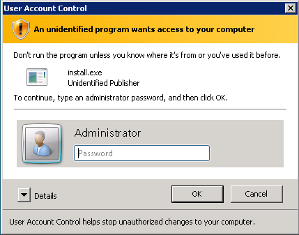
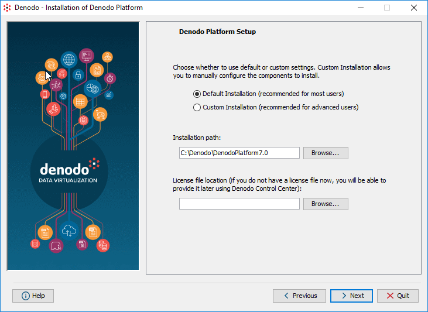
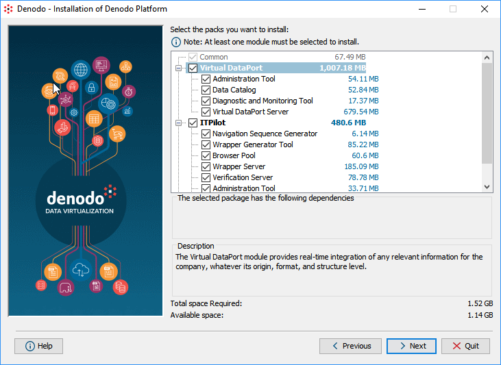
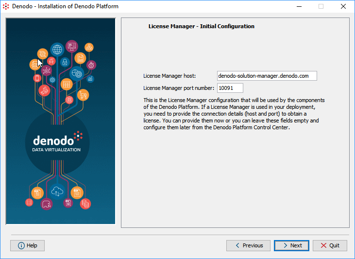

=======================================
Using the Graphical Installation Wizard
=======================================

.. toctree::
   :hidden:

   commons_settings/commons_settings.rst
   components_and_configuration_of_virtual_dataport/components_and_configuration_of_virtual_dataport.rst
   components_and_configuration_of_itpilot/components_and_configuration_of_itpilot.rst
   scheduler/scheduler.rst
   embedded_web_container/embedded_web_container.rst

This section explains how to use the graphical installer of the Denodo
Platform.

To install the Denodo Platform on a host without graphical environment,
jump to the next section (:doc:`Using the Command Line Installer <../using_the_command_line_installer/using_the_command_line_installer>`).

To do an unattended installation, see the section :ref:`Unattended Installation of the Denodo Platform`.

.. important:: We recommend installing all the modules of the Denodo Platform even if right now, you do not plan on using all of them. That is because the installer cannot add modules to an existing installation. If in the future, you want to use a module that is not installed, you would have to install and configure the Denodo Platform again.

|

After downloading the installer, decompress it and launch it by doing
the following:

**On Windows**, go to the directory ``denodo-install-7.0``, right-click ``install.exe`` and click **Run as administrator**. If the
Windows User Account Control is enabled, you will see a dialog like the
following, in which you
have the enter credentials of an administrator user.

   Administrator credentials request dialog

**On Linux**, execute the following:

.. code-block:: bash

   cd denodo-install-7.0
   chmod +x install.sh
   ./install.sh

|

The wizard will guide you through the installation steps. In addition,
you can always click the *Help* button of the wizard to obtain
assistance during the installation process.

Click **Next** to jump to Step 1.

|

**Step 1**

The wizard will display the product licensing conditions. Read them
carefully and if you accept them, select **I accept the terms of this
license** and click **Next**.

|

.. _configure-local-license-installation:

**Step 2**

Select an installation mode:

#. **Default Installation**: recommended for most
   users. You can select the modules you want to install and they will
   be installed with their default configuration values.

   With the default installation, the Denodo servers will listen for
   incoming connections on the default ports. See the list ports in
   the appendix :ref:`Default Ports Used by the Denodo Platform Modules`.

#. **Custom Installation**: recommended for advanced users. You will be
   able to set the values of several configuration parameters such as
   the ports where the Denodo Platform servers will listen for incoming
   connections.

   Step 2: selecting the installation method

Enter the **Installation path** where the Denodo Platform will be
installed.

.. important::

   -  The installation path must not contain spaces (e.g. ``C:\Denodo\Denodo_Platform_7_0``). Otherwise, the connection to some parallel processing databases will not work.

      The Denodo Platform writes data in the directory where is installed so the user that launches the Denodo servers needs to be able to write files there.

   -  If installing on Windows, the installation path cannot include
      “junctions” (`Junction Points - Microsoft Developer Network <https://msdn.microsoft.com/en-us/library/bb756982.aspx>`_).

.. note:: If you are installing Denodo Express, in the field **License file location** enter the path to the license file (denodo-express-lic-XXXX.lic) you downloaded from the site.

   If you are doing a standard installation, leave this field empty. The license file you have has to be installed in the Solution Manager, not here.

|

**Step 3**

Select the modules and components you want to install.

   Step 3: selecting the modules to install

If you selected the *custom installation*, you will have to
configure each module. The following sections explain how to configure each module of the Denodo Platform:

-  :doc:`Commons Settings <./commons_settings/commons_settings>`
-  :doc:`Components and Configuration of ITPilot <./components_and_configuration_of_itpilot/components_and_configuration_of_itpilot>`
-  :ref:`Installation settings of Scheduler <Installation Settings of Scheduler>`

|

.. _configure-license-manager-installation:

**Step 4**

Enter the host name where you installed the Denodo License Manager. If you have not installed the License Manager yet, leave the field empty. You will have to change it later from the Denodo Platform Control Center.

.. note:: In **License Manager host** you cannot enter ``localhost``. You have to enter the actual host name of the machine where the License Manager is installed. If it does not have a host name, enter the IP address. 

Before the installer begins copying the
necessary files (this process may take several minutes), the installer
will display a summary of the installation configuration. To save this summary, click **Save**.

Finally, the installation process can create shortcuts in the menus of
the operating system to launch the Denodo Platform Control Center (see
section :ref:`Execution`).
