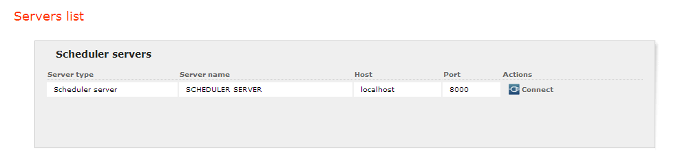
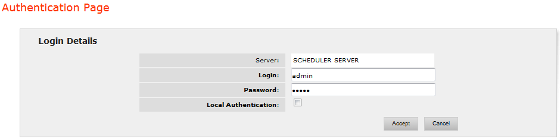

==============
Authentication
==============

After the user enters the tool, he/she is shown a screen with a list of
Scheduler servers to choose from, as shown in `Servers screen`_.

 

   Servers screen

After choosing the desired server, the user will have to enter his/her
credentials for connecting to it, as shown in `Authentication screen`_.
There is a local user out of the box (with login “admin” and password
initially set to “admin”) with administration rights for the Scheduler
server, but it is also possible to delegate the authentication to a
Virtual DataPort server. For information about how to create users in
Virtual DataPort using its Administration Tool see the 
:doc:`/vdp/administration/index`.

 

According to this, there are two types of authentication:

-  Local-based authentication. The user is authenticated against the
   Scheduler Server. To choose this type of authentication the check box
   **Local Authentication** must be checked. Note, that with this type
   of authentication only the local user “admin” can be used.
-  VDP-based authentication. It allows accessing to Scheduler with an
   existing Virtual DataPort user (including the Virtual DataPort
   “admin” user). In this case, the Scheduler server delegates the
   authentication to a Virtual DataPort server (see section :ref:`Virtual
   DataPort Settings` for instructions about how to configure it). To
   choose this type of authentication the check box **Local
   Authentication** must be unchecked.
   
   .. note:: If Kerberos is configured (see section :doc:`../web_configuration/kerberos_configuration/kerberos_configuration`),
      you can log in to the server with Kerberos using Single Sign On (SSO).
      Note there is no support to use Kerberos with user and password.

 

   Authentication screen

 

When the authentication is delegated to a Virtual DataPort server,
Scheduler also retrieves the roles that have been assigned to the user
on that server (roles can be created and assigned from the Virtual
DataPort Administration Tool). Scheduler allows assigning permissions to
a specific role, to delimit the tasks a user with that role can perform
over the Scheduler server. The permissions are assigned from the
Scheduler administration tool (see section :ref:`Permissions` for more
information).

 

.. note:: VDP-based authentication and roles retrieval is only possible if
   connection with the configured Virtual DataPort server is possible.
   Otherwise, only local-based authentication can take place (using the
   local user "admin").
