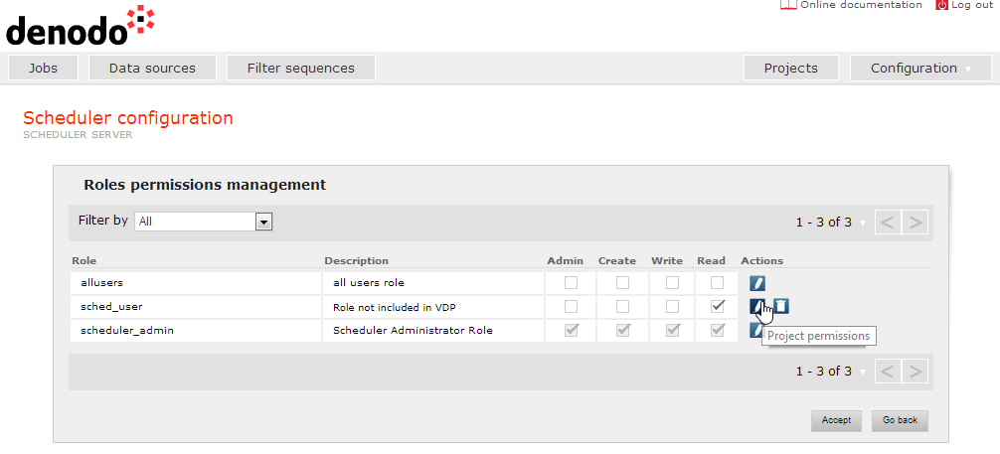
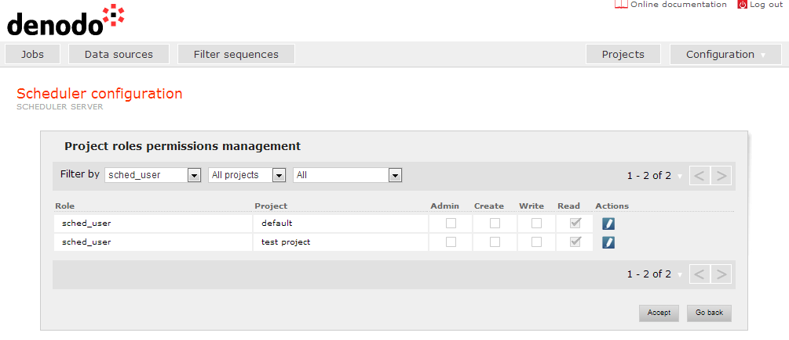
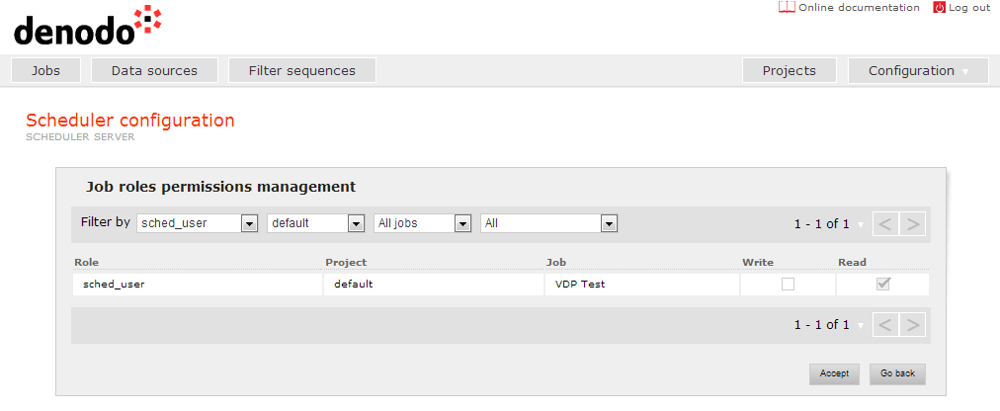

===========
Permissions
===========

Scheduler permissions are applied to a specific role, to delimit the
tasks the users with that role can perform over data sources, filter
sequences, jobs and the server configuration. Once a user is
authenticated and his/her roles retrieved, Denodo Scheduler checks
his/her permissions to decide whether he/she has the right privileges to
perform an operation or not. When a user has several roles assigned, it
can perform all the operations allowed by any of its roles.

 

By default, there exists a role with administration privileges called
"scheduler\_admin". The Scheduler local user and every Virtual DataPort
administrator user have this role assigned. It is a special role that
cannot be deleted nor its permissions modified, and it has global
administration permissions assigned to it, so users with this role can
perform all operations in the server (see below).

 

Permissions can be applied globally to the server or specifically to a
project or a job.

 

Scheduler supports the following types of **global permissions**, which
affect the whole server:

-  **Admin**: users with this permission can perform any operation in
   the whole server. It affects to projects, jobs, data sources, filter
   sequences, permissions management, server configuration,
   import/export, uploading extensions, etc.
-  **Create**: users with this permission can create jobs in every
   project.
-  **Write**: users with this permission can update and delete jobs in
   every project (and their reports).
-  **Read**: users with this permission can view and execute jobs in
   every project (and see their reports).

 

Scheduler also supports **individual permissions to specific projects**.
These permissions can be applied to a specific project, and affect only
to the elements contained in that project:

-  **Admin**: users with this permission can perform any operation in
   the project, such as creating, updating and deleting jobs, data
   sources and filter sequences, and changing the project name.
-  **Create**: users with this permission can create jobs in the scope
   of the project.
-  **Write**: users with this permission can update and delete every job
   in the project (and their reports).
-  **Read**: users with this permission can view and execute every job
   in the project (and see their reports).

 

Finally, Scheduler also supports **individual permissions to specific
jobs**. These permissions can be applied to a specific job inside a
project, and affect only to that job:

-  **Write**: users with this permission can update and delete that job
   (and their reports).
-  **Read**: users with this permission can see and execute that job
   (and see their reports).

 

Global permissions have preference over Project ones, and these over Job
ones. It means that if, for instance, a role has been assigned a global
privilege of Read, then it will have a privilege of Read for every
project and, transitively, for every job.

 

Despite a user does not have privileges for creating, updating and
deleting data sources or filter sequences (i.e. he/she does not have
global or project Admin permissions), he/she can always see their
configuration and use them when working with jobs.

 

The precedence of permissions is as follows:

-  Admin privilege implies Create, Write and Read ones.
-  Create privilege implies Write and Read ones.
-  Write privilege implies Read one.

 

When accessing the “Permissions” area in the “Configuration” drop-down
menu, the Administration tool connects to the Virtual DataPort server to
obtain the list of roles which currently exists in the server, and to
the Scheduler server to obtain the permissions assigned to the roles. A
table with the roles and the global permissions assigned to them is
shown (`Roles and global permissions screen`_). The appropriate check
box can be used to give Admin, Create, Read or Write global permissions.

 

   Roles and global permissions screen

 

Note that two kinds of roles can be displayed in the table:

-  Roles which currently exist in Virtual DataPort. The description
   given by the Virtual DataPort administrator from the administration
   tool is shown for each of them. They can have permissions assigned in
   Scheduler (in previous sessions) or not.
-  Roles that have permissions assigned in Scheduler but they do not
   exist in Virtual DataPort anymore (they have been deleted). They are
   easily identified because their description is “Role not included in
   VDP”. In this case, you can also delete this role and its assigned
   permissions in Scheduler, as you can see for the role *sched_user*
   in the `Roles and global permissions screen`_.

 

When accessing the permissions management section, if there is no
connection with the Virtual DataPort server, the table will only show
the roles already stored in Scheduler (i.e. those that have been
retrieved from Virtual DataPort in previous sessions). In this case,
the description of all these roles will be “VDP is offline. Description
not available” but the user will be allowed to manage the permissions
assigned to them.

 

Due to the precedence of the permissions explained previously, if for
example, Admin permission is checked, then Create, Write and Read
permissions are automatically checked and they cannot be unchecked. It
is possible to filter the list of roles shown in the table in order to
see only the ones that have permissions assigned or the opposite.

 

.. note:: As explained previously in this section, there exists a predefined
   role with administration privileges called “scheduler\_admin” that is
   not editable (i.e. its permissions cannot be changed).

 

The last column of the table which shows the global permissions contains
a link *Project permissions* in each row, which allows to access to the
configuration of the permissions over each specific project. When one of
these links is followed, a new table is shown listing all the projects
and the permissions assigned over each one, to the corresponding role.
The appropriate check boxes can be used to give the role permissions
Admin, Create, Read or Write over each project. For instance, the figure `Project
permissions screen`_ shows project permissions for the *scheduler\_user*
role.

 

   Project permissions screen

 

Remember that Global permissions have preference over Project ones. It
means that if, for instance, Read global permission has been assigned to
a role, then it will have Read permission over every project and it will
not be possible to uncheck the check boxes corresponding to that
permission.

 

There exist three filters in this table, in order to filter the
permissions to be displayed:

-  By role: Display all the roles or only the selected one (initially a
   role is selected in accordance to the link used to access to this
   table from the previous one).
-  By project: Display all projects or only the selected one (initially
   all projects are selected).
-  By permissions: Display all selected projects/roles, only the ones
   that have permissions assigned or the opposite.

The three filters can be used in conjunction, for example, to display
the permissions assigned to all roles in one specific project, and
displaying only the roles having permissions assigned.

 

The last column of the table which shows the project permissions
contains a link *Job permissions* in each row, which allows to access to
the configuration of the permissions over each specific job. When one of
these links is followed, a new table is shown listing all the jobs of
the corresponding project and the permissions assigned over each one to
the corresponding role (as shown in `Job permissions screen`_). The
appropriate check boxes can be used to give the role permissions Read or
Write over each job.

 

   Job permissions screen

 

Remember that Project permissions have preference over Job ones. It
means that if, for instance, Read permission over a project has been
assigned to a role, then it will have Read permission over every project
job and it will not be possible to uncheck the check boxes corresponding
to that permission.

 

There exist four filters in this table, in order to filter the
permissions to be displayed:

-  By role: Display all the roles or only the selected one (initially a
   role is selected in accordance to the link used to access to this
   table from the previous one).
-  By project: Display all projects or only the selected one (initially
   a project is selected in accordance to the link used to access to
   this table from the previous one).
-  By job: Display all jobs or only the selected one (initially all jobs
   are selected).
-  By permissions: Display all selected jobs/roles, only the ones that
   have permissions assigned or the opposite.

The four filters can be used in conjunction, for example, to display the
permissions assigned to all roles, in all the jobs of a specific
project, and displaying only the roles/jobs having permissions assigned.

