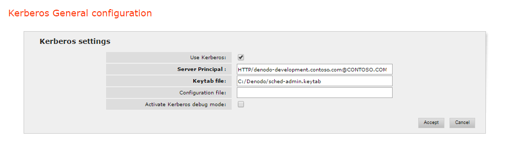
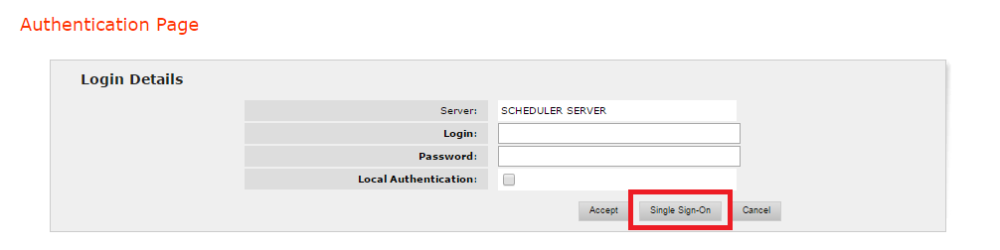

======================
Kerberos Configuration
======================

This section explains how to enable Single Sign On (SSO) on the Scheduler administration tool, 
using Kerberos authentication. With SSO, the users will not have to enter their credentials. They will be validated automatically.

.. important:: To enable single sign-on (SSO), you have to enable Kerberos in **both**
   the Scheduler administration tool and the Scheduler server. This section covers the
   steps for the Scheduler administration tool.

To enable Kerberos authentication in the Scheduler administration tool, follow these steps:

1. Enable Kerberos authentication in the Virtual DataPort server with which the Scheduler is going to
   authenticate its users. To do this, follow the instructions of the section 
   :doc:`/vdp/administration/server_administration_-_configuring_the_server/kerberos_authentication/kerberos_authentication`
   of the Virtual DataPort Administration Guide.

#. Follow the instructions of
   the post-installation task :ref:`Setting-up Kerberos Authentication in Scheduler`
   of the Installation Guide.

#. Set-up :ref:`Kerberos authentication in the Scheduler server <Kerberos settings>`.

#. In the administration tool, in the main screen, click **Kerberos configuration**. In this form, enter the following information:

   Kerberos configuration dialog

..

   i. Select **Use Kerberos**.

   #. In the box **Server Principal**, enter the “Service Principal Name” (SPN)
      used to create the *keytab* file. That is, the SPN with the Fully
      Qualified Domain Name (FQDN) of the server where the Active Directory is
      running. For example, "HTTP/denodo-prod.subnet1.contoso.com\@CONTOSO.COM".

   #. In the box **Keytab file**, enter the path to the *keytab* file.

   #. Leave the **Kerberos configuration file** box empty unless the host
      where this Scheduler administration tool runs does not belong to a
      Kerberos realm (e.g. a Windows Active Directory domain). If this host
      does *not* belong to a Kerberos realm, do one of the following:

      a. Enter the path to the ``krb5.conf`` or ``krb5.ini`` file with the
         Kerberos settings.
      b. Or follow the steps described in the appendix :ref:`Using Kerberos Authentication in Scheduler Without Joining a Kerberos Realm` of the Installation Guide.

   #. We recommend selecting the check box **Activate Kerberos debug mode**
      the first time you set up Kerberos in case you run into any issues. Once
      Kerberos is working, disable this.

      When this option is enabled, check the appendix :ref:`How to Debug Kerberos in Web Applications` 
      of the Installation Guide to learn how to see the debug information.

5. Restart the Scheduler administration tool to have these changes take effect. 

After these changes, when the users go to the Scheduler administration tool, they will be logged in automatically - without entering their credentials - because the browser will send the Kerberos credentials of their system. In order for this to work, they need to access using the full qualified URL (FQDN) configured in step 2. 
For example, \https://denodo-prod.subnet1.contoso.com:9443/webadmin/denodo-scheduler-admin/.

If you configured the administration tool to be able to connect to more than one Scheduler server, users will not be logged in automatically. They will have to select first the Scheduler server they want to connect and then, either select single sign-on or enter their credentials.

   Authentication dialog with Single Sign-On
