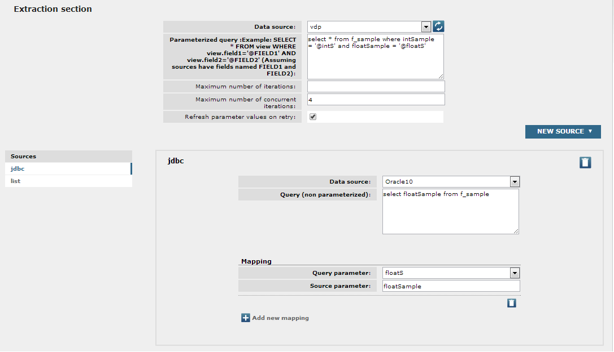
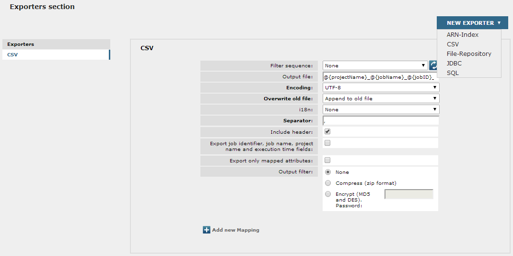
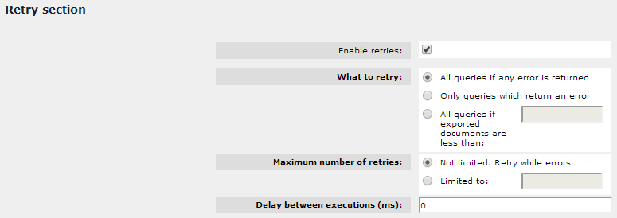
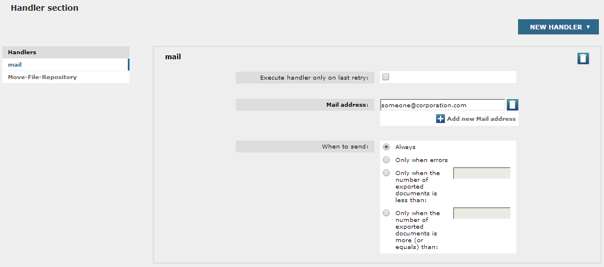
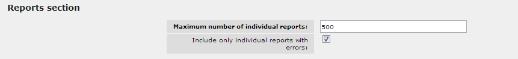
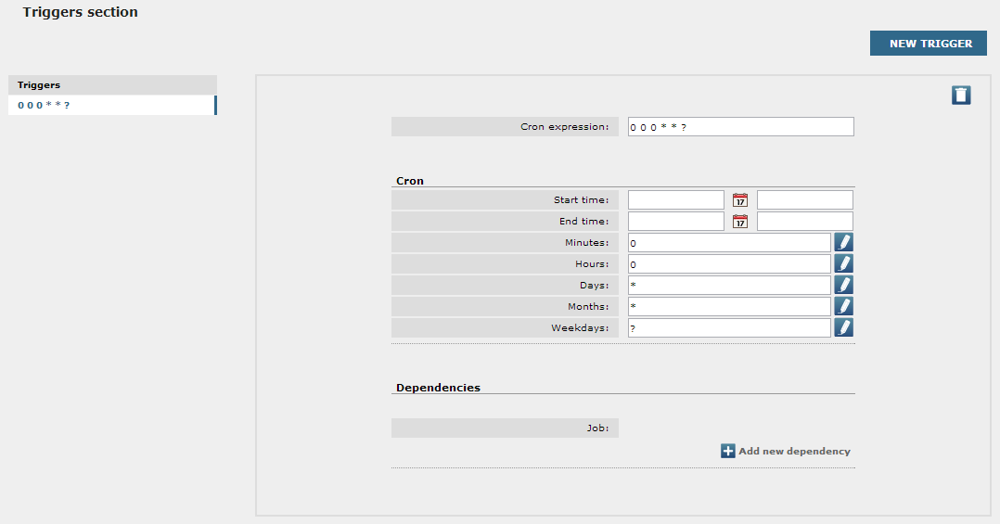

==========================
General Structure of a Job
==========================

The following are the different types of jobs supported by
Denodo Scheduler:

-  **ITP**: allow data to be extracted by querying Web automation flows
   from Denodo ITPilot.
-  **VDP**: allow data to be extracted by querying views or processes
   stored from Denodo Virtual DataPort.
-  **VDPCache**: allow querying views from Denodo Virtual DataPort
   to preload its cache. In order to preload the
   cache of a view, it must have its cache enabled and properly
   configured. With one job of this type, multiple views can be
   preloaded.
-  **VDPIndexer**: allow querying views from Denodo Virtual DataPort
   to generate an index that is then used by the
   Data Catalog. This index contains a document
   for each field of each tuple retrieved from VDP.
-  **JDBC**: allow data to be extracted from tables or processes
   contained in relational databases using JDBC. Each job of this type
   is informed of the data to access a certain database and the table or
   SQL query to be used to retrieve the required data.
-  **ARN**: allow data to be extracted from unstructured data sources,
   mainly Web sites, file systems, or e-mail servers.
-  **ARN-Index**: allow configuring maintenance operations to be performed
   on one or several Denodo Scheduler indexes.

.. important:: **ARN and ARN-Index jobs are deprecated** and will be removed in a later version of the Denodo Platform.
  This way, no new jobs of these types can be created in version 7.0 (you could still edit and execute 
  the existing ones).
 

All jobs have a name, a description, and share the job retries section
(**Retry Section**) and the result handlers section [#]_ (**Handlers Section**)
as well as time-based scheduling section (**Triggers Section**). Also, the
extraction jobs (but VDPCache) share the exporter section [#]_
(**Exporters Section**) and the parameterized jobs (ITP, JDBC, VDP, VDPCache
and VDPIndexer) also share the reports configuration section (Reports
Section). The extraction section (**Extraction Section**) is specified for
each type of extraction job and will be discussed in detail for each
type in the following sections.

 

In the extraction section (`Example of extraction section`_) the data
source from which the data is obtained is specified using a previously
created data source (see section :doc:`../data_sources/data_sources`). Different
configuration data needs to be supplied depending on the type of data
source.

 

   Example of extraction section

 

In the exporters section (`Example of exporters section`_) a list
of *exporters* can be specified. For each one can be indicated a filter
sequence for post processing the results obtained and an exporter to
dump the results into one or more external repositories. Denodo
Scheduler supplies implemented exporters to CSV files (this exporter can
also be used to generate files compatible with Microsoft Excel), relational
databases which have a JDBC adapter, and Denodo Scheduler indexes (only available for VDPIndexer jobs). It also
allows new exporters developed for special ad-hoc needs to be used.

 

   Example of exporters section

In the retries section (`Example of the retries section`_) the user can
enable retries for the job and configure how and when the retries will
be executed. In any case, a job will only be retried if there were
errors during its execution or the number of exported documents was less
than expected.

 

   Example of the retries section

In the handlers section (`Example of handlers section`_) actions to be
performed once the extraction and exportation of all the tuples of a job
have finished are specified. It allows, among other actions, sending an
e-mail with the execution summary of a job to a series of e-mail
addresses. It also allows the use of new handlers developed for custom
needs.

 

   Example of handlers section

 

In the reports section of parameterized jobs (`Reports section`_), it
can be specified what individual reports (i.e. the sub-reports
corresponding with each execution of the parameterized query) should be
added to the report of each job execution. The user can choose to
include only those individual reports informing about an error or, on
the other hand, to include all. It is also possible to limit the number
of individual reports for each job execution. By default, only
individual reports with errors will be stored, and the default maximum
is 500. It is important to note that every execution of a job will
generate a new report (regardless of this configuration). If the job is
parameterized, each combination of the input parameter values will
generate a new individual report that will be included in the main job
report (as a sub-report). If this individual report does not contain any
errors and the user has enabled the “Include only individual reports
with errors” check box or if the number of individual reports (for the
same main report) has reached the maximum configured number, it will be
not added to the main report and it will be discarded.

 

   Reports section

 

Lastly, each job defines scheduling data that specifies when it will be
executed, as shown in `Example of triggers section`_. The current
configuration allows similar features as the classic cron application
for UNIX systems.

 

   Example of triggers section

 

In the section :ref:`VDPIndexer Extraction Section` the fields returned in the documents obtained for
each type of job are discussed, as well as their types.

 

While creating or editing an existing job, there are several options to
save its configuration, all of them accessible in the “Save” drop-down
menu:

-  “Save” (default action). When using this option, the job’s
   configuration is validated so all the necessary parameters have a
   defined value.
-  “Save draft”. An incomplete job can be created by using this option.
   In this case, the only mandatory field is the name of the job. A
   draft job is a potentially incomplete job; thus, it cannot be started
   in the Scheduler perspective. A draft job can be edited like the rest
   of the jobs. After completely filling in all the mandatory fields of
   a job, pressing the *Save* button will create an executable job.
-  “Save as…” This option allows creating a new job with the current
   configuration and a new name. This option will only be enabled while
   editing a previously existing job.

 

.. note:: You can create a new job with the same configuration as an
   existing one. To do this, open the job you want to clone and press the
   button “Clone Job”. Then provide a name for the new job, and it will be
   created with this name and the same configuration as the original one.
   This is similar to the “Save as…” option explained before, but without
   the need for being editing the selected job.

 

--------------

.. [#] VDPIndexer jobs can only have handlers of type Mail.

.. [#] VDPIndexer jobs can only have exporters of type Scheduler Index or
   Elasticsearch.
