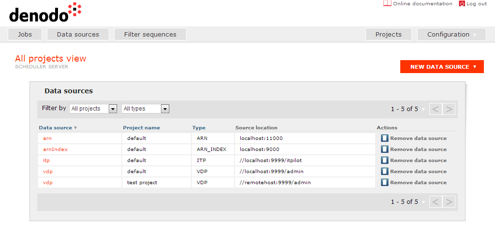

============
Data Sources
============

.. toctree::
   :hidden:
   
   arn_data_sources.rst
   arn-index_data_sources.rst
   csv_data_sources.rst
   elasticsearch_sources.rst
   itp_data_sources.rst
   jdbc_data_sources.rst
   vdp_data_sources.rst

To configure the extraction jobs, or the sources for obtaining
parameters for those jobs that can specify a parameterizable query (see
section :ref:`VDP Extraction Section`), the user needs to create data
sources.

 

Managing data sources is accomplished in the “Data Sources” perspective
(`Data sources screen`_), where a list of the existing data sources is
shown. If the user has previously selected an active project in the
“Projects” perspective, then this list will only show the data sources
created for that project. Otherwise, the user will be shown the whole
list of created data sources (it is possible to filter them by project
or data source type). Once a data source has been created, it can be
changed or deleted by clicking on its name in the list.

 

   Data sources screen
 

There is also a button to create a new data source; when clicking on it,
a list of the different types that can be created is shown: 
Scheduler Index, CSV, ITP, JDBC, and VDP. If the user has previously selected
an active project, the new data source will be created in this project;
otherwise, a dialog will ask the user to select a project prior to
create the new data source. For each data source type it is necessary to
specify a name and a set of parameters depending on the type. The
following describes the configuration needed to create or edit each of
them.

 

By default, Denodo Scheduler provides as many data sources as the ones
provided by the Denodo Platform servers that have been installed (
“scheduler index,” “itp,” and “vdp”).

 

It is important to note that only users with Admin permission over a
project can manage (create, edit and remove) its data sources. Of
course, a user with global Admin permission can manage data sources in
every project.

