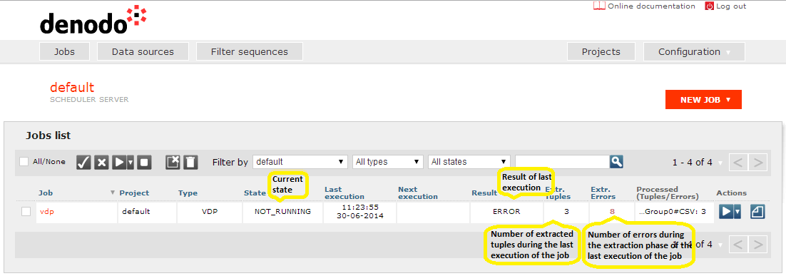

====
Jobs
====

The “Jobs” perspective for the administration tool allows the list of
Scheduler jobs to be displayed, as shown in the figure `Jobs screen`_. It is
possible to filter by project, job type, job state and/or job name. When
filtering by job name, only those jobs whose name contains the sequence
of characters typed in the search box (ignoring its case) will be shown.

 

The table showing the job information allows them to be ordered by all
their fields. For this, you only have to click on the field header for
the one you want to perform the sorting.

 

   Jobs screen
 

The following information is provided for each job:

-  **Name**. The job’s name.

-  **Project**. The name of the project the job belongs to.

-  **Type**. The type of job (ITP, JDBC, VDP, VDPCache,
   VDPIndexer).

-  **State**. The current state of the job. In particular, a job can
   be found running (RUNNING), not running (NOT\_RUNNING), waiting
   (WAITING), or having been disabled (DISABLED), in which case, it will
   not move to the RUNNING state until it is enabled. The jobs will appear
   DISABLED also in the case where the server has been paused using the API
   (you can only disable the whole server if there is no job in a RUNNING
   state). See section :ref:`Scheduler Client API` for more information on how to pause
   the server via API.

-  **Last Execution**. Shows the last time the job was executed. It
   will be blank if it never has been executed.

-  **Next Execution**. Shows the next time the job will be executed.
   It will appear blank if it has been disabled or, according to its
   time-based scheduling, it will not run again.

-  **Result**. Shows the completion state of the last execution of
   the job. A job can be completed correctly (COMPLETED), end with an error
   condition detected (ERROR), or stopped by the user (STOPPED).

-  **Extracted Tuples**. Number of tuples/documents that have been
   extracted in the last execution of the job. This number is dynamically
   updated when the job is running. If the job has a Retry Handler
   configured (see section :ref:`Handler Section`) and any retry is executed,
   this column will also show the accumulative number of extracted tuples
   over all retries executed so far. The format will be one of the
   following:

   -  without retries: #tuples
   -  with retries: #retry\_tuples (#accumulative\_tuples)

-  **Extracted Errors**. Number of errors occurred during the extraction
   phase in the last execution of the job. If the job has a Retry Handler
   configured (see section :ref:`Handler Section`), this column shows the
   number of errors occurred during the execution of the retry.

-  **Processed Tuples/Errors**. For each tuple/extracted document
   the configured filter sequences are applied, and the tuples that fulfill
   their filters are sent to the exporters. This column displays the name
   of each exporter, the number of tuples that have been sent to it and
   number of errors that occurred during the exporting process. If the job
   has a Retry Handler configured (see section :ref:`Handler Section`) and any
   retry is executed, this column will show the accumulative number of
   exported tuples (for each exporter) over all retries executed so far.
   The format will be one of the following:

   -  without retries: #tuples / #errors
   -  with retries: #retry\_tuples (#accumulative\_tuples) / #retry\_errors

-  **Actions**. Shows the different actions that can be performed on a job
   (depending on its current state).

    -  **Start**. Forces a full execution of the job at this moment. Only
       applicable to jobs that are in a NOT\_RUNNING state.
    -  **Start With Dependencies**. Executes the job at this moment by
       forcing all of its dependencies (if any) to be executed before. If
       some of these jobs have their own dependencies, they will be executed
       first (creating an execution chain).
    -  **Start With State**. In the case of jobs that can launch multiple queries against the same
       data source, if in the last execution any error occurred when
       executing any query or the job was stopped before completing the
       execution, **Start With State** will execute the job by only
       completing those queries that failed or that had not been completed
       yet. Otherwise, it works in the same way as **Start** by repeating
       the execution of the whole job.
    -  **Stop**. Stops a job. Only applicable to jobs that are in a RUNNING state.
    -  **Reports**. Allows access to reports of the last executions
       of each job. Each report shows information on the execution date for
       each job, the number of extracted tuples/documents, and the number of
       exported tuples/documents for each job exporter, indicating whether
       there have been any errors when configuring, accessing sources,
       exporting results, or during the handlers execution. According to the
       type of job executed, the report shows more detailed information
       specific to this type of job. In the case of jobs that execute multiple queries, they will show a detailed
       report for the result of the execution of each of the queries. The
       maximum number of reports stored can be configured. It is also
       possible to indicate that only the reports including errors should be
       stored (see section :ref:`General structure of a job`, for instructions
       on how to configure reports).
 

It is possible to perform the explained actions over a group of jobs. In
addition, you can also **Enable** (it enables a job that is in state
DISABLED, so it can be executed), **Disable** (it disables a job - and
stops it first if it is in state RUNNING -, so it cannot be executed) or
**Delete** several jobs and **Delete Reports** from several jobs at
once. For this, you only have to click on the check box next to each job
in order to select them and then click on the desired action. Selected
jobs are only kept as selected in the current view: when the user
selects a job and then filters the table or paginates it, if the
selected job does not appear in the new view, it will be unselected.

 

