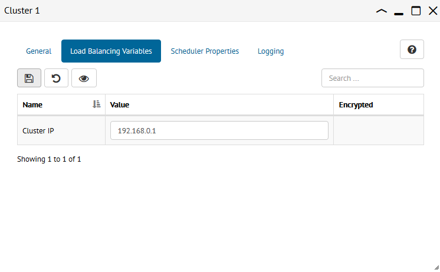

.. _sm_configuring_cluster_load_balancing_variables:

********************************************
Configuring Cluster Load Balancing Variables
********************************************

.. note:: Only global administrators and promotion administrators can configure cluster load balancing variables. 
          More information is available in the :ref:`Authorization` section.

The :ref:`load balancing variables <Load Balancing Variables>` that apply to the
clusters should have assigned a value for each cluster of the Solution Manager.
For a particular cluster, you can change their values in the pill *Load
Balancing Variables* of the cluster configuration panel.

    Assign values to the cluster load balancing variables

You need to confirm the changes clicking the save button |save-btn| or you can
revert unsaved changes clicking the button |revert-btn|. With the button
|show-passwords-btn| you can view encrypted values as clear text.

.. |save-btn| image:: ../../common_images/save-btn.png 

.. |revert-btn| image:: ../../common_images/revert-btn.png 

.. |show-passwords-btn| image:: ../../common_images/show-passwords-btn.png