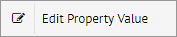
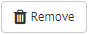

.. _sm_configuring_cluster_scheduler_properties:

********************************
Configuring Scheduler Properties
********************************

.. note:: Only global administrators and promotion administrators can manage Scheduler properties. 
          More information is available in the :ref:`Authorization` section.

For those scenarios where you work with several clusters, Scheduler allows you to export its metadata in a parameterized way, including two files in the zip with the export;
one that contains the metadata and another one that contains the values of the parameters that depend on the cluster where the server is running. 
Solution Manager makes use of this feature for :ref:`promoting changes <Promotions>` from one environment to another. 
To promote a list of revisions on a target environment, you should define the same Scheduler properties with their appropriate values, in each cluster of the environment.

.. important:: Note that the Scheduler properties should be defined at cluster level.

.. note:: There is more information about import/export Scheduler properties in the section :ref:`Use of the Import/Export Scripts for Backup` of the *Scheduler Administration Guide*.

Scheduler properties are administered from the cluster dialog. :ref:`Open it <Configuring Clusters>` and go to the section **Scheduler Properties**.
You will see a dialog like the one below, which displays all the Scheduler properties of that cluster in a hierarchical view.

   Dialog to administer Scheduler properties

Those properties that represent passwords show their values hidden by default.
You can click the icon |show-passwords-btn| to show the passwords as clear text.

This dialog allows you to perform the following operations:

* **Add a new property**: Click the |new-text-btn| button. A new dialog will
  appear. Enter its name and value and confirm.
  
  To assign an undefined value to a property, select the check box **Set as undefined**.
  This is useful if you do not know the
  value of a property but you want to create it anyway. Properties with
  an undefined value are not valid when you deploy or validate a revision. 
  To see the properties with an undefined value, select **Show only undefined properties**.

* **Edit the value of a property**: Right-click the value of a property and
  click on the option |edit-property-text-btn| in the emerging menu. Enter the
  new value for the property in the dialog that appears and confirm.

* **Edit the value of several properties**: Select several properties from 
  the tree and click the |edit-text-btn| button. Enter the new value for the
  selected properties in the dialog that appears and confirm.
    
  .. note:: It is not possible to edit password and normal properties at the same time.
  
* **Remove properties**: Select several properties from the tree and click the
  |remove-text-btn| button.

* **Import a properties file**: Click the |import-text-btn| button and a new
  dialog will appear.

  .. figure:: import-sch-properties.png
     :align: center
     :alt: Dialog to drag a file with Scheduler properties
     :name: Dialog to drag a file with Scheduler properties

     Dialog to drag a file with Scheduler properties

  You can drag and drop a file from your machine with Scheduler properties.
  As soon as the upload finishes, a new dialog will appear. From this dialog, you can preview and confirm the new values of the properties.

  .. figure:: confirm-import-sch-properties.png
     :align: center
     :alt: Dialog to confirm the new values of the imported Scheduler properties
     :name: Dialog to confirm the new values of the imported Scheduler properties

     Dialog to confirm the new values of the imported Scheduler properties

  You can restore the old value for a property, click |copy-all-values-to-left| to restore them all, or enter the new value. Also, you can select
  several properties from the tree and click |edit-text-btn| 
  to edit the value of several properties at once.
  
  Select **Show only properties with distinct values** to make it easy to see what values you may want to change.
  Take into account that the imported properties whose value is empty **will not** keep their old value.

* **Export the properties to a file**: Click the |export-text-btn| button and a
  file will start downloading to your machine with all the Scheduler properties.
  Undefined properties will not be included in the output file.

.. |show-passwords-btn| image:: ../../common_images/show-passwords-btn.png

.. |edit-text-btn| image:: ../../common_images/edit-text-btn.png

.. |import-text-btn| image:: ../../common_images/import-text-btn.png

.. |export-text-btn| image:: ../../common_images/export-text-btn.png

.. |copy-all-values-to-left| image:: ../../common_images/copy-all-values-to-left.png