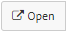

.. _sm_configuring_clusters:

********************
Configuring Clusters
********************
.. toctree::
   :hidden:
   
   configuring_cluster_load_balancing_variables.rst
   configuring_cluster_sch_properties.rst
   configuring_cluster_logging.rst

You can open a cluster to check and edit all the information related to it.
There are two different ways to do that:

#. Click the node in the catalog tree that represents the cluster |cluster_node|
   and select |open-text-btn| in the emerging menu.

   .. figure:: open-cluster-menu.png
      :align: center
      :alt: Open a cluster from the catalog tree
      :name: Open a cluster from the catalog tree

      Open a cluster from the catalog tree

#. Double-click its node.

A new tab will open in the main area of the Solution Manager Administration Tool 
with all the information of that cluster. 
Nevertheless, the dialog you see and the available options depend on 
the :ref:`kind of user <Authorization>` you are.

A **developer** can only check the basic information entered at creation time in read-only mode.

   Cluster dialog from a developer perspective

A **Solution Manager administrator** can check and edit the information that was available
in the creation dialog but cannot view or edit the load balancing variable values 
or the Scheduler properties of the cluster.
        

   Cluster dialog from a Solution Manager administrator perspective

Like a developer or a **promotion** user, a **promotion administrator** can only read the basic information of a cluster.
Nevertheless, she has full access to the configuration of 
:ref:`load balancing variables <sm_configuring_cluster_load_balancing_variables>` 
and :ref:`cluster Scheduler properties <sm_configuring_cluster_scheduler_properties>`.
        

   Cluster dialog from a promotion administrator perspective

A **JMX administrator** can only read the basic information of a cluster, 
and can change the logging level of the Virtual DataPort servers
included in the cluster.
        

   Cluster dialog from a JMX administrator perspective

A **global administrator** has no restriction at all. She can edit all the basic parameters 
as well as the configuration of 
:ref:`load balancing variables <sm_configuring_cluster_load_balancing_variables>` 
and :ref:`cluster Scheduler properties <sm_configuring_cluster_scheduler_properties>`.

   Cluster dialog from a global administrator perspective

.. |cluster_node| image:: ../../common_images/cluster-node.svg
                  :width: 30px

