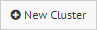

.. _sm_creating_clusters:

*****************
Creating Clusters
*****************

.. note:: Only global administrators and Solution Manager administrators can create clusters. 
          More information is available in the :ref:`Authorization` section.

Solution Manager administrators have several ways to create clusters:

#. Click an environment node |environment_node| and select
   |new-cluster-text-btn| on the emerging menu.

   .. figure:: create_cluster_from_environment.png
      :align: center
      :alt: Create new cluster from environment
      :name: Create new cluster from environment

      Create new cluster from environment

#. When you create an environment, the Solution Manager Administration Tool will suggest you to create a new cluster. 
   Accept the suggestion.

   .. figure:: create_cluster_hint.png
      :align: center
      :alt: Suggestion for creating a cluster 
      :name: Suggestion for creating a cluster

      Suggestion for creating a cluster

Whatever path you follow, the following dialog will open to create a new cluster:

   .. figure:: new_cluster_dialog.png
      :align: center
      :alt: Dialog to create a cluster
      :name: Dialog to create a cluster

      Dialog to create a cluster

As part of the cluster definition, this dialog considers the following fields:

* **Name**: Descriptive name for the cluster.
* **Description**: Extensive description about the cluster. This field is optional.
* **Cluster enabled**: To enable / disable a cluster. Disabled clusters are ignored in deployments operations.

  Disabled clusters are grayed out in the environments tree.

.. |environment_node| image:: ../../common_images/environment-node.svg 
                      :width: 30px

