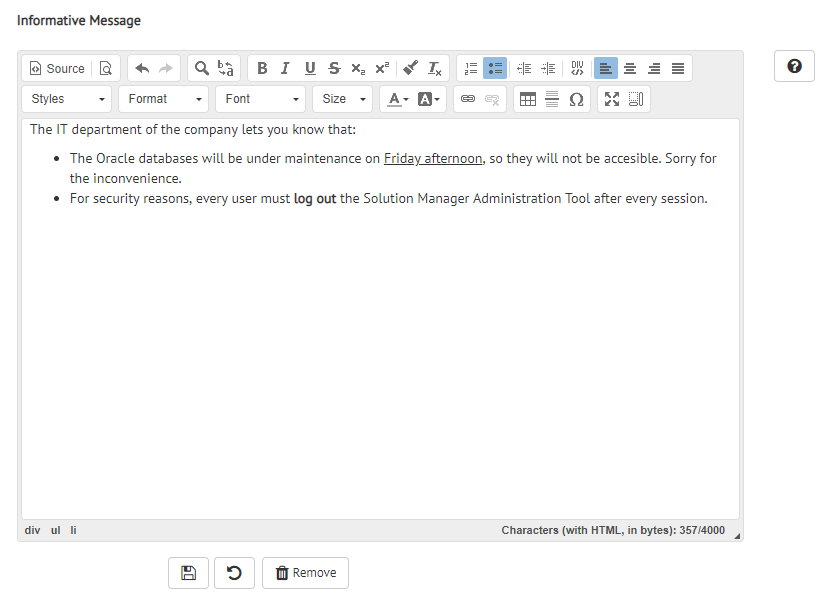
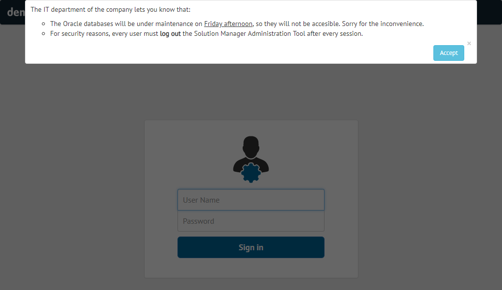
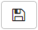
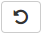

.. _sm-informative-message-configuration:

==================================
Setting-Up the Informative Message
==================================

.. note:: Only global administrators and Solution Manager administrators can configure the Informative Message. 
          More information is available in the :ref:`Authorization` section.
          
You can add an informative message that will be displayed to all users when they access the Solution Manager. It will show up at the top of the page.

It can be used to display a welcome message, inform users when the service is expected to be down for maintenance, legal disclaimers, etc.

To configure the informative message, click the menu **Configuration** > **Informative Message**.

   
   Informative Message Set-Up

To enter the message in HTML, click **Source** in the editor, enter the HTML and click **Source** again (the *Save* button is disabled while in *Source* mode).

   
   Informative Message

   

