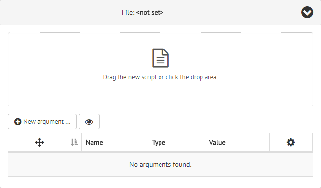
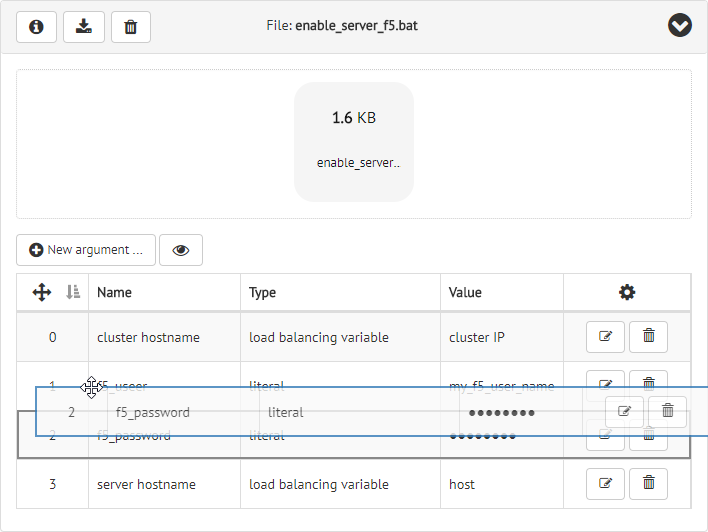
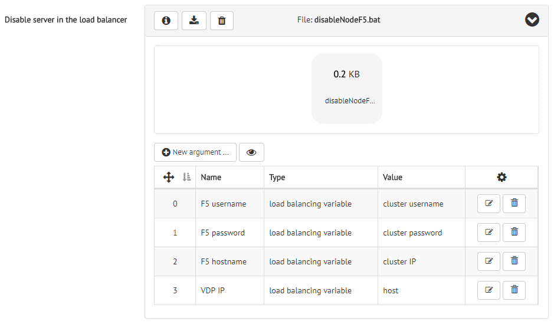
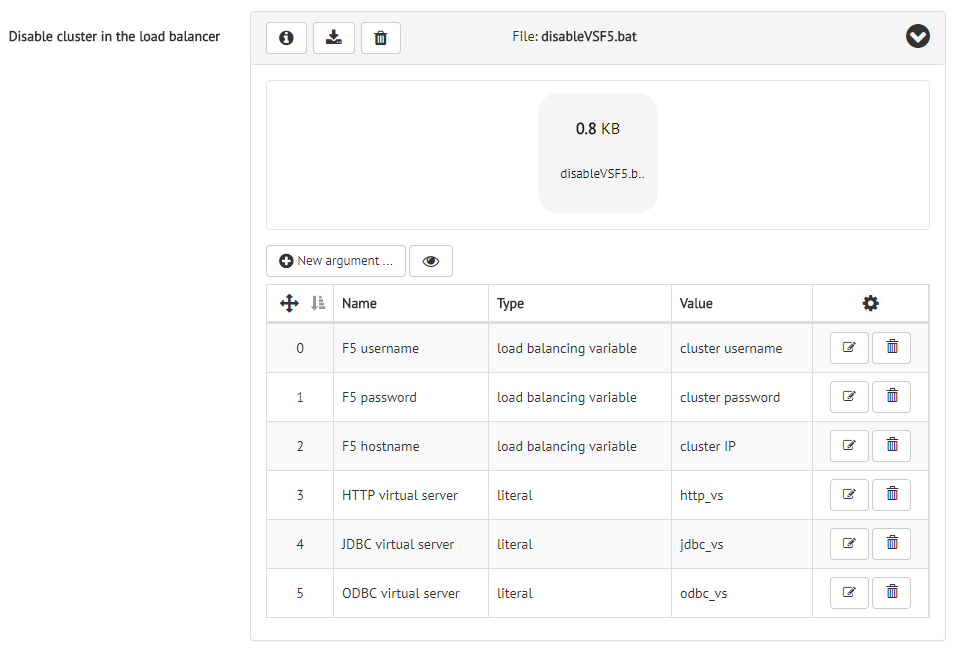

******************************
Configuring Deployment Scripts
******************************

The section `Deployment Scripts` allows you to administer the scripts that the
Solution Manager uses to enable and disable servers or clusters in the load
balancer.

.. figure:: environment-deployment-scripts.png
   :align: center
   :alt: Dialog to configure the scripts that deal with the load balancer
   :name: Dialog to configure the scripts that deal with the load balancer

   Dialog to configure the scripts that deal with the load balancer

According to the number of clusters in your environment, only a couple of
scripts will be relevant:

* Environments with one cluster: Solution Manager will use scripts *Enable
  server in the load balancer* and *Disable server in the load balancer*.
  
* Environments with more than one cluster: Solution Manager will use scripts
  *Enable cluster in the load balancer* and *Disable cluster in the load
  balancer*.

To add a script to the Solution Manager, unfold the corresponding panel and drag
and drop the file with the script inside the drop area.

   Dialog to add a deployment script

Each deployment script can declare a list of parameters. To add a new parameter,
click the |new-argument-text-btn| button and complete the form that the Solution
Manager will open. An argument is defined with the following fields:

* **Name**: A descriptive name for the parameter.

* **Type**: Solution Manager supports two kind of arguments:
  
  - Use a *Literal* argument when you want to specify the actual value for the
    parameter. You should type the value of the argument in the field **Value**
    and select the check box **Encrypted literal value** if you want that the
    Solution Manager stores it in encrypted format.
    
    .. figure:: environment-add-script-literal-argument.png
       :align: center
       :alt: Dialog to add a new literal argument to a deployment script
       :name: Dialog to add a new literal argument to a deployment script

       Dialog to add a new literal argument to a deployment script

  - Use a *Load Balancing Variable* when you want to reuse one of the
    variables defined in the :ref:`Load Balancing Variables` dialog. Take into
    account that the scripts that enable or disable clusters in the load
    balancer can only receive cluster load balancing variables as parameters.
    Nevertheless, those scripts that enable or disable servers in the load
    balancer can receive both cluster and server load balancing variables.

    .. figure:: environment-add-script-lbv-argument.png
       :align: center
       :alt: Dialog to add a new load balancing variable argument to a deployment script
       :name: Dialog to add a new load balancing variable argument to a deployment script

       Dialog to add a new load balancing variable argument to a deployment script

The Solution Manager will preserve the order of the arguments when executes the
script. In the arguments table, you can use its first column to drag and drop an
argument and reorder it.

   Reordering an argument of a deployment script

.. important:: The Solution Manager follows the convention that any successful
               script execution returns the exit code ``0`` value. Any other exit code will be considered an error in execution.

Examples of Deployment Scripts
==============================

Imagine we are a corporation with a large Denodo deployment that uses
`F5 <https://f5.com/>`_ as its load balancer. We have two environments: one for
development and one for production. Let's see how to configure the deployment
scripts in the Solution Manager and how the final scripts look like.

The development environment consists of one cluster with two Virtual DataPort
servers, so we need to provide two scripts, one to disable a server in the load
balancer and another one to enable it.

The script below is an example of how to disable a server in the load balancer.
It connects via SSH to the machine where the load balancer resides, disables the
server in the load balancer and captures any error during the execution. 

.. code-block:: bat
   :caption: Example script to disable a server in F5

   @echo off

   plink -ssh %1@%3 -pw %2 "tmsh modify /ltm node %4 state user-down session user-disabled" 1>&2

   SET err_code=%ERRORLEVEL% 
   if %err_code% == 0 (
     echo OK
   ) else (
     echo Error 1>&2
   ) 

   exit %err_code%

This script depends on the following four parameters:

#. Login of the user that connects via SSH to the load balancer machine.

#. Password of the user that connects via SSH to the load balancer machine.

#. IP or hostname of the load balancer machine.

#. IP or logical name of the Virtual DataPort server in the load balancer.

Therefore, your *Disable server in the load balancer* script in the
`Deployment Scripts` section should look like the figure below, considering
that you have defined some cluster load balancing variables for its username,
password and IP.

   Script configuration to disable the server in F5

The script that will allow you to enable a server in the load balancer again is
pretty similar to the previous one, as you can see in the following example:

.. code-block:: bat
   :caption: Example script to enable a server in F5

   @echo off

   plink -ssh %1@%3 -pw %2 "tmsh modify /ltm node %4 state user-up session user-enabled " 1>&2

   SET err_code=%ERRORLEVEL% 
   if %err_code% == 0 (
     echo OK
   ) else (
     echo Error 1>&2
   ) 

   exit %err_code%

The production environment of our corporation counts with several clusters.
Therefore, we need to provide a couple of scripts to disable a cluster in the
load balancer and to enable it again.

The service provided by the Denodo Platform is modeled in the cluster as three
virtual servers that give access to the platform via HTTP, JDBC and ODBC in a
pooled way. To disable a cluster, we need to disable these virtual servers in
the load balancer.

The script below illustrates how to disable a cluster in the load balancer. It
connects via SSH to the load balancer machine, disables the three virtual
servers and captures any error during the whole process. Note that the last step
is more complex than before, since any sentence of the three that disable one
virtual server may fail.

.. code-block:: bat
   :caption: Example script to disable a cluster in F5

   @echo off
   
   SET tempFileName=temp%RANDOM%.txt 
   
   plink -ssh %1@%3 -pw %2 "tmsh modify /ltm virtual %4 disabled; tmsh modify /ltm virtual %5 disabled; tmsh modify /ltm virtual %6 disabled; " 2> %tempFileName%
   
   SETLOCAL EnableDelayedExpansion
   SET errorString=
   for /f "delims=" %%x in (%tempFileName%) do SET errorString=!errorString!%%x
   SETLOCAL DisableDelayedExpansion
   
   DEL %tempFileName%
   
   if "%errorString%" == "" (
     echo OK
     exit 0
   ) else (
     echo Error "%errorString%" 1>&2
     exit 1
   )

This script depends on the following six parameters:

#. Login of the user that connects via SSH to the load balancer machine.

#. Password of the user that connects via SSH to the load balancer machine.

#. IP or hostname of the load balancer machine.

#. Name of the HTTP virtual server in the load balancer.

#. Name of the JDBC virtual server in the load balancer.

#. Name of the ODBC virtual server in the load balancer.

In the Solution Manager, you should add the previous script in the *Disable
cluster in the load balancer* dialog and configure their six arguments, like in
the following figure.

   Script configuration to disable the cluster in F5

Finally, you should repeat the process with the script that enables the cluster
in the load balancer, which should look like the following piece of code:

.. code-block:: bat
   :caption: Example script to enable a cluster in F5

   @echo off
   
   SET tempFileName=temp%RANDOM%.txt 
   
   plink -ssh %1@%3 -pw %2 "tmsh modify /ltm virtual %4 enabled; tmsh modify /ltm virtual %5 enabled; tmsh modify /ltm virtual %6 enabled; " 2> %tempFileName%
   
   SETLOCAL EnableDelayedExpansion
   SET errorString=
   for /f "delims=" %%x in (%tempFileName%) do SET errorString=!errorString!%%x
   SETLOCAL DisableDelayedExpansion
   
   DEL %tempFileName%
   
   if "%errorString%" == "" (
     echo OK
     exit 0
   ) else (
     echo Error "%errorString%" 1>&2
     exit 1
   )

