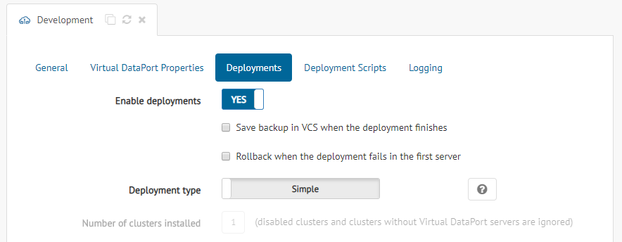
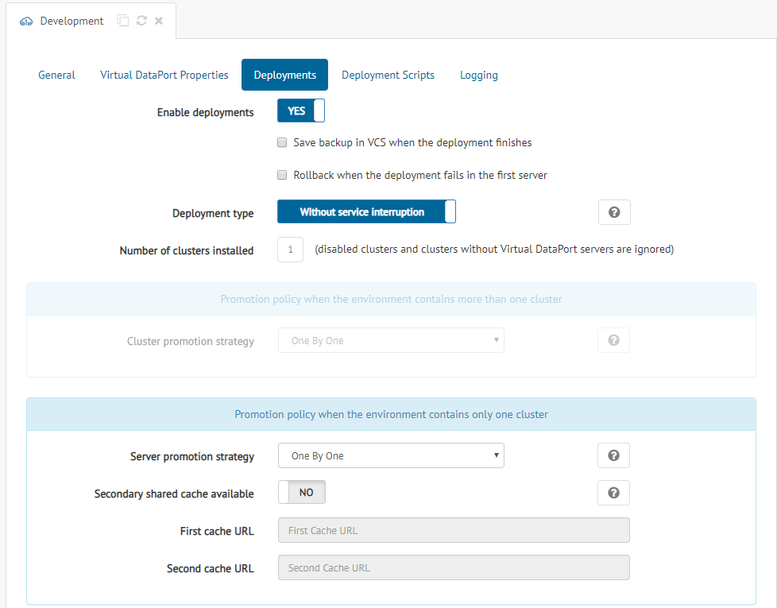
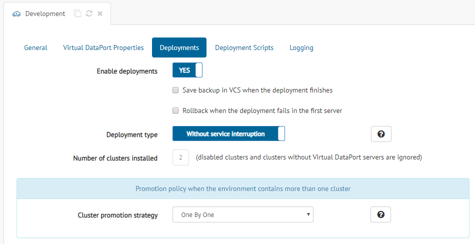
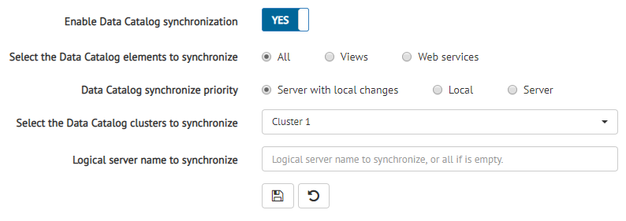

***********************
Configuring Deployments
***********************

.. note:: Only global administrators and promotion administrators
          can change the deployment configuration. See more about privileges in the :ref:`Authorization` section.

The "Deployments" section of an environment dialog, allows you to
configure how a deployment will work when this environment participates as the
deployment target.

   Dialog to configure deployments on an environment

.. note:: Before enabling deployments on an environment, you should have a good
          understanding on how they work. In the section
          :ref:`Deploying Revisions` there is a detailed explanation on
          deployments and examples of the different strategies working.

The common options that you can configure for any environment are:

* **Enable deployments**: Only environments with this option enabled admit
  working as the target of a deployment. The deployment will fail otherwise.

* **Save backup in VCS when the deployment finishes**: If selected, a backup of the
  deployment will be saved in the
  :ref:`Version Control System <sm-vcs-configuration>` you have configured. The
  backup will be performed both for successful and unsuccessful deployments, using the metadata 
  of the first enabled server in the first enabled cluster.

* **Execute rollback when the deployment fails in the first server**: The first
  enabled server of the first enabled cluster of the environment works as a test base for the
  deployment. If this option is selected and the deployment fails there, the
  Solution Manager will restore its previous state by executing the backup saved 
  during the latest successful deployment, in the 
  :ref:`Version Control System <sm-vcs-configuration>`.

* **Deployment type**: There are two types of deployments according to whether
  the Solution Manager interacts with the load balancer or not.

  - In the **Simple** deployment mode, the Solution Manager only updates the
    metadata of the servers, one by one, without any interaction with the load
    balancer. This option is intended for offline applications.

  - In the **Without service interruption** deployment mode, the Solution
    Manager disables Virtual DataPort servers or clusters in the load balancer
    and enables them again when the deployment finishes. To deal with the load
    balancer, the Solution Manager uses the scripts defined in the
    :ref:`Deployment Scripts <Configuring Deployment Scripts>` section.

When the deployment is configured as **Without service interruption**, you can
choose among different strategies to perform the promotion. The actual options
available depend on the topology of your infrastructure, which is shown by the
parameter **Number of clusters installed**. This parameter shows the number of
enabled clusters that have at least one enabled Virtual DataPort server in the environment.

In those environments with **only one enabled cluster**, the subsection **Promotion policy
when the environment contains only one cluster** will be available. 

.. note:: In a deployment, **a cluster is considered enabled** if it is not disabled and it has at least one enabled Virtual DataPort server. In addition, **a server is considered enabled** if it is enabled and the cluster it belongs to is also enabled.

   Configuration options available when the environment contains one cluster

In such scenarios, you can configure the following options:

* **Server promotion strategy**: Solution Manager uses the scripts **Enable
  server in the load balancer** and **Disable server in the load balancer** to
  enable and disable Virtual DataPort servers in the load balancer respectively
  (disabled Virtual DataPort servers are ignored in this process).
  It can promote servers in two different ways:

  - The **Half** strategy disables half of the Virtual DataPort servers in the
    load balancer first, performs the deployment and enables them again. Then,
    it repeats the process with the other half. This option ensures that the
    potential system inconsistencies will only last a short time.

  - The **One By One** strategy disables the first Virtual DataPort server of
    the cluster (according to the order in the catalog tree of the Solution
    Manager) in the load balancer, performs the deployment and enables it again.
    This process is repeated server by server, so the system may present
    inconsistencies for a longer time than for the **Half** strategy.

* **Secondary shared cache available**: To avoid any problem with the cache of
  Virtual DataPort servers, Solution Manager allows you to define two different
  cache data sources between which to alternate on every deployment. As servers
  update their metadata during the deployment, their caches swap from the
  current (old) data source to the other one, which contains updated data and,
  maybe, views with updated schemas. In this way, those servers that have not
  been updated yet are not affected by the changes in the cache. For this to
  work, there have to be two different schemas in the same database that can
  operate as cache for Virtual DataPort.
  
* **First cache URL**: URL of one of the schemas that can work as the cache for
  the Virtual DataPort servers.
      
* **Second cache URL**: URL of the other schema that can work as the cache for
  the Virtual DataPort servers.

.. important:: Currently, the **cache swap process is limited to global cache**, this is, there are no caches defined for particular databases.

In those environments composed by **several enabled clusters**, the subsection **Promotion
policy when the environment contains more than one cluster** will be available.

   Configuration options available when the environment contains more than one cluster

This subsection only contains the option **Cluster promotion strategy**, which
configures how clusters are disabled and enabled in the load balancer during the
promotion. Take into account that the Solution Manager uses the scripts **Enable
cluster in the load balancer** and **Disable cluster in the load balancer**,
respectively, for this purpose (disabled clusters are ignored in this process). There are two strategies available:

* The **Half** strategy disables half of the clusters in the load balancer
  first, performs the deployment for the servers defined in those clusters and
  enables them again. Then, it repeats the process with the other half. This
  option ensures that the potential system inconsistencies will only last a
  short time.

* The **One By One** strategy disables the first cluster of the environment
  (according to the order in the catalog tree of the Solution Manager) in the
  load balancer, performs the deployment for the servers it contains and enables
  it again. This process is repeated cluster by cluster, so the system may
  present inconsistencies for a long time.

Data Catalog Server Synchronization
-----------------------------------

It is also possible to configure Solution Manager to synchronize Data Catalog servers.

   Data Catalog Server Synchronization configuration

.. important:: The user configured for each **Data Catalog** server must have at least the *data_catalog_admin* role in order to be able to synchronize the catalog metadata during the deployment process. 

The options that you can configure for Data Catalog Synchronization are:

* **Enable Data Catalog synchronization**: Data Catalog servers will be synchronized only if this option is enabled.

* **Select the Data Catalog elements to synchronize**: Select the type of elements to synchronize (same options as in the :ref:`Data Catalog elements synchronization <Elements Configuration>`).

  - *Views*: Synchronize views metadata. 

  - *Web services*: Synchronize web services metadata. 
  
  - *All*: Synchronize metadata of all previous types. 

* **Data Catalog synchronize priority**: After synchronizing, the schemas will be updated to reflect the current ones of the server, and the descriptions can be updated in three different ways:

  - *Server*: the descriptions will be overwritten with the server ones. 

  - *Local*: all the descriptions of the Data Catalog will be preserved. 
  
  - *Server with local changes*: the descriptions will be overwritten with the server ones,
    except the ones that have been edited from the Data Catalog (that will be preserved).

* **Select the Data Catalog clusters to synchronize**: Select the cluster(s) with Data Catalog servers to synchronize. Only clusters with at least one enabled Data Catalog server will be synchronized.

* **Logical server name to synchronize**: Optional. You can specify a logical name of a server to synchronize (this corresponds
  to the name of a Virtual DataPort server in Data Catalog). You only need to configure this if in the Data Catalog server there is more than one Virtual DataPort server. 

  .. warning::  If **logical server name to synchronize** field is empty, the metadata for all the Virtual DataPort servers defined in the Data Catalog server will be synchronized. 
   
   
