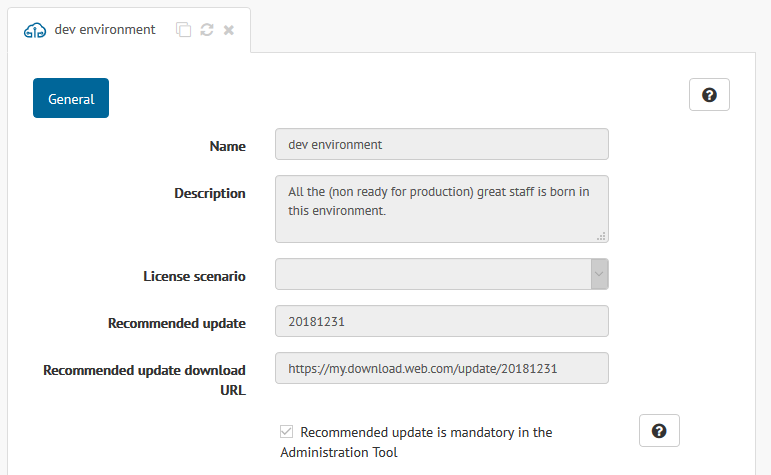
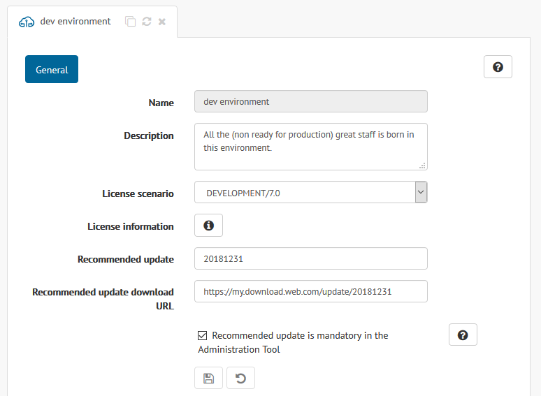
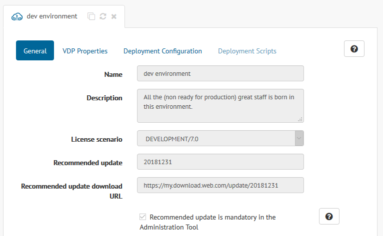
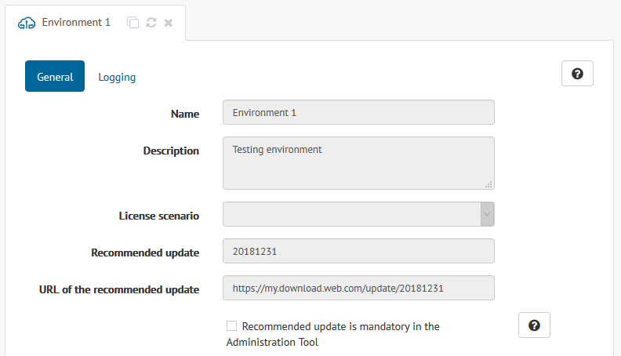
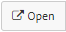
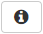

************************
Configuring Environments
************************

.. toctree::
   :hidden:
   
   configuring_vdp_properties.rst
   configuring_deployments.rst
   configuring_deployment_scripts.rst
   configuring_environment_logging.rst

You can open an environment to check and edit all the information related to it.
There are two different ways to do that:

#. Click the node in the catalog tree that represents the environment |env_node|
   and select |open-text-btn| in the emerging menu.

   .. figure:: open-environment-menu.png
      :align: center
      :alt: Open an environment from the catalog tree
      :name: Open an environment from the catalog tree

      Open an environment from the catalog tree

#. Double-click its node.
   
A new tab will open in the main area of the Solution Manager Administration Tool
with all the information of that environment. Nevertheless, the dialog you see
and the available options depend on the :ref:`kind of user <Authorization>` you
are.

A **developer** can only check the basic information entered at creation time in
read-only mode.

   Environment dialog from a developer perspective

A **Solution Manager administrator** can check and edit all the information that
was available in the creation dialog. Remember that the environment name is not
editable. In addition, this type of user can check the content of the license
assigned to the environment clicking in the |info-btn| button next to the
**License information** field.
        

   Environment dialog from a Solution Manager administrator perspective

Like a developer or a **promotion** user, a **promotion administrator** can only read the basic
information of an environment. Nevertheless, she has full access to new
configuration parameters related to :ref:`deployment <Configuring Deployments>`
and :ref:`Virtual DataPort properties <Configuring Virtual DataPort Properties>`.
        

   Environment dialog from a promotion administrator perspective

Finally, a **JMX administrator** can only read the basic information of an
environment, and can change the logging level of the Virtual DataPort servers
included in the environment.
        

   Environment dialog from a JMX administrator perspective

A **global administrator** has no restriction at all. She can edit all the basic
parameters as well as the advanced parameters about
:ref:`deployments <Configuring Deployments>` and
:ref:`Virtual DataPort properties <Configuring Virtual DataPort Properties>`.

