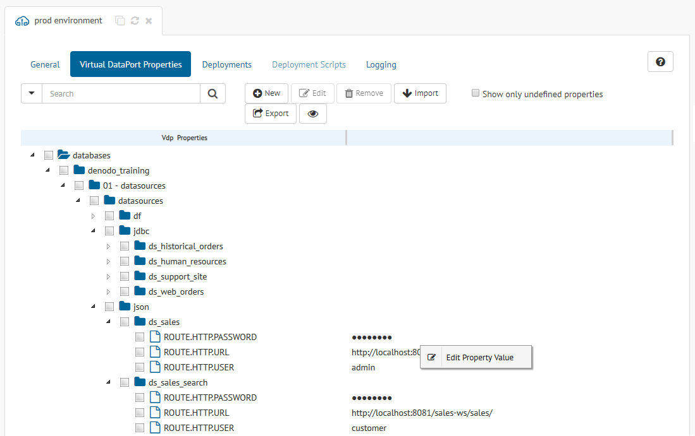

***************************************
Configuring Virtual DataPort Properties
***************************************

.. note:: Only global administrators and promotion administrators
          can manage Virtual DataPort properties. More information is
          available in the :ref:`Authorization` section.

For those scenarios where you work with several environments, Virtual DataPort
allows you to export its metadata in a parameterized way, using two files. On
the one hand, you have a parameterized VQL file with the definition of all the
elements of the catalog; on the other hand, you have a properties file with all
the environment-dependent values, like the URL of a JDBC data source or the
final location of an XML file. Solution Manager makes use of this feature for
:ref:`promoting changes <Promotions>` from one environment to another. The VQL
changes from the source environment are applied to the target environment using
the Virtual DataPort properties from the latter.

.. note:: There is more information about the list of properties considered by
          Virtual DataPort in the section
          :ref:`Export to a File with Properties` of the *Virtual DataPort
          Administration Guide*.

Virtual DataPort properties are administered from the environment dialog.
:ref:`Open it <Configuring Environments>` and go to the section **VDP Properties**.
You will see a dialog like the one below, which displays all the Virtual
DataPort properties of that environment in a hierarchical view.

   Dialog to administer Virtual DataPort properties

Those properties that represent passwords show their values hidden by default.
You can click on the icon |show-passwords-btn| to show the passwords as clear
text.

This dialog allows you to perform the following operations:

* **Add a new property**:  Click the |new-text-btn| button. A new dialog will
  appear. Enter its name and value and confirm.
  
  To assign an undefined value to a property, select the check box **Set as undefined**.
  This is useful if you do not know the
  value of a property but you want to create it anyway. Properties with
  an undefined value are not valid when you deploy or validate a revision. 
  To see the properties with an undefined value, select **Show only undefined properties**.

* **Edit the value of a property**: Right-click the value of a property and
  click on the option |edit-property-text-btn| in the emerging menu. Enter the
  new value for the property in the dialog that appears and confirm.

* **Edit the value of several properties**: Select several properties from 
  the tree and click the |edit-text-btn| button. Enter the new value for the
  selected properties in the dialog that appears and confirm.
  
  .. note:: It is not possible to edit password and normal properties at the same time.

* **Remove properties**: Select several properties from the tree and click the
  |remove-text-btn| button.

* **Import a properties file**: Click the |import-text-btn| button and a new
  dialog will appear.

  .. figure:: environment-import-vdp-properties.png
     :align: center
     :alt: Dialog to drag & drop a file with Virtual DataPort properties
     :name: Dialog to drag & drop a file with Virtual DataPort properties

     Dialog to drag & drop a file with Virtual DataPort properties

  You can drag and drop a file from your machine with Virtual DataPort
  properties. As soon as the upload finishes, a new dialog will appear where
  you can preview and confirm the new values of the properties.

  .. figure:: environment-confirm-import-vdp-properties.png
     :align: center
     :alt: Dialog to confirm the new values of the imported Virtual DataPort properties
     :name: Dialog to confirm the new values of the imported Virtual DataPort properties

     Dialog to confirm the new values of the imported Virtual DataPort properties

  You can restore the old value of a single property, restore the 
  old value of all the properties with the button |copy-all-values-to-left| or edit the new value.
  Also, you can select
  several properties from the tree and click |edit-text-btn| to edit the value 
  of more than one property at one time.
  You can select the check box **Show only properties with distinct values** 
  to filter those properties with actual changes from the previous values.
  Take into account that the imported properties whose value are empty, will lose their old values.

* **Export the properties to a file**: Click the |export-text-btn| button and a
  file will start downloading to your machine with all the Virtual DataPort
  properties. Undefined properties will not be included in the output file.

