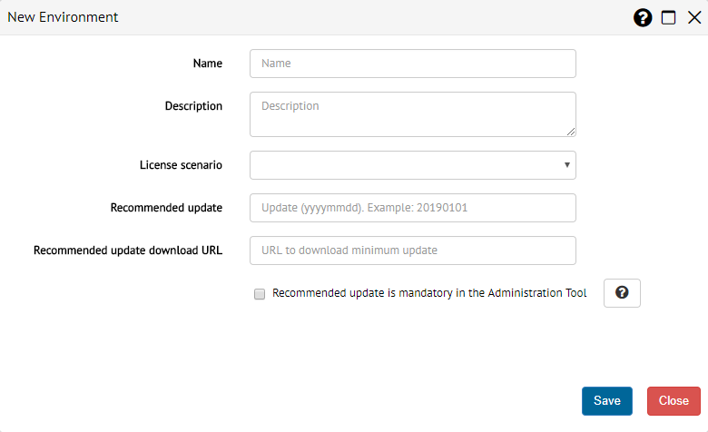
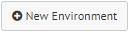

.. _sm-creating-environments:

*********************
Creating Environments
*********************

.. note:: Only global administrators and Solution Manager
          administrators can create new environments. More information is
          available in the :ref:`Authorization` section.

The first step to populate the catalog of the Solution Manager with a model of
your infrastructure is to create an environment. To do this, click the root node of the catalog tree |sm_node| and click |new-environment-text-btn| on the emerging menu.

   Dialog to create a new environment

Provide the following information:

* **Name**: Name of the environment. This
  is the only mandatory field of the dialog. You cannot change the name of an environment after creating it.

* **Description**: Description of the environment.

* **License scenario**: From the available scenarios of the current license
  installed in the Solution Manager, which one is assigned to this environment.
  This parameter will affect the capacities of the servers that belong to the
  environment. More information is available in the :ref:`License Management`
  section.

* **Recommended update**: Minimum update of the Denodo platform, expressed with
  the format ``yyyymmdd`` (e.g. 20181231), that will be required to any Virtual
  DataPort Administration Tool that connects to a Virtual DataPort Server from
  this environment.

* **Recommended update download URL**: URL where the recommended update is
  available to download. In case a Virtual DataPort Administration Tool does not
  fulfill the minimum update required by the field *Recommended update*, a
  message will suggest this URL so the user can download it.

* **Recommended update is mandatory in the Administration Tool**: When this
  field is checked, any Virtual DataPort Administration Tool that does not have
  the recommended update installed will not be able to connect to the server.
  Otherwise, it will only be notified.

.. |sm_node| image:: ../../common_images/solution-manager-node.svg
             :width: 30px

