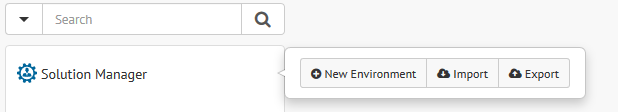

.. _sm-import-export:

=========================
Import and Export Catalog
=========================

.. note:: Only administrators and Solution Manager
          administrators can import or export the Solution Manager catalog.
          More information is available in the :ref:`Authorization` section.

To export the Solution Manager catalog, click the root of the catalog tree (|sm_node|) and click **Export**.

   Import or export the Solution Manager catalog

The export of the Solution Manager catalog includes the following elements in JSON format:

    |yes| Environments basic information.

    |yes| Clusters basic information.

    |yes| Servers basic information.

    |yes| User defined load balancing variables and the values assigned to clusters and servers.

But it doesn't include:

    |no| Virtual DataPort properties assigned to the environments.

    |no| Environments deployments configuration.

    |no| Scheduler properties assigned to the clusters.

    |no| Revisions.

    |no| Deployments.

If you select the ``Import`` option in the emerging menu of the root node, a dialog 
appears to drag the file that contains the Solution Manager catalog in JSON format.

   .. figure:: import-dialog.png
      :align: center
      :alt: Dialog to import the Solution Manager catalog
      :name: Dialog to import the Solution Manager catalog

      Dialog to import the Solution Manager catalog

If the import file contains environments that already exist in the 
Solution Manager database, you will be prompted to confirm the replacement of
these environments.

