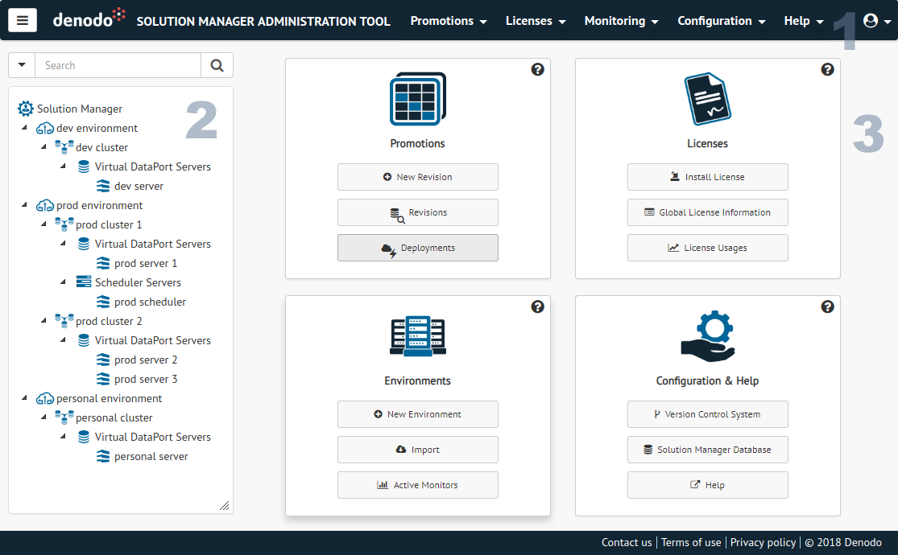

======================================================
Introducing the Solution Manager Administration Tool
======================================================

The default URL for the administration tool of the Solution Manager is http://localhost:19090/solution-manager-web-tool.

After logging in, you will access the main window.
   

   Main window of the Solution Manager Administration Tool

This window is divided into three areas:

#. **Header**: It contains the menus to access the main features of the Solution Manager and a link to logout. 

   - **Promotions**: It contains several options to check your
     :ref:`revisions <sm_revisions_table>`, to supervise the status of your current
     :ref:`deployments <Deployments Table>` or to define new
     :ref:`load balancing variables <Load Balancing Variables>`.

   - **Licenses**: You will find options to check the content of the current
     :ref:`global license <Check Global License Information>`, to monitor the
     :ref:`history of license requests <License Usages Table>` or to
     :ref:`install a new license <Install a License>`.

   - **Monitoring**: You can manage from this menu the
     :ref:`active monitors <sm-monitoring>` that are currently running.

   - **Configuration**: You will find options to set your
     :ref:`Version Control System configuration <sm-vcs-configuration>`, set the
     :ref:`Informative Message configuration <sm-informative-message-configuration>` and
     to change the :ref:`database <sm-database-configuration>` that stores the
     Solution Manager and License Manager metadata.

   - **Help**: You can consult the online documentation of the product or
     information about the product itself from here.
   
#. **Tree area**: It lists the elements defined in your catalog
   organized by :ref:`environments <Environments>`,
   :ref:`clusters <Clusters>` and :ref:`servers <Servers>`. Click on an element to create new subelements.
   Double-click on any node to open its configuration. The nodes of the tree can be expanded or collapsed;
   its state is preserved in the browser using a cookie.
   
#. **Working area**: Main part of this tool, where all the dialogs are displayed. Every dialog opens in a separate
   tab that you can detach into a floating dialog if you want.
