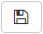

.. _sm_assign_license_to_envitonments:

**********************************
Assign a License to an Environment
**********************************

Denodo License Manager is a centralized place where Denodo servers can obtain
their license. In a regular basis, the servers ask the License Manager for their
license and it provides each one of them with a license according to the
environment they belong to. For this to work, the environment must have a
license scenario assigned.

.. note:: If the scenario of the environment to which the server belongs is
  *Production* and the Denodo global license contains *hot backup* or 
  *cold backup* license scenarios, you can assign a custom license scenario 
  to a server when you are :ref:`creating a new server <sm_creating_servers>` 
  or when you are editing an existent one.

You can assign a license scenario to an environment when you are
:ref:`creating a new environment <sm-creating-environments>` or when you are
:ref:`editing an existent one <Configuring Environments>`. In the latter case,
remember to save your changes clicking the button |save-btn|. To assign a
license scenario to an environment, just choose one of the available scenarios
for the field *License scenario*.

   Assign a license scenario to an existent environment

Check the License Information for an Environment
================================================

At any moment you can check the content of the license that the License Manager
will provide to the servers of a specific environment, according to its license
scenario. In the Solution Manager Administration Tool,
:ref:`open the environment <Configuring Environments>` and click 
|info-btn|, next to the field **License Information**. A new dialog will open
with the features and the restrictions that apply to the servers of that
environment.

   License information for an environment

.. |info-btn| image:: ../../common_images/info-btn.png 