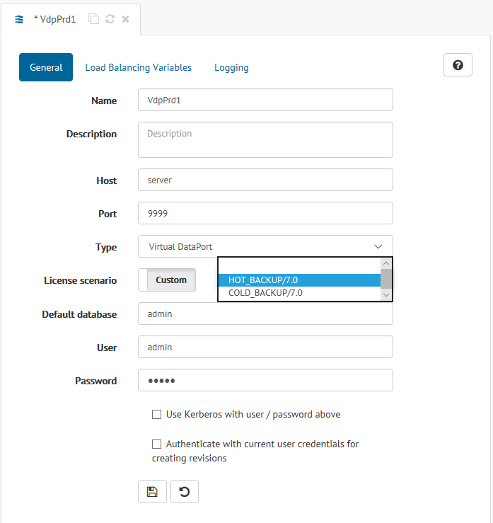

.. _sm_assign_license_to_servers:

****************************
Assign a License to a Server
****************************

The Denodo servers (Virtual DataPort, Scheduler, etc.) request a license to the License Manager when they start. 
In addition, periodically, they
send a request to the License Manager to check that this license is still valid.

If the scenario of the environment to which the server belongs is
*Production* and the Denodo global license contains *hot backup* or 
*cold backup* license scenarios, it is possible to assign a custom *hot backup* or 
*cold backup* license to the server.

You can assign a custom license scenario to a server when you are
:ref:`creating a new server <sm_creating_servers>` or when you are editing an 
existent one. To assign a custom license scenario to a server, just click 
on default license scenario and choose one of the available **hot backup** or 
**cold backup** scenarios for the field *License scenario*.

   Assign a custom license scenario to an existent server
   
This behavior is the same as when :ref:`assigning a license to an environment <Assign a License to an Environment>`.