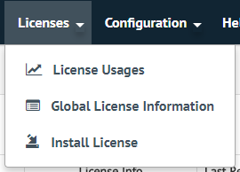
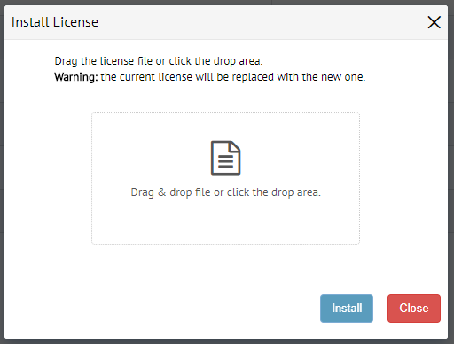
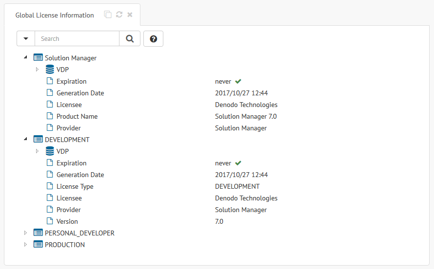

.. _sm_install_license:

*****************
Install a License
*****************

Before running the Solution Manager for the first time, you have to configure
the global license. The *Solution Manager Installation Guide* explains how to
install its first license either
:ref:`during the installation <sm-configure-local-license-installation>` or
:ref:`afterwards <sm-install-license>`.

To install a new global license on the Denodo License Manager, you can use the
Denodo Solution Manager Administration Tool. Open the **Licenses** menu and then
click **Install License**.

   Licenses menu

A dialog will open where you can drag and drop the license file. Alternatively,
you can click in the drop area to browse the file system and select the license
file. Then, click **Install** to start the license installation.

   Install license dialog

If the new license has been successfully installed, the Solution Manager
Administration Tool shows an informative message. Take into account that, at
this moment, the previous global license has already been removed from the
License Manager. On the other hand, if anything goes wrong during the license
installation, an error message will warn you and the License Manager will keep
its previous global license.

Check Global License Information
================================

At any moment you can check the content of the current global license from the
Solution Manager Administration Tool. Go to the **Licenses** menu and click
**Global License Information**. A new tab will open with the features and the
restrictions that apply to the Solution Manager itself and to each one of the
available scenarios.

   Global license information