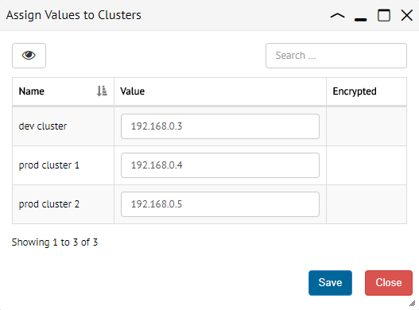
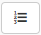

.. _sm_assign_values_to_load_balancing_variables:

***********************************************
Assigning Values to Loading Balancing Variables
***********************************************

In the :ref:`load balancing variables table <load_balancing_variables_table>`,
you can assign values for every non-predefined variable listed. Click the button
|assign-values-btn| of the corresponding row and fulfill the form that opens.
Remember that you can view encrypted values as clear text with the button
|show-passwords-btn|.

    Dialog to assign values to the clusters

Notice that if the load balancing variable applies to clusters, the dialog will
list all the clusters defined in the Solution Manager. On the other hand, if it
is of type server, it will list all the Virtual DataPort servers.

There is an alternative way of assigning values to the load balancing variables.
In the :ref:`configuration dialog of a cluster <Configuring Cluster Load Balancing Variables>`
or of a :ref:`Virtual DataPort server <Configuring Server Load Balancing Variables>`,
you can assign values for all the load balancing variables that apply to that
particular cluster or server. 

.. |show-passwords-btn| image:: ../../common_images/show-passwords-btn.png