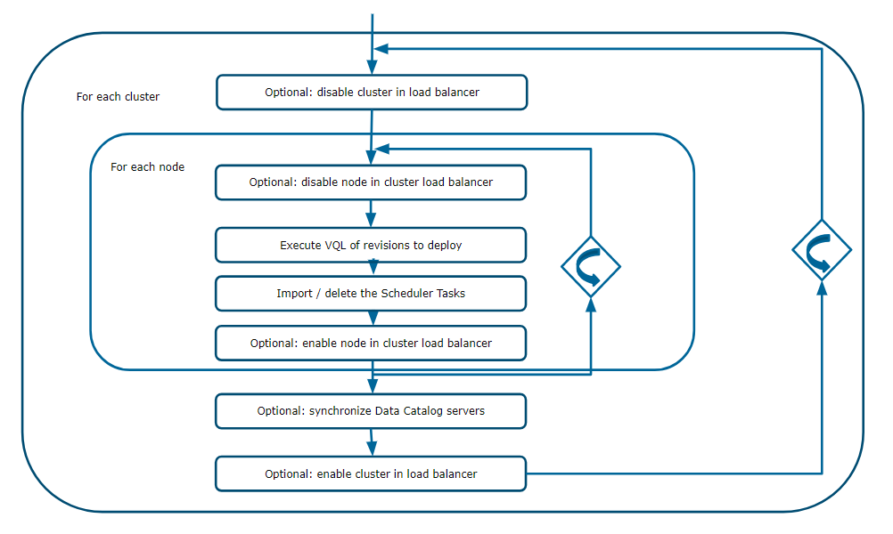
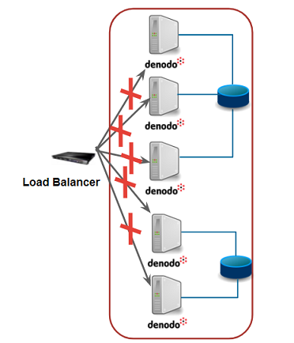
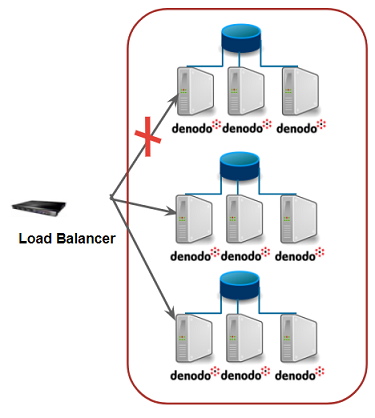
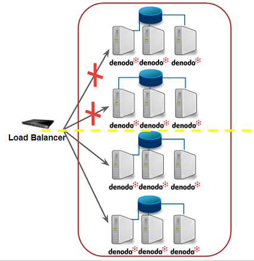
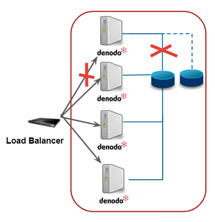
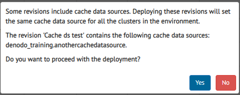

.. _sm_deploying_revisions:

*******************
Deploying Revisions
*******************

.. note:: Only global administrators, promotion administrators and promotion users
          can deploy revisions. More information is available in the
          :ref:`Authorization <Authorization>` section.

A deployment process consists in executing all the changes defined in one or
more revisions in the Denodo servers of an environment. More specifically:

* If a revision has Virtual DataPort elements, the corresponding VQL will be
  executed in all the enabled Virtual DataPort servers that belong to the environment.

* If a revision has Scheduler tasks, they will be created (for *CREATE*
  revisions) or removed (for *DROP* revisions) from the first enabled Scheduler server of each enabled cluster that
  belongs to the environment. When deploying *CREATE* revisions, the Scheduler tasks are always executed.

* If the environment has Data Catalog server synchronization configured, the corresponding Data Catalog
  servers' metadata will be synchronized according to the provided configuration.

The Solution Manager executes first all the revisions in one server before
continuing to the next one. The order in which the servers are selected depends
on how they are arranged in the catalog. Therefore, the first enabled server of the
first enabled cluster of the target environment will be the first server in updating
its metadata.

.. important:: Disabled clusters and clusters with no enabled Virtual DataPort servers will be ignored during the deployment process.

.. important:: The Scheduler tasks are only created / removed and executed (if needed) in the first enabled Scheduler server of each 
   enabled cluster of the environment.
   
   The Scheduler tasks are executed after the changes are deployed in the first Virtual DataPort server of the cluster.
   
   **In order to work properly, each Scheduler task should be pointing to the first enabled Virtual DataPort server in the cluster**. 
   This is to make sure that the Scheduler task finishes correctly if it loads a view whose schema has changed.

The next picture summarizes the basic steps of a generic deployment process:

   Basic steps of a deployment process

The :ref:`deployment configuration <Configuring Deployments>` of the target
environment defines which actions are actually performed during the deployment
process.

Remember that to :ref:`deploy one or more revisions <Deploy Revisions>` you have
to use the |deploy-text-btn| or |deploy-btn| buttons from the
:ref:`Revisions table <sm_revisions_table>`.

Deployment Preconditions
========================

The Solution Manager checks the following before deploying a revision:

#. The user must have permission to deploy revisions on the target environment. The user needs the privilege :ref:`promotion admin <Promotion Administrator>` or :ref:`promotion <Promotion>` over this environment.

#. Deployments must be enabled in the configuration of the target
   environment.

#. There is no other deployment in progress in the target environment.
  
#. The target environment has at least one enabled cluster with at least one enabled Virtual DataPort server.
  
#. If a revision includes one or more Scheduler tasks, the environment must have at least one enabled Scheduler server on each enabled cluster.
  
#. If in the *Deployments* configuration of the target environment, Data Catalog synchronization is enabled, this environment must have at least one Data Catalog registered.

#. The target environment must define all the Virtual DataPort properties of the revision.
   
   If a property is missing of the target environment, you will be able to see
   the validation details at this moment. See sections
   :ref:`Validate a Revision` and :ref:`Deploy Revisions` for more details.

#. Every enabled cluster of the target environment with enabled Scheduler servers must define all the Scheduler properties of the revision.
   
   If a property is missing in a cluster of the target environment, you will be able to see
   the validation details at this moment. See sections
   :ref:`Validate a Revision` and :ref:`Deploy Revisions` for more details.
  
#. The environment configuration has to match the current environment topology.

Additionally, the Solution Manager performs another validations depending on the
:ref:`deployment configuration <Configuring Deployments>` of the environment.
These validations are explained in the following section.

Deployment Paradigms
====================

The Solution Manager offers several options for performing the deployment
process. This section evaluates the advantages and trade-offs of each one of
them.

Simple Deployment
-----------------

This option assumes that the **application service will not be available**
during the whole deployment process. It is intended for offline promotion
scenarios.

The Solution Manager deploys the revisions in all the corresponding servers,
without explicitly disabling any cluster or server in the load balancer.

There is no need to perform any additional validation in simple deployments.

   Simple deployment scenario

Deployment Without Service Interruption
---------------------------------------

Intended for online promotion scenarios, this option maintains the application
service available during the deployment process. However, there may be
inconsistencies while the deployment lasts, since servers with old and new
versions of the metadata might provide service at the same time.

To maintain the application service, the Solution Manager executes scripts to
disable Virtual DataPort servers or clusters in the load balancer and to enable
them again when the deployment finishes. There are two promotion strategies
available that control the interaction with the load balancer:

* **One by one**: The promotion is executed in an incremental way. Only one
  server or cluster is disabled (and then enabled) at a time. This results in
  **longer times of inconsistency**. The inconsistency time grows with the
  number of clusters or servers in the target environment.

   Promotion strategy one by one

* **Half by half**: In this strategy half of the servers or clusters are
  disabled (and then enabled) at the same time. This results in **inconsistency
  for a short time**.

   Promotion strategy half by half

Take into account that the promotion strategy does not affect the deployment
process duration. No matter how many servers or clusters are disabled in the
load balancer at a time, the final servers will be updated one by one.

.. important:: The Solution Manager only enables servers whose deployment
               process finished successfully. In the same way, the Solution
               Manager only enables those clusters where the deployment process
               was successful for all their servers.

The options available for the deployments without service interruption depend on
the topology of the target environment.

Active Passive Load Balancing Considerations
^^^^^^^^^^^^^^^^^^^^^^^^^^^^^^^^^^^^^^^^^^^^

An active/passive cluster consists of one or more active servers and one or more passive standby servers with a load-balancer to determine when failover is required.

In an environment with this architecture we recommend to create / order the servers inside of each cluster putting the **passive servers before the active servers**.

Deployment Without Service Interruption in a Single Cluster Environment
^^^^^^^^^^^^^^^^^^^^^^^^^^^^^^^^^^^^^^^^^^^^^^^^^^^^^^^^^^^^^^^^^^^^^^^

This scenario is designed for environments with **only one cluster** with at
least one Virtual DataPort server. In this case, the Solution Manager Tool
allows to configure:

* The **server promotion strategy**. This policy establishes if the Virtual
  DataPort servers are disabled in the load balancer one by one or half by half.

* If a **secondary shared cache** is available. If enabled, it is necessary to
  provide a main and a secondary cache URL.
  
Secondary shared cache option is useful in those scenarios with shared cache
between all servers. During a deployment with this option enabled, the Solution
Manager:

#. **Calculates the new cache URL**. First, it detects which one of the two
   shared caches (the primary or the secondary) is configured in the first
   Virtual DataPort server. The other cache, the one that is not currently used,
   will be selected as the new shared cache.

#. **Swaps the cache** for each Virtual DataPort server to the new cache before
   deploying all the revisions in that server.

#. **Executes all Scheduler VDP Cache tasks** in order to populate the cache,
   after deploying the revisions in the first Virtual DataPort server.

   Single cluster with shared cache

.. important::  Secondary shared cache option only applies to those deployments
                with at least one *CREATE* revision that contains a Scheduler
                *VDP Cache* task.

.. important:: Currently, the **cache swap process is limited to global cache**, this is, there are no caches defined for particular databases.

In this scenario, the Solution Manager performs the following additional
validations:

* The target environment **must provide scripts to disable and enable Virtual
  DataPort servers** in the load balancer.

* All **load balancing variables that participate as arguments of the scripts
  must have a value** defined for all the Virtual DataPort servers and clusters
  that belong to the target environment of the deployment.

* **All Virtual DataPort servers must have the cache enabled**, if secondary
  shared cache is enabled and at least one *CREATE* revision contains a
  Scheduler *VDP Cache* task.

Deployment Without Service Interruption in a Several Clusters Environment
^^^^^^^^^^^^^^^^^^^^^^^^^^^^^^^^^^^^^^^^^^^^^^^^^^^^^^^^^^^^^^^^^^^^^^^^^

This scenario is designed for environments with **more than one cluster** with
at least one Virtual DataPort server. In this case, the Solution Manager Tool
allows to configure the **cluster promotion strategy**. This policy establishes
if the clusters with Virtual DataPort servers are disabled in the load balancer
one by one or half by half.

In this scenario, the Solution Manager performs the following additional
validations:

* The target environment **must provide scripts to disable and enable clusters**
  in the load balancer.

* All **load balancing variables that participate as arguments of the scripts
  must have a value** defined for all the clusters that belong to the target
  environment of the deployment.

.. note:: When a script is executed, it fails if the execution time reaches the timeout 
   defined in the property ``com.denodo.solutionmanager.scripts.timeoutInSeconds`` 
   of the file :file:`{<SOLUTION_MANAGER_HOME>}/conf/solution-manager/SMConfigurationParameters.properties`. 
   This timeout is measured in seconds. Increase this timeout if the 
   scripts perform complex operations that need more time
   to run.

Cache Limitations
=================

Solution Manager has the following limitations related with cache:

* It is not possible to define Virtual DataPort properties at cluster level. In the case of **cache data sources in multicluster environments**, it is necessary to **configure the cache manually**.
  Due to this limitation, you should not include any cache data sources in *CREATE* revisions, otherwise during the deployment process the cache configuration of all clusters will be overwritten, leaving one of them in a possible inconsistent status. Solution Manager shows a warning message when deploying a revision with the features above: 

   Warning message when deploying revisions with cache data source a in multi-cluster environment.

* **The cache swap process** (in deployments in environments with a single cluster and cache swap enabled) **only works with global cache** (it does not work with caches defined for particular databases). 

  
.. |deploy-text-btn| image:: ../../common_images/deploy-text-btn.png

.. |deploy-btn| image:: ../../common_images/deploy-btn.png