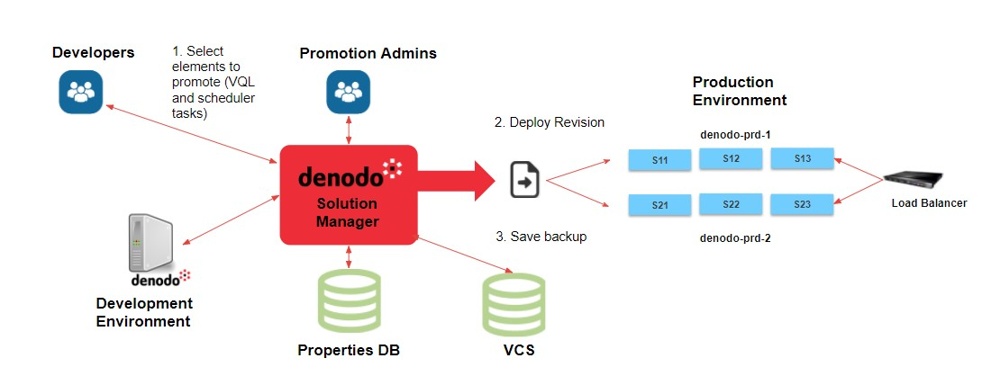

**********
Promotions
**********

Like any other software, the metadata of the Denodo servers evolve in time.
Any change of these metadata has its own lifecycle. It is created in a specific
environment, tested in another one and finally deployed in production. Migrating
these changes from one environment to the next one may be a cumbersome task in
enterprises with large Denodo deployments. Notice that you have to apply the
changes on every server of the new environment, maybe update the content of the
caches and, if you need to maintain the service in the meantime, enable and
disable servers or clusters from your load balancer. The Solution Manager helps
you along the whole process.

In the Solution Manager, a **promotion** takes into account all the tasks that
you should perform to migrate changes in the servers' metadata from one
environment to another. These changes are represented by a **revision**, which
is a collection of Virtual DataPort elements and Scheduler tasks to migrate.
The Solution Manager Administration Tool helps you create revisions. You just
select the elements you want to promote from specific Virtual DataPort and
Scheduler servers. Finally, you can deploy one or several revisions in the
environment you wish. The **deployment** will execute the changes included in
the revisions on every server that belongs to the target environment, updating
the caches if needed and considering the
:ref:`deployment strategies <Deployment Paradigms>` you have
previously configured for that environment.

The following picture summarizes the promotion process:

   Basic promotion example

Along this chapter you will learn how to promote revisions from one environment
to another using the Solution Manager. More in detail, it describes:

*  How to :ref:`create a revision <sm_creating_revisions>`.
*  How to :ref:`load revisions from vql <sm_load_revisions_from_vql>`.
*  The available :ref:`operations with revisions <sm_revisions_table>`.
*  How to :ref:`deploy revisions <sm_deploying_revisions>`.
*  The available :ref:`operations with deployments <sm_deployments_table>`.
*  How to check the :ref:`progress of a deployment <sm_deployment_progress>`.

.. toctree::
   :hidden:
   
   creating_revisions/creating_revisions.rst
   revisions_from_vql/revisions_from_vql.rst
   revisions_table/revisions_table.rst
   deploying_revisions/deploying_revisions.rst
   deployments_table/deployments_table.rst
   deployment_progress/deployment_progress.rst