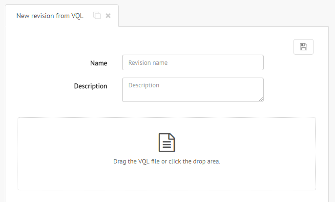
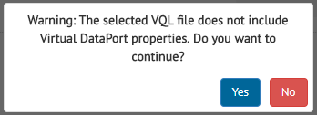

.. _sm_load_revisions_from_vql:

***********************
Load Revisions from VQL
***********************

.. note::
   Only global administrators and promotion administrators can create revisions loading a VQL file. 
   More information is available in the :ref:`Authorization <Authorization>` section.

You can create a revision from a VQL file. In order to do so, go to the :ref:`revisions table <sm_revisions_table>` by clicking in the **Promotions** menu and then **Revisions**.
  
  .. figure:: ../../common_images/promotions_menu.png
     :align: center
     :alt: Open the revisions table 
     :name: Open the revisions table

     Open the revisions table

  Then click the |new-revision-from-vql-btn| button on the header of the table and select the
  source environment.

  .. figure:: ../../common_images/new_revision_access_table.png
     :align: center
     :alt: Load a revision from VQL by clicking the "New Revision from VQL" button in the revisions table
     :name: Create a revision by clicking the "New Revision from VQL" button in the revisions table
  
     Create a revision by clicking the "New Revision from VQL" button in the revisions table

A new tab opens with the *New Revision from VQL* dialog.

New Revision from VQL Dialog
============================

The *New Revision from VQL* dialog looks like the picture below:

   Dialog to create a new revision from VQL

You can fill the following information in the dialog:

- **Name**: Descriptive name for the revision.

- **Description**: Extensive description about the revision. This field is
  optional.

- **VQL**: Dropzone to select the VQL file.

To create a revision, fill the forms, add the VQL file and click the save button |save-btn| on the top.

If the selected VQL file does not have :ref:`Virtual DataPort properties <Configuring Virtual DataPort Properties>`, the next confirmation dialog is shown:

 
   Confirm revision creation without Virtual DataPort properties.	

.. |new-revision-from-vql-btn| image:: ../../common_images/new-revision-from-vql-btn.png

.. |save-btn| image:: ../../common_images/save-btn.png