.. _sm_revisions_table:

***************
Revisions Table
***************

.. note:: Only global administrators, promotion administrators, promotion
          users and developers can see revisions information.
          Developers and promotion users can only see
          their own revisions. More information is available in the
          :ref:`Authorization <Authorization>` section.

To open the *Revisions* table, click the menu **Promotions** > **Revisions**.

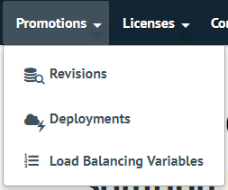

   Open *Revisions* table

A new tab will open, where you can check all the information about revisions and 
perform any available operation with each one of them, according to its current
state.

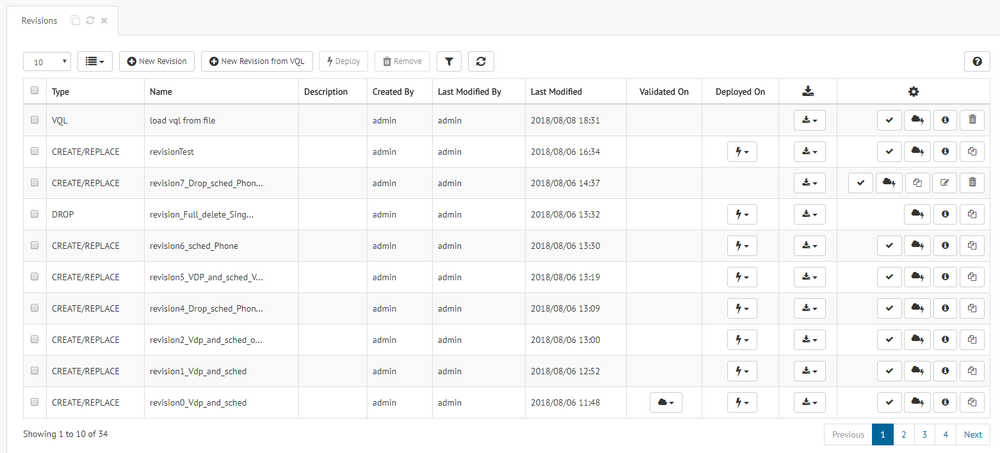

   Example of *Revisions* table

Take into account that the information shown in the *Revisions* table is not
automatically updated once open. Click |refresh-btn| to
refresh the information.

The following sections explain in detail the operations that you can execute on
revisions from this table.

Create a Revision
=================

Click |new-revision-table-btn| to open the *New Revision* dialog. The process
to create a new revision is explained in the section :ref:`Creating Revisions`.

Global administrators and promotion administrators also have the possibility to
create a new revision uploading directly a VQL file clicking the |new-revision-from-vql-btn|. 
The process is explained in the section :ref:`sm_load_revisions_from_vql`.

Edit a Revision
===============

To edit a revision, click |edit-btn|. A similar dialog to the one of
:ref:`creating a revision <Creating Revisions>` will appear. You can change any
value from the *General* pill or update the selected elements in the *Revision
Elements* one. Remember to click the |save-btn| on the top of the dialog to save
your changes.

.. warning:: When you change one of the following fields in the *General* pill,
             the candidate elements to show will change and, therefore, your
             selected elements will be lost:

             * Type

             * Virtual DataPort server

             * Scheduler server

.. note:: Take into account that no global administrator users can only edit their own revisions.
          Moreover, it is not allowed to edit deployed revisions.

.. note:: It is not possible to edit the revisions created uploading a VQL file.

See the Information of a Revision
=================================

Global administrators can edit the revisions of other users. No user can edit a revision that has already
been deployed. Nevertheless, you can check its content in read-only mode. Click
the |search-btn| button and a dialog will appear with all the information about
the revision.

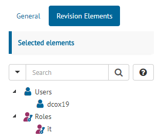

   Revision definition in read-only mode

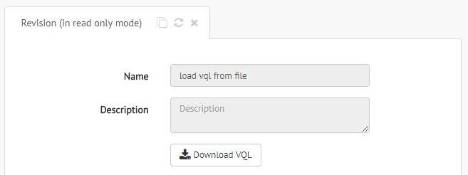

   VQL revision in read-only mode

Remove Revisions
================

You can remove revisions in two different ways:

#. Select several revisions on the table and click the |remove-text-btn| button.

#. To remove only one revision, click the |remove-btn| button on its row.

.. note:: Take into account that only global administrator users can remove other users' revisions.
          Moreover, it is not allowed to remove deployed revisions.

Filter Revisions in the Table
=============================

To apply a filter to the results in the table, click the |filter-btn| button and
fulfill the form in the dialog below.

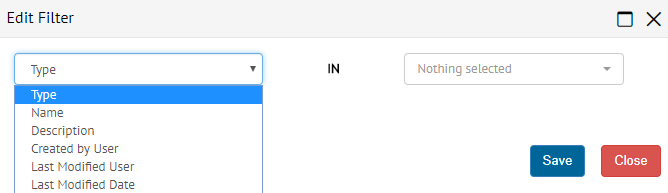

   Filter revisions dialog

A new tag like |filter-tag| will appear above the table to represent what it is
filtering. You can edit the filter clicking its name or remove it clicking its
|remove-filter| button.

You can create more than one filter. The table will show only those revisions
that verify all the filters defined.

Download the Metadata of a Revision
===================================

You can download the generated VQL or the Scheduler tasks zip that will be
deployed for a revision. Click the |download-btn| button and select the
corresponding option in the emerging menu.

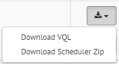

   Download the contents of a revision

Validate a Revision
===================

The elements of a revision may depend on a set of properties, like data source
URIs, user names, passwords... For a deployment to succeed, the target
environment should provide a value for each one of these properties. More
specifically:

* The target environment should define a value for every
  :ref:`Virtual DataPort property <Configuring Virtual DataPort Properties>`
  that parameterizes the VQL of the revision.

* Every enabled cluster of the target environment with Scheduler servers should define
  a value for every :ref:`Scheduler property <Configuring Scheduler Properties>`
  that parameterizes the tasks of the revision.

Before deploying a revision, you can validate that the target environment
defines all the required properties. Click the |validate-btn| button for the
corresponding revision and select the target environment that you want to
validate. You can also add a comment to the validation.

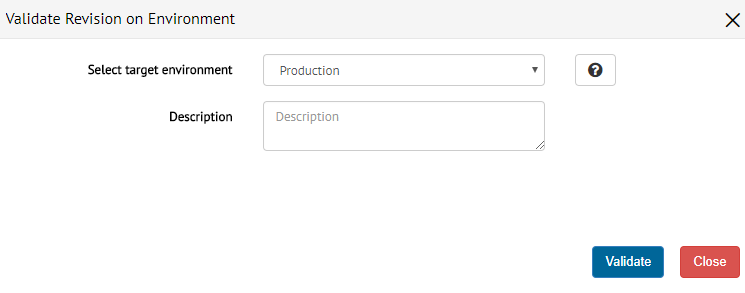

   Select the target environment for a revision validation

When the validation process ends a new dialog will appear with the result. If
there is any property missing, the validation will fail.

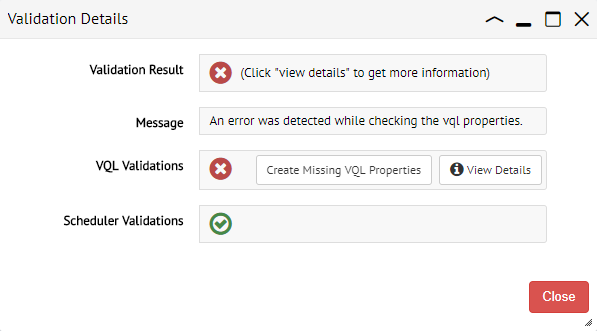

   Dialog with the result of a validation

If the validation fails and you have permission to create properties, the
button |create-missing-vql-properties| will show up. Click it and a
new dialog will show up in which you can create the missing VQL
properties.

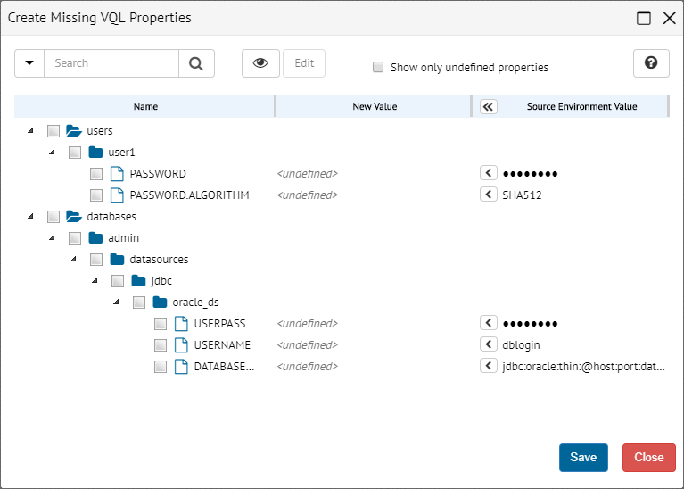

   Dialog with the missing VQL properties

By default, all properties have an undefined value.
You have 3 different options for each property:

a. Keep the undefined value. The validation process will fail if any
   property is undefined and you will not be able to deploy a revision.
#. Fill the value manually.
#. The column **Source Environment Value** contains the values of the properties
   in the environment where the revision was created. You can assign values to
   the properties copying the values from this column to the **New Value**
   column by clicking |copy-value-to-left| or |copy-all-values-to-left|. 
   After saving the missing properties, the validation process will be
   automatically relaunched.

.. note:: The feature of creating missing properties is not available for
          Scheduler properties.

.. note:: Revisions of type **DROP** are not parameterized, so they do not
          support validation.

Check the Validation Summary of a Revision
==========================================

You can check the list of environments where a revision was validated on,
clicking its |validated-on-btn| button. 

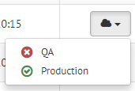

   List of environments where a revision was validated on

If you click one of the environments in the list, you will access the validation
summary for that environment.

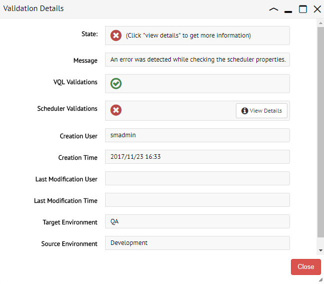

   Validation summary with errors for a revision

For those unsuccessful validations, you can check the list of missing properties
clicking the |details-btn| button.

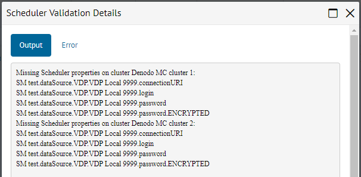

   Missing Scheduler properties for a validation

Copy Revision
=============

Click |copy-revision-btn| to copy a revision. This will open the wizard :ref:`create revisions <Creating Revisions>` with all the information copied from that revision. Then, you can edit anything on this revision and save the new revision.

.. note:: It is not possible to copy revisions of type **VQL**

Deploy Revisions
================

You can deploy revisions in two different ways:

#. Select several revisions on the table and click the |deploy-text-btn| button.

#. To deploy only one revision, click the |deploy-btn| button on its row.

A dialog will appear where you have to select in which environment you want to
deploy the selected revisions. You can also enter a description about the
deployment.

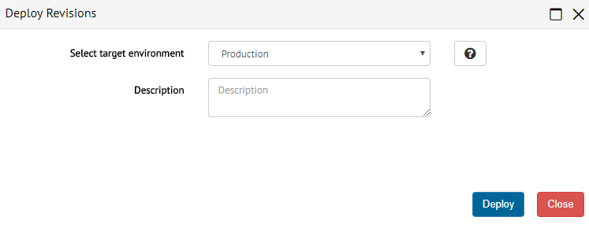

   Select the target environment for a revision deployment

If a property is missing in the target environment, you will be able to see
the validation details at this moment. If you have permission to create
properties, you will also be able to create the missing VQL properties. See section
:ref:`Validate a Revision` for more details. After saving the missing VQL
properties, the deployment process will be automatically relaunched.

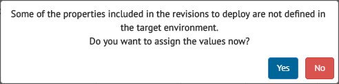

   Confirmation dialog to create VQL missing properties

If the option **Rollback when the deployment fails in the first server** is
enabled for the :ref:`target environment <Configuring Deployments>`, but there
is no backup data available, you will have to confirm that the deployment should
continue anyway.

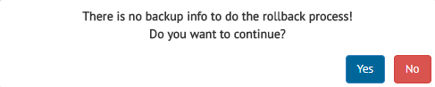

   Confirmation dialog to continue the deployment without a backup

To get more information about the :ref:`status of the deployment <Deployment Progress>`,
you can click on the notification that appears after deploying the revision.

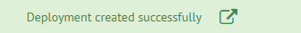

   Notification of successful deployment

.. note:: Remember that developer users cannot deploy their revisions. They can
          only validate them.

.. note:: In the section :ref:`Deploying Revisions` there is a detailed
          explanation on how the deployment process actually works for the
          different available strategies.

Check the Environments where a Revision Was Deployed
====================================================

You can check the list of environments where a revision was deployed on, 
clicking its |deployed-on-btn| button. 

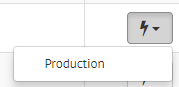

   List of environments where a revision was deployed on

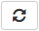

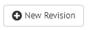

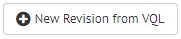

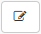

.. |save-btn| image:: ../../common_images/save-btn.png

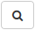

.. |remove-text-btn| image:: ../../common_images/remove-text-btn.png

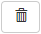

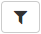

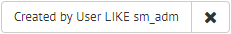

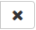

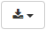

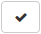

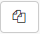

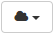

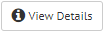

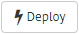

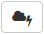

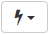

.. |copy-all-values-to-left| image:: ../../common_images/copy-all-values-to-left.png

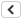

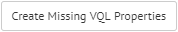