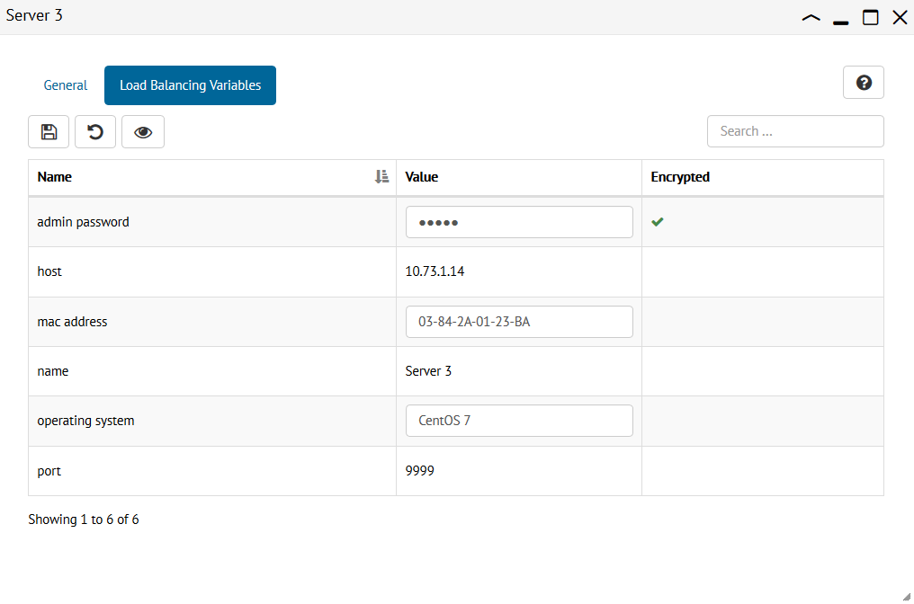

.. _sm_configuring_server_load_balancing_variables:

*******************************************
Configuring Server Load Balancing Variables
*******************************************

.. note:: Only global administrators and promotion administrators can configure server load balancing variables. 
          More information is available in the :ref:`Authorization` section.

Virtual DataPort servers should have a value assigned for every
:ref:`load balancing variable <Load Balancing Variables>` that apply to them.
For a particular server, you can change their values in the pill *Load
Balancing Variables* of the server configuration panel, except for the
predefined variables *name*, *host* and *port*, which are not editable.

    Assign values to the server load balancing variables

You need to confirm the changes clicking the save button |save-btn| or you can
revert unsaved changes clicking the button |revert-btn|. In addition, you can
view encrypted values as clear text with the button |show-passwords-btn|.

.. |save-btn| image:: ../../common_images/save-btn.png 

.. |revert-btn| image:: ../../common_images/revert-btn.png 

.. |show-passwords-btn| image:: ../../common_images/show-passwords-btn.png