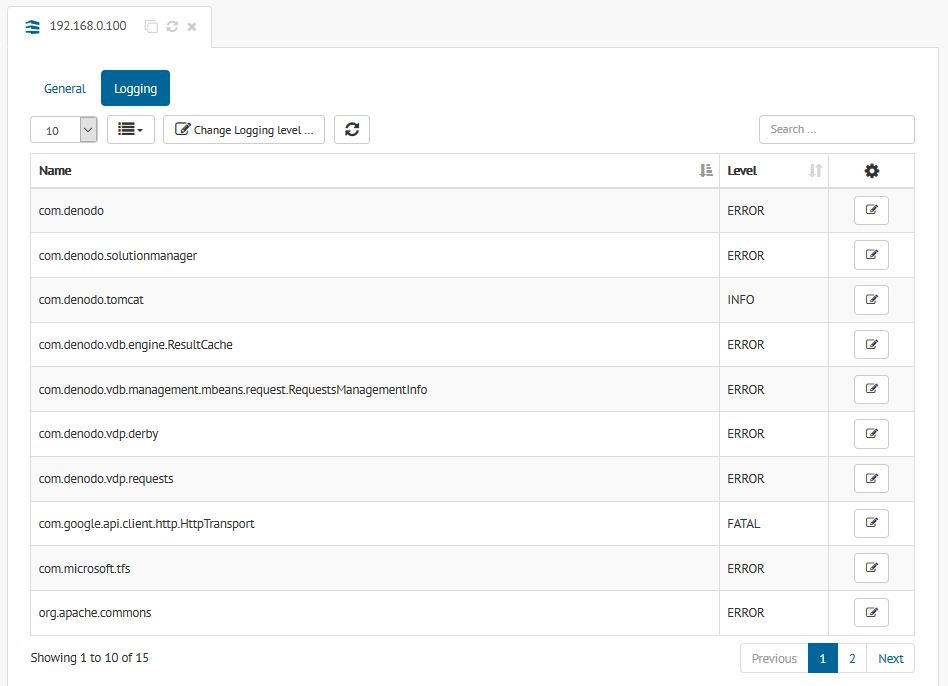
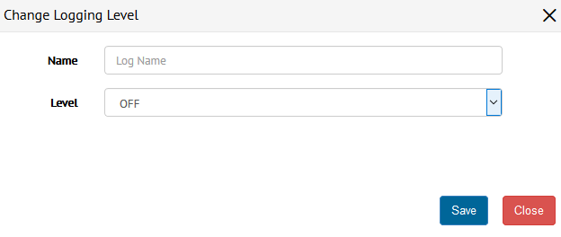

.. _sm_configuring_server_logging:

*********************************
Configuring Server Logging Level
*********************************

.. note:: Only global administrators and JMX administrators
          can change the logging level. More information is available
          in the :ref:`Authorization` section.

The `Logging` section of a server dialog, allows you to view and configure
the logging level of the Virtual DataPort server.

   Dialog to view and configure logging levels

The table shows the list of logging level categories with their assigned level.
You can edit a particular level clicking the |edit-btn| button of any table row.

To create a new log category level, click ``Change Logging Level`` at the top of the table.

   Dialog to change logging level

In the dialog, you should specify the following fields:

* **Name**: Logging category, for example, ``com.denodo``.

* **Level**: One of the following logging levels: **OFF**, **FATAL**, **ERROR**, 
  **WARNING**, **INFO**, **DEBUG**, **TRACE**.

Click **Save** to confirm the changes.

.. |edit-btn| image:: ../../common_images/edit-btn.png 