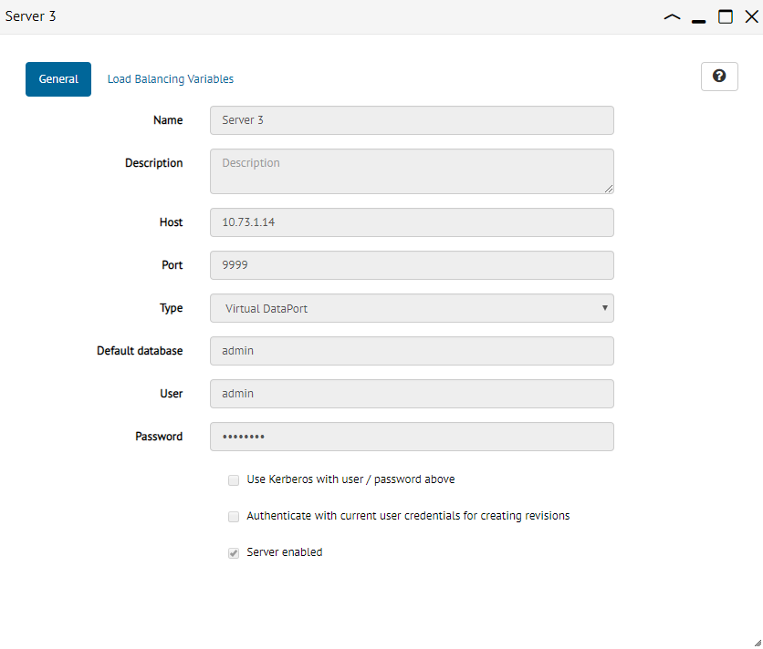

.. _sm_configuring_servers:

*******************
Configuring Servers
*******************
.. toctree::
   :hidden:
   
   configuring_server_load_balancing_variables.rst
   configuring_server_logging.rst
   
You can open a server to check and edit all the information related to it. To open it, double-click its node (|server_node|). A new tab will be displayed.

   Server configuration dialog

The available options in this dialog depend on the :ref:`privileges <Authorization>` granted to you:

-  Developers can see the configuration of the server but not modify it.
-  Administrators can modify the information of the server but not view or modify the 
   the load balancing variable values of the server.
-  Promotion administrators can see the configuration of the server but not modify it. They can manage the :ref:`load balancing variables <sm_configuring_server_load_balancing_variables>` of the servers.
-  JMX administrators can see the configuration of the server but not modify it. They can manage the logging level of the Virtual DataPort servers.
-  Global administrators do not have any restriction.

.. |open-text-btn| image:: ../../common_images/open-text-btn.png
