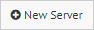
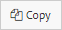

.. _sm_creating_servers:

****************
Creating Servers
****************

.. note:: Only global administrators and Solution Manager administrators can create servers. More information is available in the :ref:`Authorization` section.

To create a server, click on a cluster (|cluster_node|), and on the popup that will show up, click |new-server-text-btn|.

You can also create a server based on the configuration of an existing server, click on that server and on the popup that will show up, click |copy-server-text-btn|.

The Tool will display the dialog to create a server.

   .. figure:: create_server_dialog.png
      :align: center
      :alt: Dialog to create a server
      :name: Dialog to create a server

      Dialog to create a server

Enter the value for the following fields:

* **Name**. Name of the server. This name has to be unique. You cannot assign the same name to two servers, even if they are in different environments or clusters.

* **Description** (optional). Description of the server.

* **Host**. Name of the host where the Denodo server runs. Enter the full host name of the machine, not an alias. 
  That is because what you enter here has to match what that machine considers it is its host name. 
  See more about this in the section :ref:`How Licenses Work`. Alternatively, you can enter the IP address the host. 
  However, entering a host name is better because the host name of a host is usually more permanent than its IP.

* **Port**. Port where the server component listens to incoming requests.

* **Type**. Type of server component. Its value can be:

  - **Virtual DataPort**

  - **Scheduler**

  - **ITPilot Browser Pool** or **ITPilot Verification**. This kind of
    servers are only intended to provide a license dynamically through the
    :ref:`License Manager <License Management>`. These services do not support revisions nor promotions.

  - **Data Catalog**. It is not necessary to define the Data Catalog
    servers in Solution Manager to get the license. You can add Data
    Catalog servers in a cluster to provide optional synchronization
    with the Virtual DataPort servers during the :ref:`deployment process <sm_deploying_revisions>`.
    
* **Default database**. Database for authentication. Only required for the Virtual DataPort servers.

* **User** and **Password**. Credentials to connect to the server.

  .. important:: If you are creating a *Data Catalog* server, this user must have the role *data_catalog_admin* role. Otherwise, the synchronization of metadata will fail.
  
* **Use Kerberos with user/password above**. Select this to use Kerberos authentication to connect to the server. A Kerberos ticket will be obtained using the values of the fields *User* and *Password*. This
  option is only available for Virtual DataPort servers and if :ref:`Kerberos is enabled <Authenticating with Kerberos>` in the Solution Manager.
  
  The Solution Manager will not be able to deploy revisions to Scheduler when Scheduler has Kerberos authentication enabled.

* **Authenticate with current user credentials for creating revisions**. Select this
  to :ref:`create the revisions <Creating Revisions>`
  using the credentials of the user that is logged in the Solution Manager, instead of the credentials of this dialog. 

* **Server enabled**. If you clear this, the server will be ignored when deploying a revision. The disabled servers are displayed in gray in the environments tree.

* **License Scenario**. If the *license scenario* of the environment of this server is *PRODUCTION* and the license allows servers of type *HOT BACKUP* or *COLD BACKUP*, you can assign a custom backup scenario to this server. To do this, click **Default** to change to *Custom* mode and then, select **HOT BACKUP** or **COLD BACKUP**.

  Otherwise, this option is not displayed.

  .. figure:: custom_license_scenario.png
     :align: center
     :alt: The license scenario assigned to the server is a custom license scenario
     :name: Custom license scenario
  
.. note:: You cannot register two servers with the same host name and port.

.. |cluster_node| image:: ../../common_images/cluster-node.svg
                  :width: 30px

.. |server_node|  image:: ../../common_images/server-node.svg
                  :width: 30px

