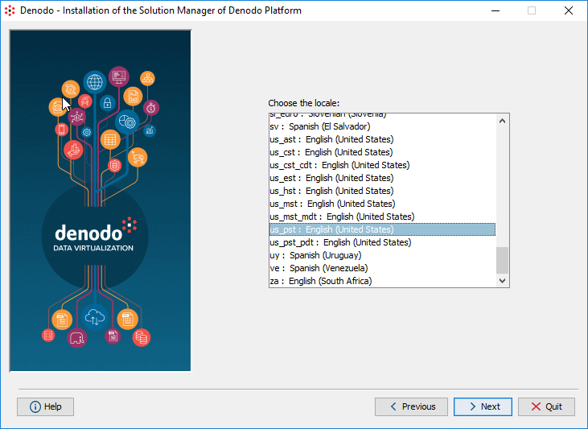

================
Commons Settings
================

When you select *Custom Installation* in the step 2 of the installation
wizard, you can configure the internationalization configuration for the
Solution Manager.

   Choosing the internationalization configuration
