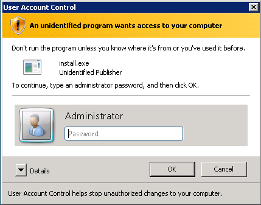
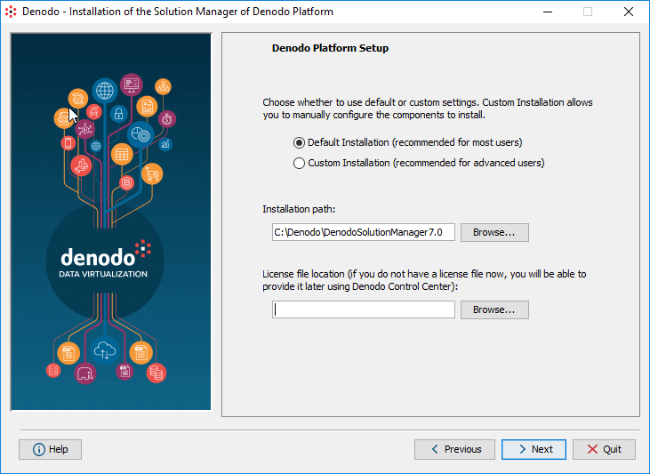
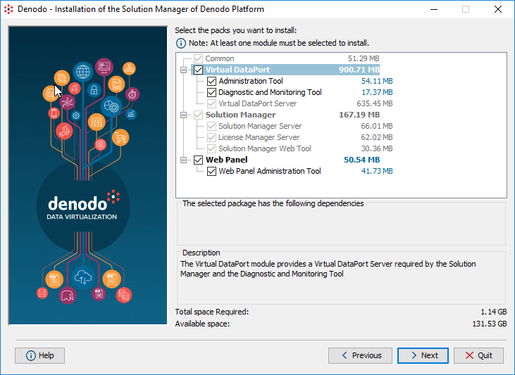

=======================================
Using the Graphical Installation Wizard
=======================================

.. toctree::
   :hidden:

   commons_settings/commons_settings.rst
   components_and_configuration_of_virtual_dataport/components_and_configuration_of_virtual_dataport.rst
   components_and_configuration_of_solution_manager/components_and_configuration_of_solution_manager.rst
   components_and_configuration_of_web_panel/components_and_configuration_of_web_panel.rst
   embedded_web_container/embedded_web_container.rst

This section explains how to use the graphical installer of the Solution Manager.

To install the Solution Manager on a host without graphical environment,
jump to the next section (:doc:`Using the Command Line Installer <../using_the_command_line_installer/using_the_command_line_installer>`).

To do an unattended installation, see the section :ref:`Unattended Installation of the Denodo Platform`.

.. important:: We recommend installing all the modules of the Solution Manager even if right now, you do not plan on using all of them. That is because the installer cannot add modules to an existing installation. If in the future, you want to use a module that is not installed, you would have to install and configure the Solution Manager again.

|

After downloading the installer (see the section :doc:`Download the Installer <../preinstallation_tasks/download_an_installer/download_an_installer>`
to see which installer you need), decompress it and launch it by doing
the following:

**On Windows**, go to the directory ``denodo-install-solutionmanager-7.0``, right-click ``install.exe`` and click **Run as administrator**. If the
Windows User Account Control is enabled, you will see a dialog like the
following, in which you
have the enter credentials of an administrator user.

   Administrator credentials request dialog

**On Linux**, execute the following:

.. code-block:: bash

   cd denodo-install-solutionmanager-7.0
   chmod +x install.sh
   ./install.sh

|

The wizard will guide you through the installation steps. In addition,
you can always click the *Help* button of the wizard to obtain
assistance during the installation process.

Click **Next** to jump to Step 1.

|

**Step 1**

The wizard will display the product licensing conditions. Read them
carefully and if you accept them, select **I accept the terms of this
license** and click **Next**.

|

.. _sm-configure-local-license-installation:

**Step 2**

Select an installation mode:

#. **Default Installation**: recommended for most
   users. You can select the modules you want to install and they will
   be installed with their default configuration values.

   With the default installation, the Solution Manager servers will listen for
   incoming connections on the default ports. See the list ports in
   the appendix :ref:`Default Ports Used by the Solution Manager Modules`.

#. **Custom Installation**: recommended for advanced users. You will be
   able to set the values of several configuration parameters such as
   the ports where the Solution Manager servers will listen for incoming
   connections.

   Step 2: selecting the installation method

Enter the **Installation path** where the Solution Manager will be installed. 

.. important:: 

   -  The installation path must not contain spaces (e.g. ``C:\Denodo\DenodoSolutionManager7.0``). Otherwise, the connection to some parallel processing databases will not work.

   -  The Denodo Platform writes data in the directory where is installed so the user that launches the Denodo servers needs to be able to write files there.

   -  If installing on Windows, the installation path cannot include
      “junctions” (`Junction Points - Microsoft Developer Network <https://msdn.microsoft.com/en-us/library/bb756982.aspx>`_).

|

In the field **License file location** enter the path to the license file provided by Denodo. If you do not have one yet, leave this box empty.
In this case, the Solution Manager will be installed without a license but you can provide one later (the section :doc:`Install the License <../postinstallation_tasks/license_installation/license_installation>` explains how to do this)

|

**Step 3**

Select the modules and components you want to install.

   Step 3: selecting the modules to install

If you selected the *custom installation*, to save this summary, click **Save**.

|

Before the installer begins copying the
necessary files (this process may take several minutes), the installer
will display a summary of the installation configuration. You can save the summary in plain text or HTML by clicking
the **Save** button.

Finally, the installation process can create shortcuts in the menus of
the operating system to launch the :doc:`Denodo Platform Control Center <../denodo_platform_control_center/denodo_platform_control_center>`.