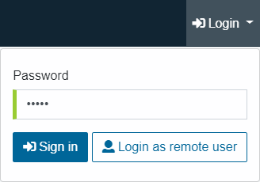
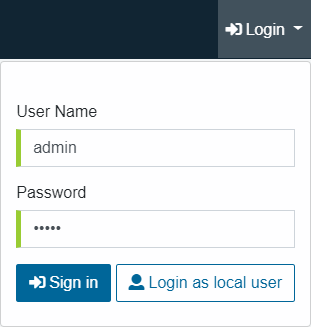

.. _web_panel_authentication:

==============
Authentication
==============

.. note:: These options are only available when accessing the Web Panel
   Administration Tool in administration mode 
   (http://localhost:19090/webpanel/#/admin). Keep in mind that if you 
   are using Kerberos authentication, you must access the Web Panel using the 
   *Fully Qualified Domain Name* defined by the configured 
   *Server Principal Name*.

There are three types of authentication:

-  **Local-based authentication**. This authentication type can be used
   to configure the Kerberos settings or the Virtual DataPort server used for 
   authenticating to the Web Panel Administration Tool.

   To use this type of authentication, click **Login as local user** in the 
   **Login** dropdown. With this type of authentication, you can only use the 
   local administrator user whose password is “admin” by default.
   
   Once you log in for the first time using this authentication method, we
   recommend changing the password of the local administrator user. To do this,
   click **Change password** on the top right of the site (under the user icon).

   
   Login as a local administrator in the Web Panel

-  **VDP-based authentication** (default option). With this option, the
   tool delegates the authentication of users to Virtual DataPort.
   Therefore, you have to use the same login and password that you use in
   the Virtual DataPort Administration Tool.

   Login as a Virtual DataPort user in the Web Panel

When you select “VDP-based authentication”, the Virtual DataPort server checks
that the provided credentials are valid and that the user has the
privileges granted to connect to the Tool. Take the following into
account: only the global administrators of the server and the users with the
role *web_panel_admin* can administer the Web Panel.

- **Kerberos authentication**. To enable Kerberos authentication for the Web 
  Panel you must follow these steps:
  
  #. Perform the post-installation tasks described in the section :ref:`Setting-up
     Kerberos Authentication` of the Installation Guide.
  
  #. Enable and configure Kerberos in the Web Panel, as
     described in :doc:`Kerberos Configuration <../configuration/configuration>`.
  
  #. `Configure Kerberos in your browser
     <https://www.oracle.com/technetwork/articles/idm/weblogic-sso-kerberos-1619890.html>`_.
  
  .. important:: To access the Web Panel Administration Tool in administration
     mode, remember to
     use the Fully Qualified Domain Name of the Server Principal Name you
     configured in the Web Panel Administration Tool. For
     example, if your Server Principal Name is
     ``HTTP/denodo-prod.subnet1.contoso.com@CONTOSO.COM``, you should access the
     Web Panel Administration Tool through 
     ``http://denodo-prod.subnet1.contoso.com:19090/webpanel/#/admin`` or 
     ``https://denodo-prod.subnet1.contoso.com:19443/webpanel/#/admin``.  
