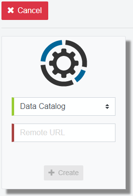

===========================
Web Applications Management
===========================

.. note:: These options are only available when accessing the Web Panel
   Administration Tool in administration mode 
   (http://localhost:19090/webpanel/#/admin). Keep in mind that if you 
   are using Kerberos authentication, you must access the Web Panel using the 
   *Fully Qualified Domain Name* defined by the configured 
   *Server Principal Name*.

You can enable access to remote web applications in the **Remote** section
(click **Remote** in the top navigation bar). Here you can click **Add** to
configure access to a *Data Catalog* or a *Scheduler Administration Tool*. You 
only need to choose the type of web application and introduce its URL. For 
instance, \http://acme.com:9090/denodo-data-catalog for a
*Data Catalog* or \http://acme.com:9090/webadmin/denodo-scheduler-admin for a 
*Scheduler Administration Tool*. 

.. note:: The configured URL will be the only one used to access the 
   corresponding web application: if you want
   to use ``https`` or Kerberos authentication to access it, you must set the 
   appropriate URL. For instance, you will need to
   use the *Fully Qualified Domain Name* defined by the *Server Principal Name* 
   in order to access the web application with Kerberos.

Note that you can only add one web application of each kind.

You can also remove a remote web application from the Web Panel or edit its URL.

   Configuring access to a Data Catalog

While in administration mode, it is also possible to start and stop local web
applications (the *Diagnostic & Monitoring Tool* and the 
*Solution Manager Web Tool*). To do this, go to **Home** and click **Start** or 
**Stop** on the desired web application.
