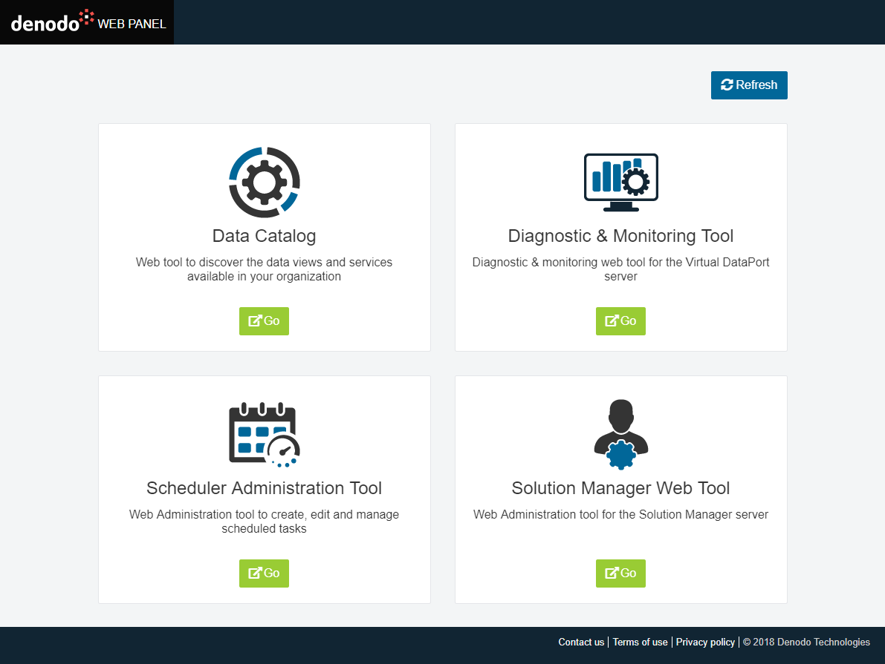
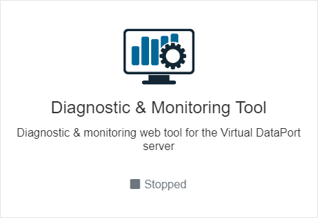
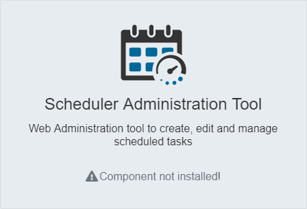

==========================
Accessing Denodo Web Tools
==========================

From the Web Panel home page, you can access several Denodo web applications:

- Applications that are local to the Web Panel installation:

  - :ref:`Diagnostic & Monitoring Tool <Diagnostic & Monitoring Tool Guide>`
  - :ref:`Solution Manager Web Tool <Solution Manager Administration Guide>`
  
- Applications in other installations (these are optional and must be 
  :ref:`added by an administrator <Web Applications Management>` if needed):
  
  - :ref:`Data Catalog <Data Catalog Guide>`
  - :ref:`Scheduler Administration Tool <Scheduler Administration Guide>`
  
To access a web application, click **Go** (this will only be enabled if the
web application is detected to be running). You can refresh the status of the 
web applications by clicking **Refresh**.

   Web Panel home

   
   Stopped web application
   
Unavailable web applications will show a *Component not installed!* warning.
Local web applications will be unavailable if they are not included in the 
same installation as the Web Panel, while applications in other installations 
will not be available until an administrator has 
:ref:`added<Web Applications Management>` them to the Web Panel.

   
   Unavailable web application
