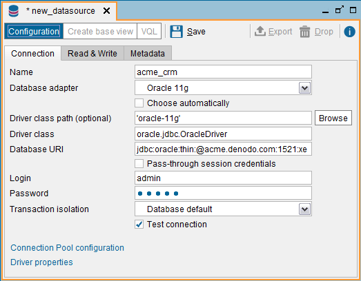
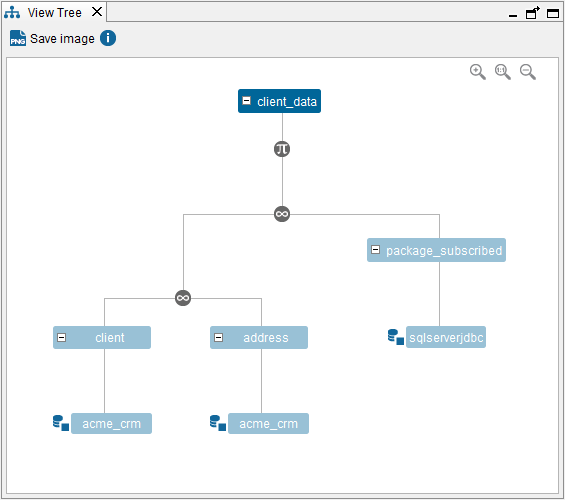
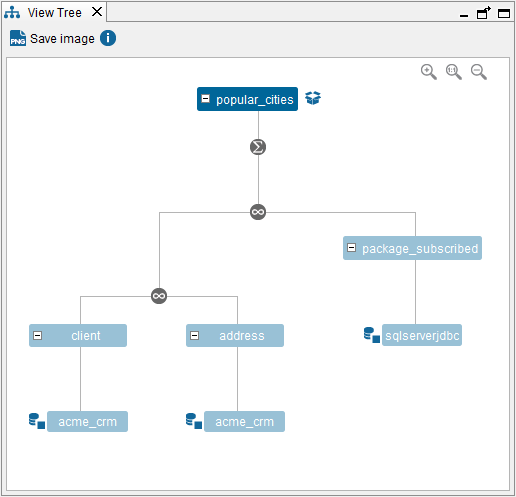
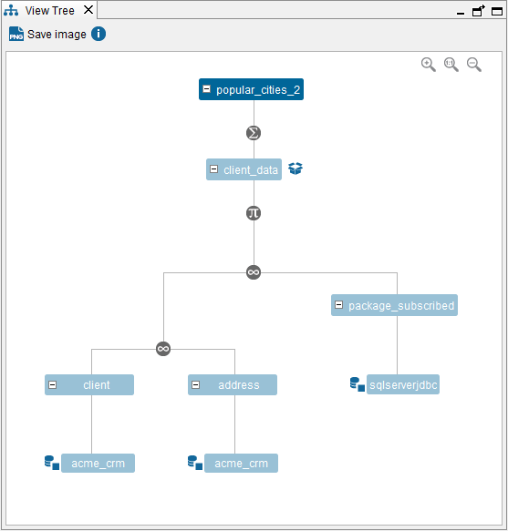
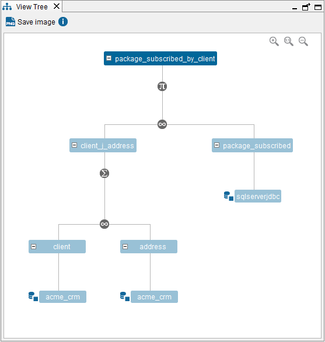

==========================================================================
Considerations When Configuring Data Sources with Pass-Through Credentials
==========================================================================

In Virtual DataPort, some data sources support “pass-through
credentials”. That is, when a query involves a data source with this
feature enabled, Virtual DataPort will connect to this source using the
credentials of the user that executes the query.

This allows leveraging the existing authentication and authorization
system of the organization.

When “pass-through credentials” is enabled in a data source, the “Login”
and “Password” fields are only used at design-time to inspect the
sources and test that the connection to the source can be established.

The main reasons for enabling this feature are:

-  To take advantage of the authorization restrictions, usually per row
   and/or column, in the underlying sources that may vary depending on
   the user or role. Therefore, Virtual DataPort must use the user’s
   credentials to connect to the source in order to prevent obtaining
   unauthorized information.
   
   .. note:: Denodo role-based permissions also allow specifying access
      restrictions at schema, row and column level, and it applies to any
      kind of data source (no matter if the data source allows such
      authorization restrictions or not).

-  Auditing purposes, if the underlying database needs to keep track of
   which users accessed what information.

There are some considerations to take into account when pass-through credentials is enabled on a data source
and cache is enabled.

   JDBC data source with “Pass-through session credentials” enabled

The credentials of the data source are used only to
introspect the database (see the schemas of the database in JDBC
data sources, the operations of a Web service, etc.).

At runtime, when a query involves a data source with pass-through
session credentials, Virtual DataPort will use the credentials
of the user who is executing the query, to connect to the database.

The Cache Module, to determine whether the data requested is available
or not in the cache, does not check which user issued the query that
populated the cache. Thus, depending on the authorization restrictions in
place within the underlying sources, you have to consider some extra
steps to use the cache and get appropriate results.

For example, let us say that we have a view called ``CLIENT_DATA`` whose
data is obtained from two data sources. One of the sources is called
``ACME_CRM``, has pass-through credentials enabled and it returns
different data depending on the user. For performance reasons, we would
like to cache the results of ``CLIENT_DATA``.

   Tree View of the view “CLIENT\_DATA”

Let us say that the query that populates the cache is executed by a user
whose privileges in ``ACME_CRM`` define a column restriction that masks
a column with ``NULL`` values and a row restriction that prevents her
from obtaining all the rows.

If after this, a user with full privileges executes the same query, the
data will be obtained from the cache. The result will be different from
a result returned by the source because the two users have different
privileges.

There are two options to solve these issues:

a. Do not use cache in these cases and always get the data from the data
   source.

b. If caching the data is a requirement, there are some extra
   considerations:

   -  The cache must be populated using a user without restrictions in the underlying database. Thus,
      the standard approach where the first query fills the cache and it
      expires using the TTL is not valid. Schedule the queries that load
      the cache and execute them with a user with no restrictions.
   
   -  Enabling "pass-through session credentials" *on the cache
      data source* has the following implications *for views with cache mode full*:
      
      i. The cache engine uses the credentials of the user - not the data source - to execute queries on the cache database.
      
      #. The cache engine uses the credentials of the data source - not the ones of the user that executes the query - 
         to create the necessary tables on the cache database and insert data in these tables.

      .. note:: "Consider the security 
         implications of enabling "pass-through session credentials" on 
         the cache data source. If you enable this option, you will need to grant read access to 
         these users on the cache database. These users will be able to connect directly 
         to this database, not just from Denodo and they will be able to by-pass the row restrictions, column 
         restrictions and other privileges set in Denodo.

   -  For views with cache mode partial, the cache engine always uses the credentials of the data source - not the ones of the user that 
      executes the query - to create the necessary tables on the cache database, insert data in these tables and query these tables. 
      This is the behavior regardless of if "pass-through session credentials" is enabled or disabled.

   -  The authorization rules defined in the database have to be duplicated
      in the derived view of interest, using the row and column
      restrictions and the masking support of Virtual DataPort (see more
      about these in the section :ref:`Types of Access Rights`)
   -  If the queries will have aggregation operations (``GROUP BY``,
      ``HAVING`` ...), the aggregations have to be performed over the cached
      view. Otherwise, aggregated fields such as ``COUNT(*)`` may contain
      erroneous results.
      In the following figure, you can see that the aggregation (|image2|) 
      is performed “before” the data is cached, which may lead to
      wrong results.

   Example of pass-through credentials that may lead to incorrect results

In the following figure, the aggregation is performed over the view with
cache enabled. This way, the aggregation can be done on top of the
correct results if the appropriate row restrictions are set in the
``CLIENT_DATA`` view.

   Example of pass-through credentials used correctly

The cache of a view should *not* be enabled in the following scenario:

-  The data source has pass-through credentials enabled
-  The query delegated to the database has an aggregation operation
-  And, the values obtained for the projected fields in the aggregation,
   depend on the user who launches the query (like in the ``COUNT(*)``
   example, mentioned above)

The following figure displays a scenario where pass-through credentials
should not be enabled.

   Scenario where pass-through credentials should not be enabled

Web Services
============

When creating a REST or SOAP web service with SAML or OAuth authentication, do not publish views whose data comes from data sources with *pass-through authentication*. The requests to these views will fail. That is because, when an application sends a request with SAML or OAuth authentication, it does not send a user/password. Instead, it sends an *OAuth access token* or a *SAML assertion*, from which is not possible to obtain a user and password to pass to the data source.

