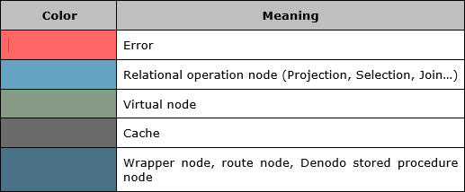
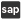

===========================
Execution Trace Information
===========================

When executing a query using the Administration tool, you can see a
graphical representation of the execution trace of the query, by
clicking the button **View execution trace**.

The following tables explain the meaning of the information provided by
the trace:

-  `Icons of the execution trace and their meaning`_ provides the meaning
   of the icons displayed in the execution trace.

-  `Color code of the nodes of the execution trace`_ provides the meaning
   of the color of the trace's nodes.

-  `Values of the "State" attribute of the nodes of a query's execution
   trace`_ lists the possible values of the attribute “State” of the
   trace’s nodes.

.. table:: Icons of the execution trace and their meaning
   :name: Icons of the execution trace and their meaning
   
   +-------------------------+---------------------------------------------------+
   | Icon                    | Meaning                                           |
   +=========================+===================================================+
   | |image0|                | Flatten                                           |
   +-------------------------+---------------------------------------------------+
   | |image1|                | Group By                                          |
   +-------------------------+---------------------------------------------------+
   | |image2|                | Interface                                         |
   +-------------------------+---------------------------------------------------+
   | |image3|                | Intersection                                      |
   +-------------------------+---------------------------------------------------+
   | |image4|                | Join                                              |
   +-------------------------+---------------------------------------------------+
   | |image5|                | Minus                                             |
   +-------------------------+---------------------------------------------------+
   | |image6|                | Projection                                        |
   +-------------------------+---------------------------------------------------+
   | |image7|                | Selection                                         |
   +-------------------------+---------------------------------------------------+
   | |image8|                | Subquery                                          |
   +-------------------------+---------------------------------------------------+
   | |image9|                | Union                                             |
   +-------------------------+---------------------------------------------------+
   | |image10|               | Void. This branch of the execution                |
   |                         | plan has not been executed.                       |
   +-------------------------+---------------------------------------------------+
   | |image11|               | Intermediate results were swapped to              |
   |                         | disk                                              |
   +-------------------------+---------------------------------------------------+
   | |image12|               | Data was obtained from the cache of               |
   |                         | the view.                                         |
   +-------------------------+---------------------------------------------------+
   | |image13|               | The node has additional information               |
   |                         | such as:                                          |
   |                         |                                                   |
   |                         | -  A function / operation cannot be               |
   |                         |    delegated to the data source                   |
   |                         | -  The selection has not been                     |
   |                         |    executed because it contains                   |
   |                         |    incompatible conditions                        |
   +-------------------------+---------------------------------------------------+
   | |image14|               | Route plan                                        |
   +-------------------------+---------------------------------------------------+
   | |image15|               | Virtual Plan: node that appears in                |
   |                         | the execution trace when the                      |
   |                         | execution of a derived view is                    |
   |                         | entirely pushed down to the data                  |
   |                         | source.                                           |
   +-------------------------+---------------------------------------------------+
   | |image16|               | Root node of ``SELECT INTO``                      |
   |                         | queries. It indicates that the                    |
   |                         | results of the query have been                    |
   |                         | inserted in a materialized table                  |
   |                         | (see section :ref:`Materialized                   |
   |                         | tables` of the VQL Guide)                         |
   +-------------------------+---------------------------------------------------+
   | |image17|               | Data Movement. It indicates that the              |
   |                         | data obtained from a view has been                |
   |                         | “temporary” inserted into another                 |
   |                         | data source. The section :ref:`Data               |
   |                         | Movement` explains the Data                       |
   |                         | Movement optimization.                            |
   +-------------------------+---------------------------------------------------+
   | |image18| and |image19| | JDBC data source and base view                    |
   +-------------------------+---------------------------------------------------+
   | |image20| and |image21| | ODBC data source and base view                    |
   +-------------------------+---------------------------------------------------+
   | |image22| and |image23| | Multidimensional data source                      |
   +-------------------------+---------------------------------------------------+
   | |image24| and |image25| | Web service data source                           |
   +-------------------------+---------------------------------------------------+
   | |image26| and |image27| | XML data source                                   |
   +-------------------------+---------------------------------------------------+
   | |image28| and |image29| | JSON data source                                  |
   +-------------------------+---------------------------------------------------+
   | |image30| and |image31| | DF data source                                    |
   +-------------------------+---------------------------------------------------+
   | |image32| and |image33| | WWW data source (ITPilot)                         |
   +-------------------------+---------------------------------------------------+
   | |image34| and |image35| | LDAP data source                                  |
   +-------------------------+---------------------------------------------------+
   | |image38| and |image39| | Google Search data source                         |
   +-------------------------+---------------------------------------------------+
   | |image40| and |image41| | BAPI data source (SAP ERP)                        |
   +-------------------------+---------------------------------------------------+
   | |image42| and |image43| | Custom data source (Custom wrapper)               |
   +-------------------------+---------------------------------------------------+
   | |image44| and |image45| | Stored procedure                                  |
   +-------------------------+---------------------------------------------------+

   Color code of the nodes of the execution trace

The following table lists the possible values of the attribute “State”
of the nodes of a query’s execution trace.

.. table:: Values of the "State" attribute of the nodes of a query's execution trace
   :name: Values of the "State" attribute of the nodes of a query's execution trace

   
   +-----------------------------+-----------------------------------------------+
   | Status                      | Meaning                                       |
   +=============================+===============================================+
   | INIT                        | The query has started, but the node           |
   |                             | has not begun processing any result.          |
   +-----------------------------+-----------------------------------------------+
   | PROCESSING                  | The node is currently processing              |
   |                             | results generated by the nodes below.         |
   +-----------------------------+-----------------------------------------------+
   | STOPPED                     | The execution was cancelled by the            |
   |                             | user.                                         |
   +-----------------------------+-----------------------------------------------+
   | OK                          | The execution of the node finished            |
   |                             | correctly.                                    |
   +-----------------------------+-----------------------------------------------+
   | ERROR                       | There was an error during the                 |
   |                             | execution of the query.                       |
   +-----------------------------+-----------------------------------------------+
   | THREAD\_TIMEOUT             | The Server requested a thread to the          |
   |                             | Threads Pool, but the timeout was             |
   |                             | reached before obtaining one.                 |
   |                             |                                               |
   |                             | You can increase the timeout of the           |
   |                             | threads in the “Thread Pool” dialog           |
   |                             | of the “Administration > Server               |
   |                             | configuration” menu.                          |
   +-----------------------------+-----------------------------------------------+
   | TOO\_MANY\_WORKS\_TIMEOUT   | The Server has reached the maximum            |
   |                             | number of threads.                            |
   |                             |                                               |
   |                             | You can increase the maximum number           |
   |                             | of threads in the “Thread Pool”               |
   |                             | dialog of the “Administration >               |
   |                             | Server configuration” menu.                   |
   +-----------------------------+-----------------------------------------------+
   | PARSE\_ERROR                | There was an error while parsing the          |
   |                             | input data. E.g., the query involves          |
   |                             | a JSON base view and the input JSON           |
   |                             | document is not well formed.                  |
   +-----------------------------+-----------------------------------------------+
   | INVALID\_ROUTE              | The connection details of the data            |
   |                             | source are not valid.                         |
   +-----------------------------+-----------------------------------------------+
   | CONNECTION\_ERROR           | There was an error while trying to            |
   |                             | connect with the source. E.g., the            |
   |                             | view queries a Web service base view          |
   |                             | and the Web service server cannot be          |
   |                             | reached.                                      |
   +-----------------------------+-----------------------------------------------+
   | QUERY\_TIMEOUT              | The query reached the timeout.                |
   |                             |                                               |
   |                             | All the clients of the Virtual                |
   |                             | DataPort server establish a timeout           |
   |                             | for the queries. That applies to              |
   |                             | clients that connect to Virtual               |
   |                             | DataPort via JDBC and ODBC and to             |
   |                             | the Administration Tool.                      |
   |                             |                                               |
   |                             | To change the query timeout of the            |
   |                             | Administration Tool, open the                 |
   |                             | “Connection” tab of the “Tools >              |
   |                             | Admin Tool preferences” menu.                 |
   |                             |                                               |
   |                             | Read the sections “Access through             |
   |                             | JDBC” and “Access through ODBC” of            |
   |                             | the Developer Guide to know how to            |
   |                             | change the query timeout of JDBC or           |
   |                             | ODBC clients.                                 |
   +-----------------------------+-----------------------------------------------+
   | LICENSE\_QUERY\_TIMEOUT     | The query reached the timeout set by          |
   |                             | the current license of the Denodo             |
   |                             | Platform.                                     |
   +-----------------------------+-----------------------------------------------+
   | ROW\_LIMIT\_REACHED         | The execution finished correctly but          |
   |                             | not all the rows of the result set            |
   |                             | have been returned. That is because           |
   |                             | the query contains the ``LIMIT``              |
   |                             | clause or the query has been                  |
   |                             | executed from the “Execute view”              |
   |                             | dialog with the “Stop query when the          |
   |                             | limit is reached” check box                   |
   |                             | selected.                                     |
   +-----------------------------+-----------------------------------------------+
   | ENOUGH\_ROWS\_RETRIEVED     | The node was stopped because no more rows     |
   |                             | from this node were needed to complete the    |
   |                             | request.                                      |
   +-----------------------------+-----------------------------------------------+
   | INTERFACE\_NOT\_IMPLEMENTED | The query failed because the query involves   |
   |                             | an interface view that does not have an       |
   |                             | implementation view assigned.                 |
   +-----------------------------+-----------------------------------------------+
   | INCOMPATIBLE\_QUERY\_VIEW   | The node was not executed because the         |
   |                             | simplification engine detected that the       |
   |                             | selected query will not return results        |
   +-----------------------------+-----------------------------------------------+
   | CACHE\_LOAD\_ERROR          | The cache load process finished with error    |
   +-----------------------------+-----------------------------------------------+

.. |image1| image:: ../../common_images/tree-aggregation.png

.. |image13| image:: DenodoVirtualDataPort.AdministrationGuide-348.png

