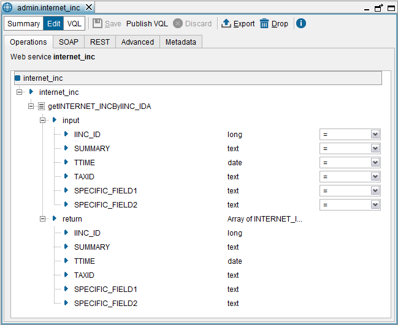
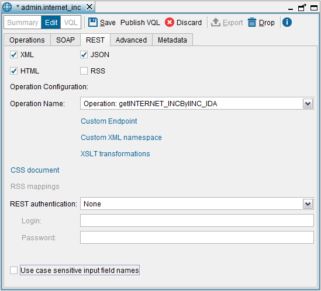
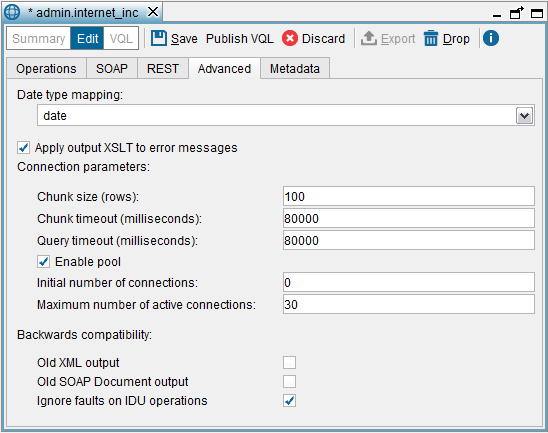

=======================
Publishing Web Services
=======================

.. warning:: This section is about the Web services created with previous
   version of the Denodo Platform.

To publish a view or a stored procedure, right-click on it in the
Server Explorer and click **Web service** on the **New** > **Data
service** menu.

You can also publish the result of any VQL query by clicking **Web
service** on the **New** > **Data service** menu and then, clicking
**Publish from VQL expression**.

The dialog to create new “publishable” Web services has five tabs:

#. **Operations**: select the view/stored procedures published by this
   Web service. See section `Operations Tab`_.
#. **SOAP**: manage the configuration of the SOAP version of the Web
   service. See section :ref:`SOAP tab`.
#. **REST**: manage the configuration of the REST versions of the Web
   service: XML, JSON, RSS and HTML. See section :ref:`REST tab`.
#. **Advanced**: manage advanced configuration options such as the
   connection between the Web service and the Virtual DataPort Server or
   date type mappings. See section :ref:`Advanced Tab (Connection
   Parameters)`.
#. **Metadata**: select the target folder of the Web service and provide
   a description for it.

After configuring everything, click **Save** to create the Web service.
The Tool will display the “Web service container status” table that
lists the existing Web services (see section :ref:`Web Service Container
Status Table`).

Operations Tab
=================================================================================

This tab contains the list of operations that this Web service will
publish.

In this dialog, you can rename the Web service (only when you are
creating it), rename / delete input and output parameters, add
pagination support for operations, etc.

   Creating a “publishable” Web service (“Operations” tab)

To add a new operation, drag a view/stored procedure from the Server Explorer to the dialog. Then, the Tool analyzes its query capabilities and
generates the “candidate operations” of the Web service. These
operations have these characteristics:

-  The input parameters of the generated operations correspond to the
   fields of the view or the input parameters of the stored procedure.
   If you have added an operation by entering a query in the **Publish from
   VQL expression** dialog, the input parameters are the interpolation
   variables of the query (see the section :ref:`Using Interpolation Variables
   as Custom Sources’ Input Parameters` for information about
   interpolation variables).

-  The return value of the ``SELECT`` operations is an array of elements.
   Each element of this array corresponds to a row of the view and will
   have one subelement for each field.

-  If the view is updateable (see “Inserts, Updates and Deletes over Views”
   section in the VQL Guide), the Tool generates operations to
   insert, update, and delete rows from this view. More specifically, it
   generates the following operations:

   -  An insert operation with a parameter for each field of the view. The
      name of the operation will start with “insert” followed by the name
      of the view.
   -  A delete operation with a parameter for each field of the view. The
      name of the operation will start with “delete” followed by the name
      of the view.
   -  An update operation with *two* parameters for each field of the view:
      one of the parameters will take the name of the field and the other
      will take the name of the field prefixed by “New”.
      The parameters with the prefix “New” correspond to the new values
      (``SET`` clause of the ``UPDATE`` statement). Those without this
      prefix are used to choose the tuples to be updated (``WHERE`` clause
      of the ``UPDATE`` statement). The name of the operation will start
      with “update” followed by the name of the view.

Besides creating operations from views, you can also create operations
that return the result of any VQL statement. To do that, click **Publish
from vql expression** and provide the VQL statement. These statements
can include *interpolation variables* that will be considered the input
parameters of the Web service operation. See section :ref:`Execution context of
a query and interpolation strings` of the VQL Guide for
more information about *interpolation variables*.

You can modify the operations of the Web service as follows:

-  Rename an operation: right-click on the operation and click
   **Rename**.
   By default, input parameters of Web services are case-insensitive.
   However, if you rename one, it becomes case-sensitive. That is,
   during the invocation of the REST, JSON, HTML and RSS Web services
   the parameter ``Parameter1`` is different from
   ``PARAMETER1``.
-  Delete an operation: right-click on the operation and click **Drop**.
-  Delete an input parameter of an operation: click **Drop** alongside
   the name of the parameter.
   Depending on the query capabilities of the view (see section :ref:`Query
   Capabilities`), some operations generated may include mandatory
   parameters that cannot be deleted.
-  Delete a return parameter.

Indicate the operator used to execute the query with the value provided
for this input parameter: click on the current operator and select the
new one. This means that if you select the operator ``<=`` for a
parameter ``P`` of an operation ``O``, when a client invokes this
operation, the query sent to the server will be like this:
``SELECT ... WHERE P <= <value>``

You can change the operator of several input parameters at once by
right-clicking on them and click **Change operator**. The new operator
will be applied to the parameters that can accept the selected operator.
To select two or more operations / parameters, hold Ctrl or
Shift and click on each operation.

To search for an element in the tree of operations, press **Ctrl+F**.

Pagination Support
------------------

When you are defining a Web service with an operation that returns a lot
of data, you may want to paginate the results in order to avoid
retrieving them all at once. With this feature, a client can request the
first thousand results, then the next thousand, then… In addition, a
client may be interested in limiting the number of rows returned by the
Web service.

The pagination support is added operation by operation. That means that
if a Web service has several operations, not all of them may have
*pagination* support.

To add pagination to an operation, right-click on the operation and
click **Add pagination**. The Tool will add two new parameters to the
operation: ``COUNT`` and ``START_INDEX`` (these parameters can be
renamed):

-  ``COUNT`` limits the number of rows returned by the operation.
-  ``START_INDEX`` skips the rows of the result from row #\ ``0`` up to
   row #\ ``<START_INDEX>``.

These two parameters are optional and if their value is not present, the
operation returns all the results of the operation, at once.

If a client passes the ``START_INDEX`` and ``COUNT`` parameters, the
operation will return ``<COUNT>`` rows, starting from the row number
``<START_INDEX>`` (the first row is ``0``)

If a client just passes the ``COUNT`` parameter and not ``START_INDEX``,
the Web service will return the first ``<COUNT>`` rows of the result.

If a client just passes the ``START_INDEX`` parameter and not ``COUNT``,
the Web service will return all the rows of the result from row
``<START_INDEX>``.

If later, you need to remove the pagination support from an operation,
right-click on the input parameters ``COUNT`` and ``START_INDEX`` and
click on **Drop**.

There is no graphical support to add pagination to operations created
with **Publish from vql expression**. For these operations, you have to
add the clauses ``FETCH`` and ``OFFSET`` to the query of the operation.
For example:

.. code-block:: sql

  SELECT *
  FROM V
  OFFSET @START_INDEX ROWS FETCH NEXT @COUNT ROWS ONLY;

The section :ref:`OFFSET, FETCH and LIMIT` of the VQL Guide
contains more information about these clauses.

Support for CONTEXT Variables
-----------------------------------------------------------------------------------------------------

In Virtual DataPort, views can be created with variables in the
selection conditions. At runtime, clients have to provide the values of
these variables, in the queries. See more about this in the section
:ref:`Adding Variables to Selection Conditions (GETVAR and SETVAR)` of the
VQL Guide.

When you create a Web service operation, you may need an input parameter
that at runtime is added as a variable to the ``CONTEXT`` clause of the
query. To do this, click on **Add context variable**. The Tool will add
a new input parameter called ``CONTEXT_VAR`` that it can be
renamed, as any other parameter.

When invoking the Web service, the input parameters that represent
context variables are optional. At runtime, for each input parameter
that represent a context variable, the Server will add a variable to the
``CONTEXT`` clause of the ``SELECT`` statement. The name of the variable
will be the name of the parameter and the value will be the one provided
by the Web service client.

It is not possible to add context parameters to operations created with
**Publish from vql expression**. For these operations, you have to add
the variables directly on the ``CONTEXT`` clause in the query of the
operation. E.g.

.. code-block:: sql

   SELECT *
   FROM WEALTHY_CLIENT_BY_STATE
   CONTEXT ('VAR _var_wealthy_client_income_limit' = '250000')

SOAP Tab
=================================================================================

In this tab, you can configure the following parameters of the SOAP
version of the Web service:

-  The Web Service style: **RPC** or **DOCUMENT**.
-  XSLT Transformations. You can define XSLT stylesheets that transform
   the SOAP requests and responses to adapt them to the requirements of
   existing SOAP clients. See section :ref:`XSLT Transformations of Web Services Created with Previous Versions`.
-  SOAP over JMS. Virtual DataPort can subscribe to a JMS server to
   listen to SOAP messages. See section :ref:`SOAP over JMS`.
-  Configure the authentication method of the SOAP version of the Web
   Service. See section :ref:`Authentication in Web Services Created with Previous Versions`.
-  To disable the SOAP version of the Web service, clear the **SOAP**
   check box.

   Creating a “publishable” Web service (“SOAP” tab)

REST Tab
=================================================================================

In this tab, you can configure the following parameters of the REST
versions of the Web service:

-  Select the output of the REST Web service, which can be:

   -  XML: the output of the operations is an XML document containing the
      response.
   -  JSON: the output is in JSON format (`JavaScript Object Notation <http://www.json.org/>`_).
   -  RSS. Similar to the XML version, but the output is generated in the
      RSS format (`Really Simple Syndication Format - RSS - version 2.0 <http://www.rssboard.org/rss-specification>`_).
   -  HTML: the output is an HTML table with the response of the query. The
      table includes JavaScript code to sort the data by any field and/or
      paginate them. It is also possible to adjust the size of the table
      and its cells and to modify its graphic appearance using a custom CSS
      file.

-  For each operation, you can:

   -  Define a **Custom Endpoint**. By default, an operation is invoked by
      encoding the parameters in the query part of the URL. E.g.
      ``http://.../getIncidents?IINC_ID=1&TAX_ID=123``\ …
      However, you also can customize the endpoint of each operation. See
      section :ref:`Defining a Custom Endpoint`.
   -  Define a **Custom XML namespace** for the XML output of the Web
      service. Each operation has a default namespace that can be
      customized.
   -  Define an **XSLT stylesheet** to transform the requests and responses
      to this operation, to adapt them to the requirements of an existing
      REST-XML client. See section :ref:`XSLT Transformations of Web Services Created with Previous Versions` (only for the
      XML output).

-  Edit the default **CSS File** (only for HTML output) to customize the
   appearance of the HTML table that display the results.

-  **RSS Mappings**. The RSS format imposes a series of specific fields for
   each item of its output. Therefore, on exporting a view in RSS format,
   the correspondence between the fields of the view and the fields in RSS
   format must be specified. See section :ref:`Mappings for the RSS
   Representation` for further details.

-  Configure the **authentication** method of the REST versions of the Web
   Service. See section :ref:`Authentication in Web Services Created with Previous Versions`.

-  Select **Use case sensitive input field names** if you want the input
   fields of the REST version of the Web Service to be case sensitive. If
   cleared, the input parameters are case insensitive.
   E.g. if the check box is cleared and the service has a parameter called
   REGION, in the URL you can provide the parameter “REGION” or “ReGiOn”
   and the service will return a response.

   Creating a “publishable” Web service (“REST” tab)

Defining a Custom Endpoint
--------------------------

By default, the operations of the REST Web services are invoked by
encoding the parameters in the query part of the URL. E.g.
``http://.../getIncidents?IINC_ID=1&TAX_ID=123``\ ….

However, you can customize this URL to provide some parameters in the
path part of the URL.

For example, if you publish the view ``incidents``, whose fields are
``summary``, ``ttime``, ``taxid`` and ``inc_type``, you can query this
view by invoking the URL ``http://.../getIncidents?taxid=123`` (see the
section :ref:`Invoking the Operations of the REST Services` for more
information about invoking REST Web services without a custom endpoint).

Now, suppose you define the following custom endpoint for the operation
``getIncidents``:

.. code-block:: none

   /getIncidents/summary/@SUMMARY/ttime/@TTIME/taxid/@TAX\_ID/incident\_type/@INC\_TYPE/

When a client invokes the URL of this operation, the value of the
parameters prefixed with the character ``@`` will be added to the
``WHERE`` part of the query sent to the server

For example:

.. code-block:: none
   
   http://.../getIncidents/summary/ttime/taxid/123/incident\_type/

will return the result of the query

.. code-block:: sql

   SELECT * 
   FROM incidents 
   WHERE TAX_ID= '123'
   
``http://.../getIncidents/summary/ttime/taxid/123/incident_type/3``
returns the results of the query

.. code-block:: sql

   SELECT * 
   FROM 
   incidents WHERE TAX_ID = '123' AND INC_TYPE = 3

The custom endpoints have to fulfill these conditions:

#. The endpoint has to start and end with ``/``.
#. The parameter names have to be specified with the character
   ``@`` followed by the name of the field in the published view
   the operation queries. The name of the parameter has to be followed
   by the character ``/``.
#. If one of the specified parameters is optional, you do not have to
   provide a value for it.
   For example, if you define the custom endpoint:
   ``/getCustomer/name/@FULL_NAME/taxId/@TAX_ID/`` and the fields
   ``FULL_NAME`` and ``TAX_ID`` are not required to query the view, you
   can invoke this operation with the following URLs:
   
   ``http://.../getCustomer/name/taxId/`` will return all the data of
   the view.
   
   ``http://.../ getCustomer/name/taxId/123/`` will return the data of
   the customer with ``taxId = 123``
   
   ``http://.../ getCustomer/name/John%20Smith/taxId/`` will return the
   data of the customers named “John Smith”

The input parameters not included in the custom endpoint can be
specified in the query part of the URL.

Advanced Tab (Connection Parameters)
=================================================================================

The Web services exported will be installed in an application server
(typically in the Web service container embedded in the Denodo
Platform). Each time a Web service operation is invoked, it will execute
a statement against the Virtual DataPort Server to obtain the required
results. It is possible to configure certain connection parameters to be
used by the Web service to connect to the Server.

The most important aspect of these settings is the use of a connection
pool. If enabled, the connections opened by the Web service to Virtual DataPort
are reused. In production environments, the use of the connections pool
is **strongly recommended**.

The configuration parameters of the connection are:

-  **Chunk Size**, **Chunk Timeout** and **Query Timeout**. Their
   meaning is the same as in any other VDP client (see section :doc:`Access
   through JDBC <../../../developer/access_through_jdbc/access_through_jdbc>` of the Developer’s Guide).
-  **Enable Pool**. Select this check box to enable the connection pool.
-  **Initial Size**. Initial number of connections opened by the pool.
-  **Max Active**. Maximum number of connections in the pool. A negative
   value means there is no limit.

This tab also allows configuring the following:

-  The type of data used to publish ``date`` fields. The options are the
   XML Schema ``date`` and ``dateTime`` data types. The XML Schema
   ``date`` type only considers the day, month and year, whereas the
   ``dateTime`` also considers the hour, minute, second and millisecond.
-  **Old XML output** (only applies to the XML output): if selected, the
   output of the XML Web service is backward compatible with the XML Web
   services published in Virtual DataPort version 4.6. If not selected
   the output of the XML service produces a simpler XML document.
-  **Old SOAP DOCUMENT output** (only applies to the SOAP output with
   DOCUMENT style): if selected, the output of the SOAP Web service is
   backward compatible with the SOAP Web services published from
   previous versions of the Denodo Platform.

   Creating a “publishable” Web service (“Connection parameters” tab)

