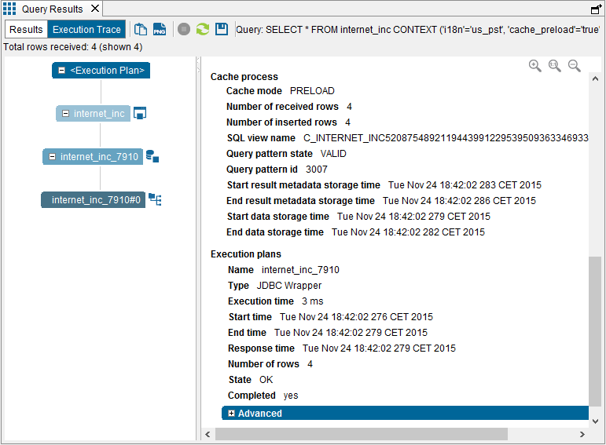

======================================================
Recommended Parameters for Queries that Load the Cache
======================================================

When you execute a query and its only purpose is to load the cache of a view, add the following parameters to the ``CONTEXT`` clause of the query:

::
   ``'cache_return_query_results' = 'false'``, ``'cache_wait_for_load' = 'true'``

This applies to views with partial cache and with full cache.

For example:

.. code-block:: sql

   SELECT *
   FROM internet_inc
   CONTEXT(
         'cache_preload' = 'true'
       , 'cache_invalidate' = 'all_rows'
       , 'cache_return_query_results' = 'false'
       , 'cache_wait_for_load' = 'true')

-  With ``'cache_return_query_results' = 'false'`` you speed up the process of loading the cache.

-  With ``'cache_wait_for_load' = 'true'`` you can detect when there are errors during the process of loading the cache.

These parameters are particularly relevant when caching large data sets
because the data will be cached faster.

The sections below explain these options in detail.

Avoid Obtaining the Result of a Query Executed to Load the Cache
================================================================

With the parameter
``'cache_return_query_results' = 'false'``, the Server does not
return the result of the query to the client. As a result, the process
of inserting the data into the cache database will be performed faster.
That is because when the Server does not return the results of the query
to the client, it does not swap to disk the data pending to be inserted
in cache as it does when it has to return the results of the query.
Instead of swapping data to disk, the Server adjusts the speed of data
retrieval from the sources to the speed of insertions in cache.

The main benefit of avoiding swapping is that the insertions in cache
are performed faster and the CPU and disk usage is much lower. This is
especially important when dealing with large datasets.

Checking If the Cache Has Been Loaded Correctly
=================================================================================

By default, a query finishes once the results have been returned to the
client or almost immediately when the ``CONTEXT`` clause has the
``'cache_return_query_results' = 'false'`` parameter.

When the Server has to store the result of the query in the cache
database, the query will probably finish before caching all the data. If
after the query has finished, there is an error while inserting the data
into the cache database, the Server cannot notify the client of this
error. If you add ``'cache_wait_for_load' = 'true'``, the query will not finish until all the results are stored in the cache database.

If you are running this from the administration tool, once the query finishes open the execution trace, click the node of the queried view (under the “Execution” node), expand the “Advanced”
category (right side of the dialog) and scroll down to the “Cache
process” section. The attribute “Query pattern state” indicates if the
cache has been loaded correctly.

If there is an error while storing the results of the query, the rows
that already have been inserted will remain there. However, they will
not be marked as valid. After 24 hours, if the Cache maintenance task is
executed, it will delete these invalid rows.

The following figure displays the information you can see in the
Execution trace about the “Cache process”.

   Cache preload query: result of a “Cache process”
