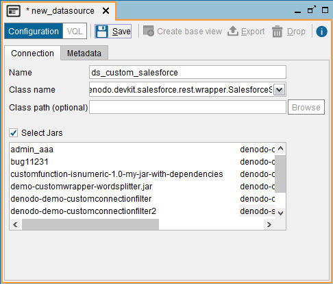
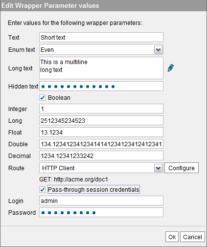
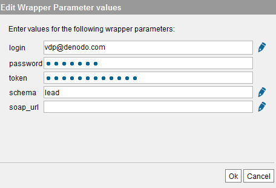
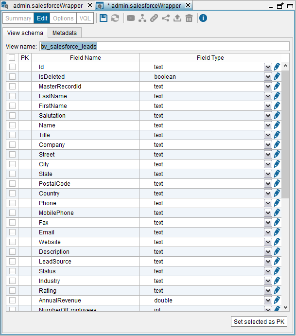

==============
Custom Sources
==============

Custom data sources, also called Custom wrappers, are *ad-hoc* wrappers
developed in Java to access any source that Virtual DataPort does not
have support for.

These wrappers are developed to expose the metadata and query
capabilities of any kind of application or proprietary data repository,
to the Denodo Platform.

The section :doc:`Developing Custom Wrappers <../../../developer/developing_extensions/developing_custom_wrappers/developing_custom_wrappers>`
of the Developer Guide explains how to develop them.

The Denodo Platform includes the source code of a sample custom source
that retrieves data from `Salesforce.com <https://www.salesforce.com>`_. The example is located at
:file:`{<DENODO_HOME>}/samples/vdp/customWrappers`.

To compile the classes of the example, execute the script
``scripts/compile_salesforce_customwrapper``, which generates the
``jar`` file ``target/jars/denodo-demo-salesforce-customwrapper.jar``.

.. note::
   You need a Salesforce account to use this sample Custom
   source. Before creating the sample custom data source in Virtual
   DataPort, you have to import the jar that contains its classes. To do
   this, click **Extension management** on the menu **File**. Then, click on
   **Import**, select the file
   :file:`{<DENODO_HOME>}/samples/vdp/customWrappers/target/jars/denodo-demo-salesforce-customwrapper.jar`
   and click **Close**. When doing this, the contents of the jar are sent
   to the Server.

To create a Custom data source, right-click on the Server Explorer and
click **New** > **Data source** > **Custom**.

The Tool will display the dialog to create the data source.

   Creating a custom data source

The following data are requested in this dialog:

-  **Name**. Name of the new data source.

-  **Class name**. Full name of the Java class that implements the Custom
   data source.
   In our Salesforce example:
   ``com.denodo.vdp.demo.wrapper.custom.salesforce.SalesforceWrapper``

   If the class you want to use is located in a Jar that was loaded into
   the Server from the *File* > *Extension management* dialog (see section
   :ref:`Importing Extensions`), select the **Select jars** check box and then,
   select the class name from the list.

   If the class is inside a jar file that was copied into the
   :file:`{<DENODO_HOME>}/extensions/thirdparty/lib` directory, enter the name of
   the class.

-  **Classpath**. Optional. Path to the jar file(s) that contain the Java
   classes of the custom source.

   Although you can use this field, we recommend importing the jar files into the Virtual DataPort server and then,
   select them in the *Select Jars* box. That way, you do not depend on these jars being on a particular location.

   Leave this field empty if one of these conditions are met:

   a. You imported the jar file with the “Extension Management” dialog.
   b. Or the jar file has been copied to the directory
      :file:`{<DENODO_HOME>}/extensions/thirdparty/lib/`.

   To enter the path, click **Browse** to select the jar. To select more
   than one jar, hold Ctrl and select each jar.

   .. note::
      When clicking **Browse**, you will browse the file system of
      the host where the Server is running and not where the Administration
      Tool is running.

   In our example, leave it empty.

-  **Select Jars**. If the class belongs to a jar file imported into the
   Server, select this check box and select the appropriate Jar in the
   list below.
   In our example, select the jar you just have imported.

   .. note:: To select two or more Jars, hold Ctrl and click on the
      required Jars.

In the **Metadata** tab, set the folder where the data source will be
stored and provide a description.

When editing the data source, you can also change its owner by clicking
the button |image1|.

Then, click **Save** to create the data source.

Click **Create base view** to create a base view over the new data
source.

Custom Sources, also called Custom wrappers, may accept input
parameters. If they do, you have to provide their value when creating
the base view. The Administration Tool will show a suitable component to
edit the parameter value depending on its type: a text box, a drop-down
list, a check box, etc. The section :doc:`Developing Custom Wrappers <../../../developer/developing_extensions/developing_custom_wrappers/developing_custom_wrappers>`
of the Virtual DataPort Developer Guide lists the available types.

.. important:: If the value of a parameter contains one of the following
   characters, you have to escape them with the character ``\``
   because they are reserved characters in Virtual DataPort:

   -  \\
   -  ^
   -  {
   -  }
   -  @

   E.g. if your Salesforce login name is ``joe@acme``, you have to enter
   ``joe\@acme``.

   If you load the value of a parameter with **Load file** of the “Value
   editor”, the Tool automatically escapes these characters. To open this
   editor, click on |image1| beside the parameter box. This editor is only
   available for parameters with the type ``LongString``.

We recommend loading the value of a parameter from a file if the value
is very long or may contain reserved characters.

If the custom wrapper allows **pass-through session credentials** it is
required to define one input parameter of type “login” and another one
of type “password”. If these parameters are present in the custom
wrapper, the Administration Tool will show a “Pass-through session
credentials” check box to enable this behavior. When executing a view
created with this option enabled, the server will use the login and
password used by the user to authenticate in the server to fill the
login and password parameters of the custom wrapper.

.. warning::
   Users should be careful when enabling the cache for views
   that involve data sources with pass-through credentials enabled. The
   section :ref:`Considerations When Configuring Data Sources with Pass-Through
   Credentials` explains the issues that may arise.

   Editing input parameter values of a custom wrapper

The Salesforce wrapper has the following input parameters:

-  LOGIN = <your Salesforce.com user name>
-  PASSWORD = <your Salesforce.com password>
-  TOKEN = <your user token>
-  SCHEMA = account (or any other schema available in Salesforce)

The values of the input parameters of the wrapper may affect the schema
of the base views or the behavior of the wrapper. For example, the base
views created over the Salesforce wrapper have different fields
depending on the value of the parameter ``SCHEMA``. E.g. if the value of
``SCHEMA`` is ``account``, the base views will have fields like
``shippingcity`` or ``billingcity``. If the value of ``SCHEMA`` is
``lead``, it will have fields like ``leadsource``.

This feature is very useful to develop Custom sources that can retrieve
data from a source and the schema of the data may have different
schemas.

   Creating a base view from a Custom data source

Now, click **Ok** to display the schema that the new base view will have
(see `New base view from a Custom data source`_).

   New base view from a Custom data source

At this point, you can change the name of the view and the type of its
fields. In the **Metadata** tab, set the folder where the base view will
be stored and provide a description.

Click **Save** to create the base view.

After creating the base view, you can click on **Edit** to modify the
view. In this dialog, you can rename the fields of the view, change
their type and store the view in another folder.

When editing the base view, you can also change its owner by clicking
the button |image1|.

Using Interpolation Variables as Custom Sources’ Input Parameters
=================================================================

When creating a base view over a Custom source that has input
parameters, you can provide:

   -  The values of these parameters.
   -  Or, interpolation variables.

If you provide interpolation variables, the Tool will ask sample values
of these variables in order to query the source and know the schema of
the base view. That is because a custom wrapper may return a different
schema depending on the value of these parameters.

For example, in the Salesforce wrapper, instead of putting your
credentials in the fields LOGIN and PASSWORD, you can put interpolation
variables. E.g., fill in the field LOGIN with ``@LOGIN_NAME`` and
PASSWORD, with ``@PASSWORD``.

After creating the base view, you will see that it has two extra fields:
``LOGIN_NAME`` and ``PASSWORD``. This fields will be required to query
the view, so they have to be provided in the ``WHERE`` clause of the
query.

When filling in the values of input parameters you can combine several
input variables in the same parameter. E.g. LOGIN =
``@LOGIN_NAME@DOMAIN``.

You can also mix a variable with static text. E.g. LOGIN =
``@LOGIN_NAME\@acme.com``. In this case, the character ``@``
is escaped, so the text ``@acme.com`` is interpreted as a literal.

.. |image1| image:: ../../common_images/edit.png
