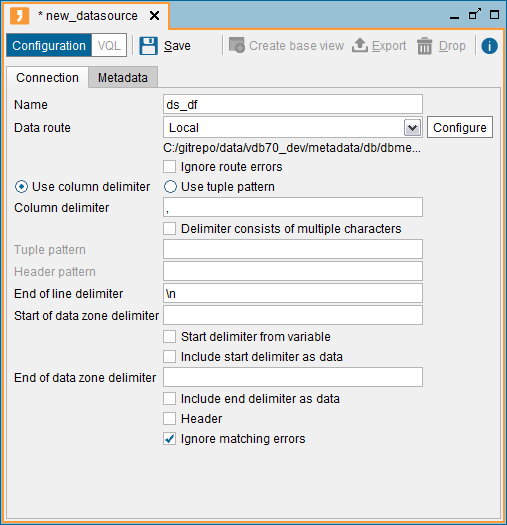

======================
Delimited File Sources
======================

This type of source retrieves data from text files in CSV (Comma
Separated Values) format or similar. Complex regular expressions can
also be used to extract the desired data from other kinds of text files
(e.g. application log files).

To create a new DF (delimited file) data source, right-click on the
Server Explorer and click **New** > **Data source** > **DF**

The Tool will display the dialog to create the data source.

   Importing from a new delimited file source

The following data are requested:

-  **Name**. Name of the new data source.
-  **Data route**. Path to the delimited file. The formats of the
   available paths are described in detail in the section :ref:`Path Types in
   Virtual DataPort`. The path can be parameterized using
   *interpolation variables* (see section :ref:`Paths and Other Values with
   Interpolation Variables`).
   
   .. note::
      If the selected “Data route” is **Local** or **FTP / SFTP /
      FTPS Client** and the route points to a directory, the base views
      created over this data source will retrieve the data from all the
      files in the directory and not just one file. The data in all the
      files must have the same schema.
   
|  If you want this data source to only obtain data from some of the
   files of the directory, enter a regular expression that matches the
   names of these files, in the **File name pattern** box. For example,
   if you want the base view created over a data source to return the
   data of all the files with the extension ``log`` located in the
   folder ``C:\log_files``, set the “Local path” to ``C:\log_files`` and
   the “File name pattern” to ``(.*)\.log``. Note that “File name
   pattern” is a regular expression and not a file pattern.
   
   .. note:: When you need to retrieve data from files that use a
      date-based naming convention (as is usual in log files), use the
      ``^DateRange`` interpolation function. See the section :ref:`Paths Using
      Date Ranges` to learn to use this function.

-  **Ignore route errors**. If selected, the Server will ignore the errors occurred when accessing the file(s) to which the data source points.
   
   This option is not meant to be used when the data source reads a single file. Its main purpose is when the data source points to a collection of files and you know some of them may be missing. For example, you can create a DF data source to read a set of log files with this local path: ``/opt/denodo/denodo/logs/apache-tomcat/http_access.^DateRange("yyyy/MM/dd",@start_date,@end_date,"yyyy-MM-dd").log`` (see more about "DateRange" in the section `Paths Using Date Ranges`_).

   When you query a base view created over this data source, the data source will read all the log files in order. For example, if in the query you put the condition ``start_date='2018/05/01' AND end_date = '2018/05/04'``, the data source will try to read the files "http_access_2018-05-01.log", "http_access_2018-05-02.log", "http_access_2018-05-03.log" and "http_access_2018-05-04.log". If one these files is missing, the query will fail.
												  
   If you want to ignore this error, select the check box *Ignore route errors*. With this option if one of the files does not exist, the data source will skip it and read the next one. If you run the query from the administration tool, you can identify which files could not be read in the *Execution trace*: in the trace, click on the nodes with *Type = Route*. The ones that could not be read will have the attribute *Exception* followed by an error message.
     
-  **Column delimiter**. Character that separates the values of a row.

   If you enter more than one character, all these characters will be considered a delimiter unless you select the check box *Delimiter consists of multiple characters*. For example, if you enter ``,|``, every time the data source finds the character comma (,) *or* the vertical bar (|), it will consider the beginning of a new field.

   Some "invisible" characters have to be entered in a special way. See the table below:

   .. table:: Invisible characters as columns delimiter 
   
      +----------+-----------------+
      | Character| Meaning         |
      +==========+=================+
      | \\\t     | Tab             |
      +----------+-----------------+
      | \\\n     | Newline         |
      +----------+-----------------+
      | \\\r     | Carriage return | 
      +----------+-----------------+
      | \\\f     | Formfeed        |
      +----------+-----------------+
   
   .. note::
      The text qualifier is the double quote (").
      
-  **Tuple pattern**. Regular expression that specifies the format of
   the tuples that will be extracted from the delimited file. This
   regular expression has to match the whole line of the file, not only
   the part that you want to capture. The fields of the views created
   over this data source will be the capturing groups of the regular
   expression.
   
   The syntax of these regular expressions is the one defined by the
   Java language (the documentation of the Java class `Pattern <https://docs.oracle.com/javase/8/docs/api/java/util/regex/Pattern.html>`_ 
   lists the constructs of these expressions).
   
   The section :ref:`Examples of How to Define a Tuple Pattern` has several
   examples of data sources with Tuple Pattern.
   
-  **Delimiter consists of multiple characters**. If selected, the character 
   delimiter can be multiple characters. For example, ``~|`` would now be a 
   valid delimiter. If cleared, enter only one character in *Column delimiter* or all of them will be considered a delimiter.

-  **End of line delimiter**. Character string to be used to mark the
   end of a tuple. The default value is ``\n`` (carriage return).
   
   .. note:: The character ``\r`` cannot be used as an end of line
      delimiter. You always have to indicate the end of line delimiter with
      ``\n`` regardless of the operating system where Virtual DataPort is
      running.

-  **Start of data zone delimiter**. Java regular expression identifying
   the position in the file where the Server has to start retrieving
   data (or obtaining the header if the **Header** option is selected).
   If empty, the search will start at the beginning of the file.
-  **Start delimiter from variable**. If selected, the “Start of data
   zone delimiter” will be considered the name of an interpolation
   variable that, at runtime, will contain the “Data zone delimiter”.
-  **Include start delimiter as data**. If selected, the text matching
   the “Start of data zone delimiter” expression will be included in the
   search space.
-  **End of data zone delimiter**. The Server stops retrieving data from
   the file when it finds this string. If empty, the Server will
   continue retrieving data until the end of the file.
-  **Include end delimiter as data**. If selected, the text matching the
   “End of data zone delimiter” expression will be considered in the
   results.
-  **Header**. If selected, the Server considers that the first line of
   the data region contains the names of the fields in this file. These
   names will be the fields’ names of the base views created from this
   data source.
-  **Header pattern**. Java regular expression used to extract the name
   of the fields that form the header. This only needs to be specified
   if the header has a different structure than the data. This option
   can only be used when the “Header” option is selected.
-  **Ignore matching errors**. If selected, when a query involves this
   data source, the Server will ignore the lines of this data file that
   do not have the expected structure. I.e. rows that do not have the
   expected number of columns or, if you are providing a tuple pattern,
   rows that do not match the pattern.
   
   If you clear this check box, the Server will return an error if there
   is a row that does not have the expected structure.
   When you select this check box, you can check if the Server has
   ignored any row in a query. To do this, execute the query from the
   Administration Tool. Then, click “View execution trace” and click the
   “Route” node. You will see the attribute “Number of invalid tuples”.

In the **Metadata** tab, you can set the folder where the data source
will be stored and provide a description.

When editing the data source, you can also change its owner by clicking
the button |image1|.

Click **Save** to create the data source.

Then, click **Create base view** to create a base view associated with
the new data source. If the path to the data file includes interpolation
variables, you will have to provide a value for them (the section :ref:`Paths
and Other Values with Interpolation Variables` explains how to create
paths to files with variables).

The Tool will display the schema that the base view will have. At this
point, you can change the name of the view and the name and type of its
attributes. In the **Metadata** tab, click **Browse** to select the
folder where the new base view will be stored. Then, click **Save**
(|image2|).

In the Server Explorer, double-click the new base view to display its
schema. Click **Edit** to open the edition wizard of the view. In this
wizard, you can change the name and type of the base view.

Examples of How to Define a Tuple Pattern
=================================================================================

This section contains two examples of delimited-file data sources that
are defined with a Tuple Pattern. Although in these examples we use a
static value, the value of Tuple Pattern can be an interpolation
variable (see the section :ref:`Paths and Other Values with Interpolation
Variables` for more information about interpolation variables).

**Example 1 of tuple pattern**: Let us say that we have a file that
contains product information in the following format (note that the
``discount`` attribute is optional):

 

.. code-block:: none
   :caption: Example 1 of tuple pattern: contents of the delimited file
   :name: Example 1 of tuple pattern: contents of the delimited file

   product_name=Acme Laptop Computer;price=1500 euro;discount=50
   product_name=Acme Desktop Computer;price=1000 dollar

The following pattern can be used to extract from each row the following
information about each product:

-  Its name
-  Price and currency
-  Discount. For the tuples without a discount value, the value of this
   cell will be ``NULL``.

.. code-block:: none
   :caption: Example 1 of tuple pattern: regular expression to extract the contents of the file
   :name: Example 1 of tuple pattern: regular expression to extract the contents of the file

   Product_name=(.+);price=([0-9]+)\s(.+);(?:discount=(.+))?

**Example 2 of tuple pattern**: Let us say that we want to extract the
name of the files (not directories), its date and its size, from the
output of the Windows command ``DIR``:

 
.. code-block:: none
   :name: Example 2 of tuple pattern: output of the Windows command DIR
   :caption: Example 2 of tuple pattern: output of the Windows command DIR

   11/07/2007 10:10 <DIR>           .dbvis                                             
   09/18/2008 15:09 <DIR>          .eclipse                                           
   01/19/2011 16:55 <DIR>          .gimp-2.6                                          
   11/10/2009 18:43         215   .ITLMRegistry                                        
   03/26/2010 14:16       3.498   .keystore                                          
   05/18/2010 17:56 <DIR>          .m2                                               
   02/02/2010 15:23 <DIR>          .maven                                            
   03/26/2010 14:01 <DIR>          .netbeans                                      
   02/02/2011 19:20 <DIR>          .smc\_cache                                        
   06/15/2010 09:59 <DIR>          .ssh                                               
   10/14/2009 13:26 <DIR>          .thumbnails                                        
   02/15/2010 12:06           0   .Xauthority                                            
   01/16/2008 12:02         517    ant.install.log                                      
   02/11/2010 13:29 <DIR>          Application Data                                   
   07/16/2010 08:51         772    build.properties                                     
   02/18/2008 15:19 <DIR>          Contacts                                           
   01/14/2011 10:02         190    default-soapui-workspace.xml                         
   09/16/2010 16:35    78.170.461    denodo-v46-update-201009161734.jar            
   02/07/2011 11:44 <DIR>          Desktop                                            
   04/01/2009 15:11 <DIR>          Favourites                                         
   08/22/2008 12:50 <DIR>          Start Menu                                         
   01/27/2011 17:18 <DIR>          My Documents                                       
   02/12/2009 12:36         201   osdadmin.ini                                         
   02/12/2009 12:35         201   osdadmin.ini.bak                                     
   01/14/2011 10:02         7.958   soapui-settings.xml                                
   02/09/2010 10:02        22.358   temp.txt                                          
   04/19/2010 18:55           583   test.cert                                            
   02/10/2011 09:22 <DIR>          Tracing                                            
   03/05/2010 09:41             0   vdpws.log                                              
   04/17/2009 09:49 <DIR>          workspace                                          

The “Tuple pattern” has to be:

.. code-block:: none
   :caption: Example 2 of tuple pattern: regular expression to extract the output of the command DIR
   :name: Example 2 of tuple pattern: regular expression to extract the output of the command DIR

   (\d{2}?/\d{2}?/\d{4}?)\s+?\d{2}:\d{2}.*?(\d[^ ]*)\s(.*)

The base views created with this tuple pattern will have three fields:
the date of the file, its size and its name.

Paths Using Date Ranges
=================================================================================

When you need access to files that use a date-based naming convention
(as is typical in log files), use the ``^DateRange`` interpolation
function to consider only the files between a given start date and a
given end date.

The syntax of the ``^DateRange`` function is the following:

.. code-block:: none

   ^DateRange (
       pattern of the date range : text
     , start date : text
      , end date : text
      , pattern of the files : text
      )

-  ``Pattern of the date range``: pattern of the parameters
   ``start date`` and ``end date``. This pattern follows the syntax
   specified by the class `SimpleDateFormat <https://docs.oracle.com/javase/8/docs/api/index.html?java/text/SimpleDateFormat.html>`_ of the Java API.
   
   For example, ``yyyy-MM-dd`` is the pattern for <year (4
   digits)>-<month in year (2 digits)>-<day in month (2 digits)>. E.g.,
   “2014-01-31”.
   
   This parameter can be a literal or an interpolation variable.
-  ``Start date``: initial date of the date range. This value has to
   follow the pattern specified in the first parameter of the function.
   It can be a literal or an interpolated variable.
-  ``End date``: finish date of the date range. This value has to follow
   the pattern specified in the first parameter of the function. It can
   be a literal or an interpolated variable.
-  ``Pattern of the file names``: pattern of the file names. This
   parameter can be a literal or an interpolated variable.

When using this function, follow these two rules:

#. The literal parameters of the ``DateRange`` function have to be
   surrounded by double quotes. With this function you cannot use single
   quotes.
#. You cannot leave any space between the parameters of the
   ``DateRange`` function.

**Example 1**

Let us say that the ``C:/logs`` directory contains the log files
generated daily by an application. The name of these files follows the
pattern ``application_log_<year>-<month>-<date>.log`` (e.g.
``application_log_2014-11-19.log``).

To create a data source that reads all the logs of January 2014, set the
path of the data source to the following:

``C:/logs/application\_log\_^DateRange('yyyy/MM/dd','2014/01/01','2014/01/31','yyyy-MM-dd').log``

Note that the value of the first parameter (``yyyy/MM/dd``) is the
pattern followed by the start date and end date parameters of the
function.

A base view created over this data source will return the data “in
order”. That is, the data source reads the file of the data range, which
is the first of January (``application_log_2014-01-01.log``). Then,
reads the file of the next day (``application_log_2014-01-02.log``),
then the file of the next day (``application_log_2014-01-03.log``), etc.

At runtime, if one of the files of the date range is missing and “Ignore route
errors” check box is not selected, the query will return an error but it will
also return the contents of all the files it found. For example, if the file 
``application_log_2014-01-15.log`` does not exist, a query to this data source
will return an error message that explains the situation, but the result will
contain the data read from all the other files. I.e.
``application_log_2014-01-16.log``

**Example 2**

In the previous example, the date range of the files was fixed and it
could not be changed at runtime. If you want this range to be dynamic,
you can set the ``start date`` and ``end date`` parameters to be
interpolation variables. E.g.

``C:/logs/application\_log\_^DateRange('MM/dd/yyyy',@start\_date,@end\_date,'yyyy-MM-dd').log``

The base views created over this data source will have two extra fields
called ``start_date`` and ``end_date`` whose value will set the date
range. For instance, the following query

.. code-block:: sql
   
   SELECT * 
   FROM bv_application_log 
   WHERE start_date = '01/01/2014' AND end_date = '03/31/2014'
   
will make the data source to process the log files of the first quarter
of 2014.

Note that when a parameter is an interpolation variable, you do not have
to add double quotes.

**Example 3**

``^DateRange`` can also be used with paths that point to directories
instead of a group of files.

For instance, if the logs of each day are stored in a separate directory
with the naming convention ``yyyyMMdd``, set the path of the data source
to this:

``C:/tmp/^DateRange('yyyy/MM/dd',@startdate,@enddate,'yyyyMMdd')/``

The base views created over this data source will read all the files
from every directory in the specified date range.

.. |image1| image:: ../../common_images/edit.png
.. |image2| image:: ../../common_images/save.png

