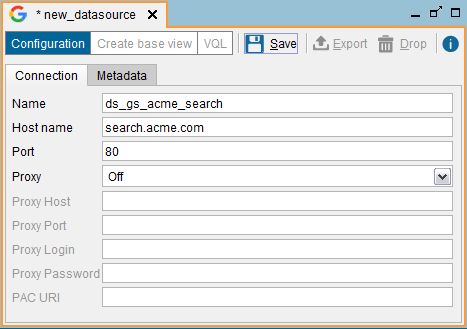
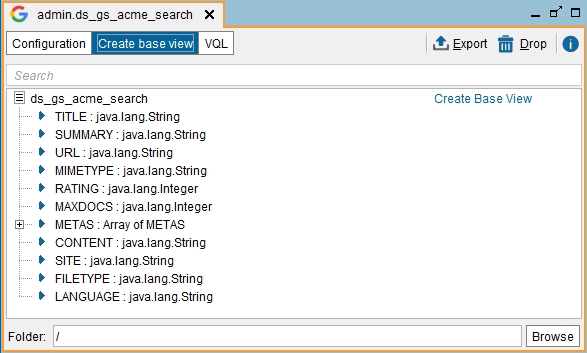
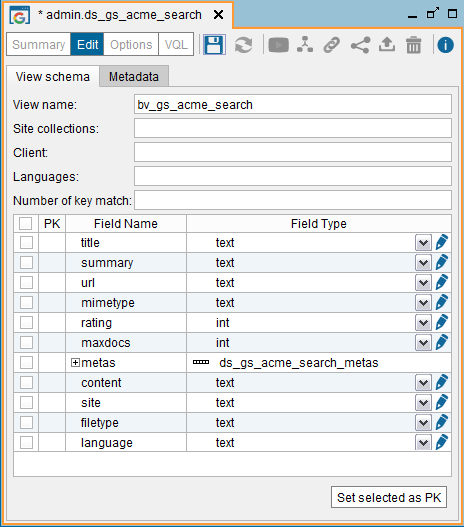

=====================
Google Search Sources
=====================

.. note:: The Google Search feature is deprecated and it may be removed in future
   major versions of the Denodo Platform. 
   
   The section :ref:`Features Deprecated in Virtual DataPort 7.0` lists all the features that are deprecated.

Virtual DataPort can extract data from `Google Search <https://enterprise.google.com/search//>`_ engines.

To create a new Google Search data source, right-click on the Server Explorer and click **New** > **Data source** > **Google Search**.

The Tool will display the dialog to create the data source.

   Importing a new Google Search data source

The following data are requested in this dialog:

-  **Name**. Name of the new data source.

-  **Host name**. Name of the machine in which the search engine is
   accessible. This may be a remote machine accessible on the Internet
   (e.g. “search.acme.com”).

-  **Port**. Port on which the Google Search service listens (usually 80).

-  **Proxy Configuration**. If the connection is established through a
   proxy, you have three options:

   -  Select **Manual** and enter the host name and port of the proxy
      server. If it is an authenticated proxy, enter the user identifier
      and the password of the proxy.
   -  Select **Default**. The Server will use the default HTTP proxy
      configuration of the Server (see section :ref:`Default Configuration of
      HTTP Proxy`).
   -  Select **Automatic** and enter the URL of a ``proxy.pac`` file that
      contains the configuration parameters of the proxy.

In the **Metadata** tab, you can set the folder where the data source
will be stored and provide a description.

When editing the data source, you can change its owner by clicking the
button |image1|.

Click **Save** to create the data source. Then, click **Create base
view** to see the schemas stored in the Google Search engine.

   Description of a Google Search data source

Click **Create Base View** to create a base view associated with the new
data source (see `Creating a Google Search base view`_).

   Creating a Google Search base view

A value can be specified for the following parameters at the top of the
screen:

-  **Site Collections**. Required. It specifies the collections within
   the Google Search server on which to make the search. The collections
   are created by the Google server administrator. Its name is
   upper/lower case-sensitive. It is possible to specify several
   collections separated by commas. In this case, the search will be
   made on all of them. The collection that is being searched by a
   particular search form can normally be obtained by examining the
   value of the *site* parameter of its invocations.
-  **Client**. Optional. It identifies the client making the queries.
   Google Search servers can be configured to behave differently
   depending on the client.
-  **Languages**. Optional. If specified, only documents in that
   language will be returned.
-  **Number of Key Match**. Optional. Google Search allows the
   administrator to manually set a priority of the pages. This parameter
   receives an integer between 0 and 5, where 5 is the top priority. If
   this value is established, the searches made on this base relation
   will only return the pages with the priority specified or over.
-  The value of these parameters can be modified later, on the “Options”
   dialog of the base view (see section :ref:`Configuration Properties for
   Specific View Types`).

The name and type of the fields can be modified. The contents of each
one of the attributes is:

-  ``TITLE``. Title generated by Google server for the document.
-  ``SUMMARY``. Summary generated by Google server for the document.
-  ``URL``. Document URL.
-  ``MIMETYPE``. MIME type of the document.
-  ``RATING``. Priority assigned by the Google server administrator for
   the document. This may take values of between 0 and 5, where 5 is the
   maximum priority.
-  ``MAXDOCS``. Attribute that limits the maximum number of results
   returned by a search.
-  ``METAS``. Attribute of Array of records type that contains the
   metatags for the document. Each record has two fields to indicate the
   name of the metatag (``metakey``) and its value (``metavalue``).
-  ``CONTENT``. Contents of the document. This is the field normally
   used for searches.
-  ``SITE``. If specified, Google server will only return the documents
   that belong to that site / collection (e.g. “acme.com”).
-  ``FILETYPE``. Extension of the document file.

In the **Metadata** tab, you can set the folder where the base view will
be stored and provide a description.

When editing the base view, you can also change its owner by clicking
the button |image1|.

Then, click **Save** to create the base view.

The most common way of querying the Google Search base view is using the
``CONTAINS`` operator, which runs complex Boolean searches on indexed
textual data (see the section :ref:`Support for the CONTAINS operator of each source
type` of the VQL Guide).

.. |image1| image:: ../../common_images/edit.png

