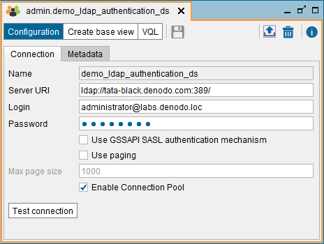
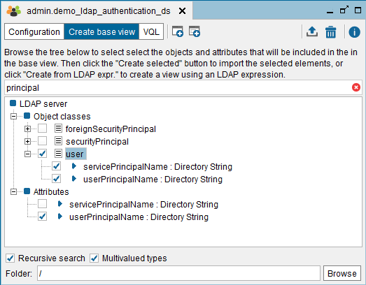
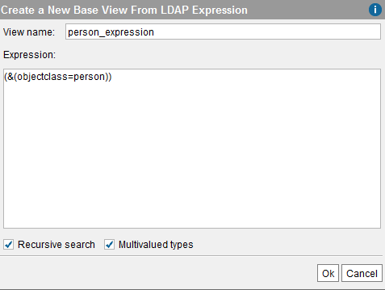
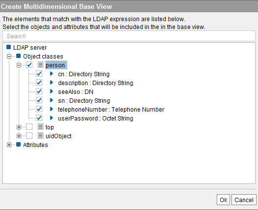

============
LDAP Sources
============

The LDAP data sources allow registering an LDAP server in Virtual
DataPort. LDAP data sources can be used for two purposes:

#. To extract data stored in the LDAP server.

#. To delegate authentication tasks to an LDAP server:

   a. To authenticate users that want to connect to a database with LDAP
      authentication (see section :ref:`Creating a Database with LDAP
      Authentication`).
   b. To authenticate users that have been created with LDAP
      authentication, which want to connect to a database with normal
      authentication (see section :ref:`Creating Users`)
   c. To authenticate users of Web Services published by the Virtual
      DataPort server (see section :doc:`/vdp/administration/publication_of_web_services/publication_of_web_services`).
   d. To import the user’s roles from an LDAP server (see section :doc:`/vdp/administration/databases_users_and_access_rights_in_virtual_dataport/administration_of_databases_users_roles_and_their_access_rights/creating_users`)

To create a new LDAP data source, right-click on the Server Explorer and
click **New** > **Data source** > **LDAP**.

The Tool will display the dialog to create a new LDAP data source.

   Creating an LDAP data source

Fill in the following fields:

-  **Name**. Name of the new data source.

-  **Server URI**. Path to the LDAP server. For example:
   ``ldap://acme:389`` or ``ldap://acme:389/dc=example,dc=com``

-  **Login** and **Password**. Credentials to access the LDAP server

-  Select **Use GSSAPI SASL authentication mechanism** to connect to the LDAP server with SASL binding with GSSAPI authentication mechanism, instead of "simple binding".

-  Select **Use Paging** if the LDAP server has a limit on the number of
   results per query. If selected, Virtual DataPort will do paged searches
   to obtain all the results of the queries.

-  Select **Enable connection pool** so the data source has a pool of
   connections to the LDAP server, which will be reused for each query.

   We recommend enabling it because with a pool, instead of opening a new
   connection every time it has to send a query to this source, the
   connection is already opened. This improves the response time of the
   queries.

   Having the pool enabled speeds up these operations:

   1. *Authentication of users*. To check the credentials of a user,
      Virtual DataPort opens a connection to the LDAP server using the
      credentials provided by this user. If the pool of the data source is
      enabled and the connection is established successfully (i.e. the
      credentials are correct), this connection is stored in the pool. If
      in the next thirty minutes this same user connects to Virtual
      DataPort again, the connection does not have to be established again.
   2. *Queries to the base views of the data source*. The connections to
      the LDAP server are reused instead of having to open a new connection
      for each query.

   The connections of the pool are closed after thirty minutes of not being
   used.

   The maximum number of connections in the pool is twenty.

-  Click **Test Connection** to check that the Server can connect to this LDAP server using the credentials you entered

In the **Metadata** tab, set the folder where the data source will be
stored and provide a description.

When editing the data source, you can also change its owner by clicking
the button |image1|.

Click **Save** to create the data source.

Once the new data source has been created, it can also be used to
authenticate the users of the Virtual DataPort server. The section
:doc:`Creating Users <../../databases_users_and_access_rights_in_virtual_dataport/administration_of_databases_users_roles_and_their_access_rights/creating_users>` contains more information about this.

To create an LDAP base view, open the data source and click **Create
base view**.

 

   New LDAP data source

In this dialog, select the desired object classes *and* attributes that
you want the new base view to return. If you select multiple object
classes, the base view will return the data of the LDAP entries that
derive from *all* (not any) the selected object classes.

For instance, selecting “person” and “inetOrgPerson” for a typical LDAP
v3 directory base view will create a view that returns one record for
each “inetOrgPerson” entry in the directory. The resulting view’s fields
will consist of the superset of attributes found in the “person” and
“inetOrgPerson” LDAP object classes.

To search an object class, type its name or the name of one of its
fields in the box located at the top of the dialog. The list will only
show the elements whose name contains the text you entered.

Select or clear **Recursive search**. If selected, the LDAP query
executed by the Server to retrieve data from the LDAP server, will
recursively consider all the nodes in the subtree hanging from the node
pointed by the data source path. If cleared, the LDAP query will only
consider the direct children of the node.

Select or clear **Multivalued types**. If selected, the multivalued
attributes of the base view will be converted into an array where each
element will be one of the values. If cleared, all the values will be
concatenated and separated with the character ``.``.

Click **Browse** to select the folder where the base view will be
stored.

Then, click **Create selected**. The Tool will display the schema that
the base view will have. In this dialog, you can do the following:

-  Rename the base view and its fields
-  Change the type of the base view’s fields
-  Set the primary key of the view (see section :ref:`Primary Keys of
   Views`)
-  In the **Metadata** tab, set the folder where the base view will be
   stored and provide a description.
   When editing the base view, you can also change its owner by clicking
   the button |image1|.

You can also create a base view from an expression, which is delegated
to the LDAP server. To do this, click **Create from LDAP expr**. The
Tool will show a form to enter the expression. This expression can have interpolation
variables (see section :ref:`Paths and Other Values with Interpolation
Variables`). If interpolation variables are used, then the user will be
asked for example values for the variables to perform a query against
the LDAP server. Using this query, the system will obtain the object
classes that can be reached using the expression. The user can then
select the object classes to be used to generate the base view schema.

Optionally, you can specify whether the query to perform against the
LDAP server must be recursive or not. The interpretation of this option
is the same as in the formerly explained case of creating the base view
without specifying an expression.

   New LDAP base view from expression

   Selecting the objects of an LDAP base view created from an expression

.. |image1| image:: ../../common_images/edit.png

