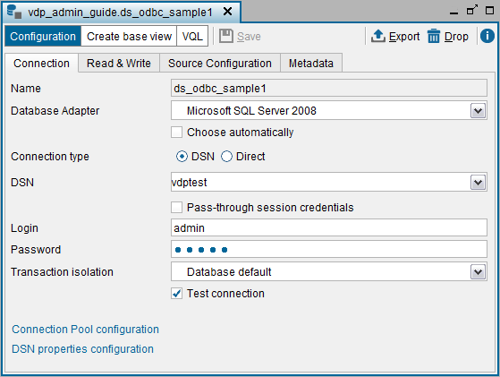
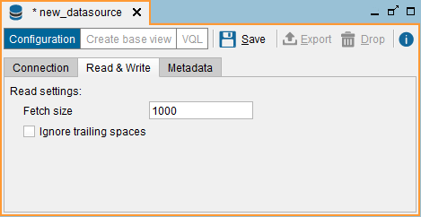
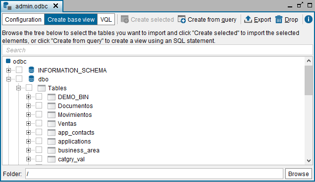

============
ODBC Sources
============

Virtual DataPort provides access to ODBC sources.

To retrieve data from a Microsoft Excel file, we recommend creating an
Excel data source instead of an ODBC one because the performance of the
queries involving this type of data source will be much better. See more
about this type of data source in the section :ref:`Excel Sources`.

.. note::
   If a source can be accessed with a JDBC driver and with an
   ODBC driver, create a JDBC data source instead of an ODBC one. The
   reason is that in Virtual DataPort, queries involving a JDBC data source
   run faster than if they involve an ODBC data source, even if the
   underlying source is the same.

.. important::
   The creation of ODBC data sources is disabled by default
   when the Virtual DataPort server runs on Linux. To enable it, follow the
   steps described on the section :doc:`Enabling the Support for ODBC Sources
   When the Virtual DataPort Server Runs on Linux <../../../../platform/installation/postinstallation_tasks/postinstallation_tasks_in_virtual_dataport/enabling_the_support_for_odbc_sources_when_the_virtual_dataport_server_runs_on_linux>` 
   of the Installation Guide.

.. note::

   If you configured the Denodo server to run with an external Java Runtime Environment, not the one included in Denodo, follow the steps of the appendix :ref:`Enabling the Support for ODBC Sources When an External JRE is Used`.

To create a new ODBC data source, right-click on a database of the
Server Explorer and click **New** > **Data source** > **ODBC**.

The Tool will display the dialog to create the data source.

**“Connection” tab**

   
   ODBC data source: “Connection” tab

-  **Name**. Name of the new data source.

-  **Database adapter**. Adapter used to connect to the database. 
   Virtual DataPort provides adapters to
   connect to Database Management Systems (DBMS). Each adapter 
   knows the capabilities supported by the database: what operators and functions the database has, what clauses it supports, etc.
   
-  **Connection type**. There are two types of ODBC connections:
   
   
   
   -  **DSN** (Data Source Name). Use one of the existing DSNs of the
      system where Virtual DataPort server is installed.
     
   -  **Direct**. Access to a file stored in the local file system of the
      Server, using one of the ODBC drivers registered on the Server. The
      path can use interpolation variables (see section :ref:`Paths and Other
      Values with Interpolation Variables`).
   
   
-  **Login**. User login to access the external database.

-  **Password**. User password to access the external database.

-  **Pass-through session credentials**. If selected, when a client
   queries a view that uses this data source, Virtual DataPort will use
   the credentials of the user to connect to the database, instead of the
   values of the fields “Login” and “Password”.

   The section :ref:`Importing JDBC Sources` explains this option in more
   detail.

   .. warning:: Users should be careful when enabling the cache for views
      that involve data sources with pass-through credentials enabled. The
      appendix :ref:`Considerations When Configuring Data Sources with
      Pass-Through Credentials` explains the issues that may arise.

-  **Transaction isolation**. Isolation level of the transactions and
   queries executed in the database of this data source. The section
   :ref:`Importing JDBC Sources` explains the different isolation levels in
   more detail.

   If you select **Database default**, the Server uses the default
   isolation level of the database to execute queries.

-  Click **DSN Properties Configuration** to add properties to the
   connection URI.

-  Click **Test Connection** to check that the Server can connect to this database.

-  Open the **Connections Pool Configuration** dialog to configure several
   parameters of the connections pool that Virtual DataPort will use to
   optimize access to the external database:

  -  **Initial Size**: number of connections with which the pool is to
     be initialized. A number of connections are established and created in
     “idle” state, ready to be used.
 

  -  **Maximum number of active connections**: maximum number of active
     connections to this database the pool will open. Once this limit is
     reached, the next request that involves sending a query to this database
     will have to wait until another query finishes.
   
     -  Enter -1 to remove the limit of maximum number of active connections.
        There will not be a limit on the number of connections that the pool
        creates.
     -  Enter 0 to disable the pool of connections. Therefore, for every query
        Virtual DataPort sends to the database, it will open a new connection
        to this database. Once the query finishes, it will close this
        connection.
   
   
  -  **Ping Query**: SQL query used by the pool to verify the status of
     the connections. The query should consume as little resources in the
     database as possible, and the table in question should exist
   
   
  -  **Test Connection**: if this property is checked and there is a
     specified ping query, each connection retrieved from the connection pool
     will be validated by executing the ping query.
   
   
.. note::
   In production environments, we strongly recommend selecting
   the **Test connection** check box and defining a **Ping query**.

**“Read & Write” tab**

   
   ODBC data source: “Read & Write” tab

-  **Fetch size**: it gives the ODBC driver a hint as to the number of
   rows that should be fetched from the database when more rows are
   needed.
-  **Ignore trailing spaces**: if selected, the Server removes the space
   characters at the end of ``text`` type values of the results returned
   by this data source’s views.

**“Source Configuration” tab**

This tab is only visible when editing a data source, not when creating a
new one.

The section :doc:`/vdp/administration/creating_data_sources_and_base_views/data_source_configuration_properties/data_source_configuration_properties` explains the
properties that can be changed in this dialog.

.. note::
   In most cases, the default value for these options is correct.
   Therefore, this dialog will only be useful in very specific
   environments.

**“Metadata” tab**

In the **Metadata** tab, you can set the folder where the data source
will be stored and provide a description.

When editing the data source, you can also change its owner by clicking
|image2|.

Once the ODBC source has been imported, the process of creating base
views is the same as for JDBC data sources (see section :ref:`Creating Base
Views from a JDBC Data Source`).

The Excel ODBC driver provided by Microsoft Windows has some
limitations:

-  It cannot delete data from Excel spreadsheets. It can only query them
   and append more data.
-  The Excel driver of Microsoft Excel 2003 or earlier, can execute only one
   query simultaneously. This can be a problem if we are combining data
   from the same Excel file.
   
   The newer versions of the Excel driver do not have this limitation.

Creating Base Views from an ODBC Data Source
=================================================================================

After creating an ODBC data source, you have to create base views over
it. You can later query these base views or combine its data with data
from other views.

   
   Schemas, tables and views of an ODBC source

To create an ODBC base view, follow these steps:

#. On the Server Explorer, double-click the ODBC data source to open it
   and then, click **Create base view**.
#. Select the check boxes beside the tables that you want to create base
   views from.
#. Click **Create selected**.

After this, each new base view will be listed in the Server Explorer in
two places:

#. In the folder that the view has been created in.
#. As a child node of the data source that the base view belongs to.
   This node cannot be moved to other folders. It is added to the tree
   to provide an easy way to see the base views created from a data
   source.

As the process of creating ODBC base views is very similar to creating
JDBC base views, see the section :ref:`Creating Base Views from a JDBC Data
Source` for more information about this process.

