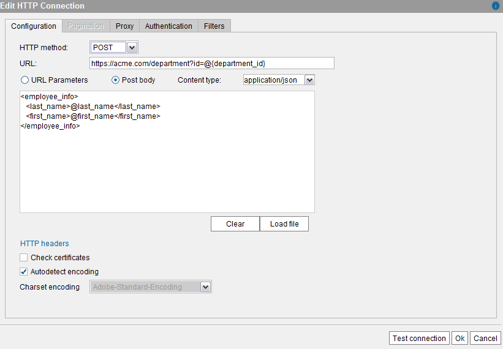
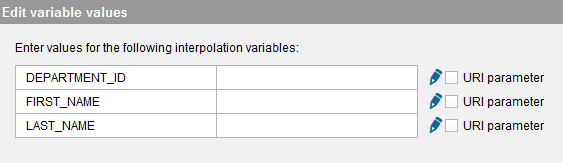
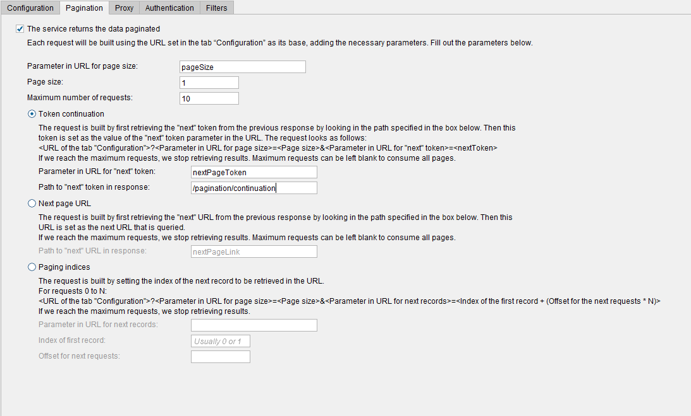
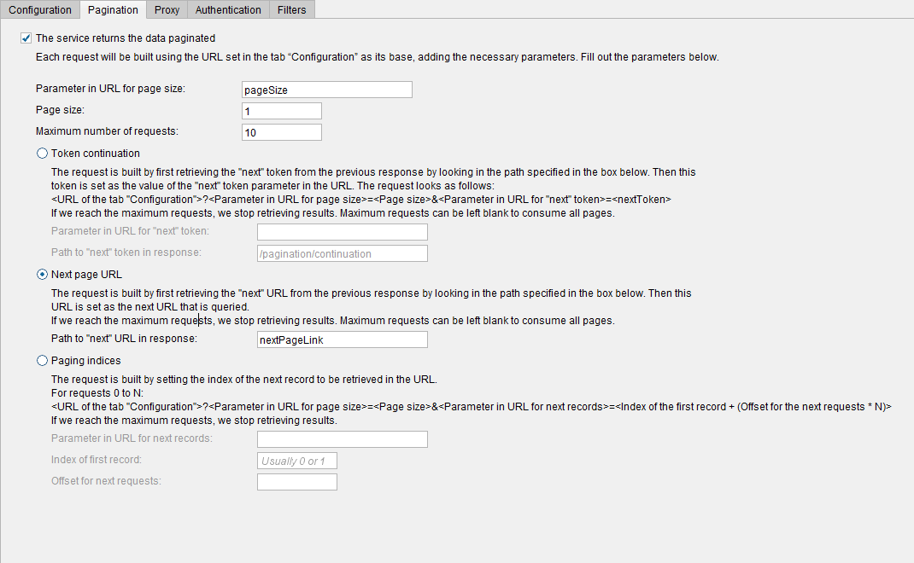
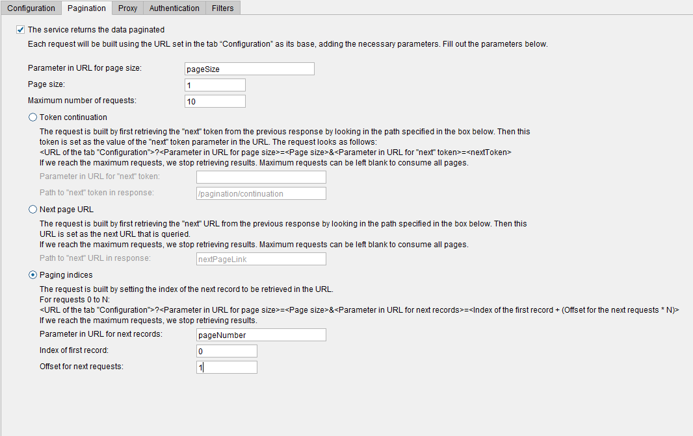
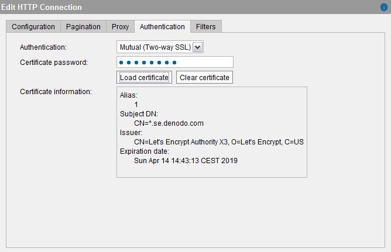
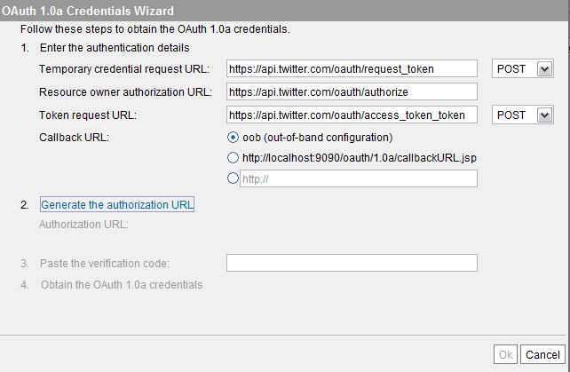
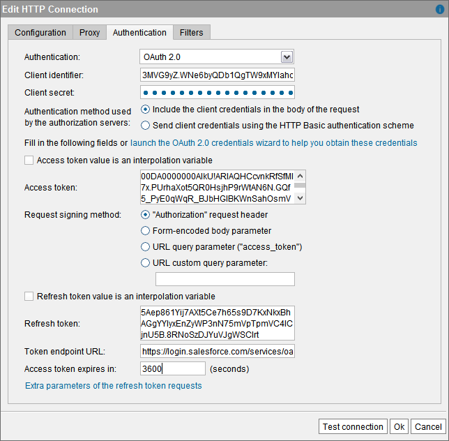
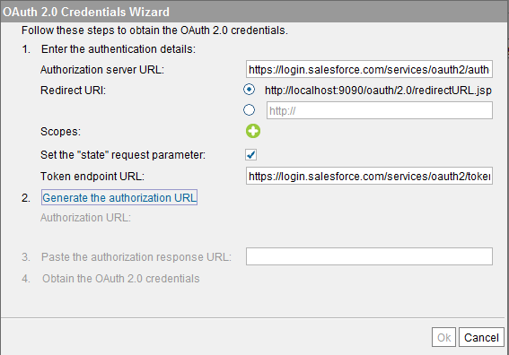

=========
HTTP Path
=========

Use an HTTP path when the data has to be obtained by sending an HTTP
request to a server.

With HTTP paths you can either send a request with the HTTP method GET, PUT, POST, DELETE or PATH.

There are two ways of adding parameters to the body of a **POST**, **PUT** or **PATH** 
request:

#. **URL parameters**: if the URL contains query parameters, they will
   be removed from the URL and sent in the body of the request as the
   values of an HTML form. The “Content-type” header of the HTTP request
   will be “application/x-www-form-urlencoded”.
   
   For example, if the URL is ``http://acme/customer?first_name=John&last_name=Smith`` at runtime, 
   the Server will send the HTTP request to ``http://acme/customer`` (without the query parameters) and the body of the request will be 
   ``first_name=John&last_name=Smith``.
   
#. **Post body**: the contents of the text area below this option will
   be sent in the body of the HTTP request. Enter the content type of
   the body in the **Content type** box.

To add a header to the HTTP requests sent to retrieve the data, click
**HTTP headers**. In the “HTTP Headers” dialog, click **New** and enter
the name and the value of the header.

The following elements of an HTTP path can contain interpolation
variables (the section :ref:`Paths and Other Values with Interpolation
Variables` explains what interpolation variables are):

#. The URL. It can contain one or more interpolation variables. For
   example, ``https://acme.com/department?id=@{department_id}``
#. The HTTP headers. Both the names and their values can be
   interpolation variables.
#. The “Post body” can contain one or more interpolation variables. This
   is useful if you want to send a POST request and one or more values
   of the body need to be set at runtime, when the data source is
   queried.
   For example, let us say that the body of the POST request is the
   following:
 
   .. code-block:: xml 
   
      <employee_info>
         <last_name>@last_name</last_name>
         <first_name>@first_name</first_name>
      </employee_info>
 

   HTTP POST request with XML Body with an interpolation variable

|
   The XML contains the string ``@first_name`` and ``@last_name``. The character “@” 
   indicates that first_name and last_name are interpolation variables, which
   means that at runtime, the strings @first_name and ``@last_name`` will be substituted
   by a value when this data source is queried.
   
   When you create a base view over this data source, the view will have three extra
   fields: department_id, last_name and first_name. The queries to this view will always
   have to provide a value for these fields in the WHERE clause. 
   
   For example, if the query is 

.. code-block:: sql
   
   SELECT * 
   FROM view 
   WHERE department_id = 2 AND first_name = 'John' AND last_name = 'Smith' 

..
      
   the Server will send a request to ``https://acme.com/department?id=@{department_id}`` with this body:
   
.. code-block:: xml
 
   <employee_info>
       <last_name>Smith</last_name>
       <first_name>John<first_name>
   </employee_info>

..

   Any query involving a base view created over this data source that does not provide a value for
   these three fields will fail.

   .. note::
      You have to escape the characters “@”, “{” and “}” when they are not part of the name of an interpolation variable.
      They are escaped with the character “\” and the character “\” with itself (e.g. “\\”). For example:

 
.. code-block:: xml

   <employee_info_request>
     <department_name>department \@1 \{ACCT\}</department_name>
   </employee_info_request>

.. _path_types_in_virtual_dataport_separator_3:

   If the body of the request is loaded with **Load file**, the Tool escapes all these characters automatically.
   
The benefit of using interpolation variables is that the HTTP request to
the Web server is not static and can be different for every query.

If the definition of the HTTP path has interpolation variables and you click “Test connection”, you will have to provide the value of the interpolation variables. You also have to do this when creating a base view over this data source. The Administration Tool will display a dialog like the following to provide the value of the variable.

   Providing the value of an interpolation variable for an HTTP path

In this dialog, select the **URI parameter** check box if the value of
the variable is the value of a query parameter of the URL. If selected,
the value of the variable will be escaped accordingly. Otherwise, if the
variable is part of the URL, the value will be escaped as any other part
of the URL. For example, if the URL is
``http://acme/recipe?name=@dish``, when you provide the value of the
variable “dish”, select the check box “URI parameter”. That way, if the
value of ``dish`` is “Mac&Cheese”, the Server will send a request to
``http://acme/recipe?name=Mac%26cheese``. Note that “&” has been
properly encoded by replacing “&” with “%26”. If ``dish`` is not marked
as a “URI parameter”, the URL will be
``http://acme/recipe?name=Mac&cheese``, which in this case is not
correct because as the URI has “&” after “Mac”, the Web server will
treat “cheese” as another query parameter.

When the interpolation variable does not belong to the URL of the path,
leave the “URI parameter” check box cleared.

|

Select the check box **Check certificates** if you are in one of these
scenarios:

-  The service uses SSL/TLS (i.e. the URL starts with ``https``) and you
   want Virtual DataPort to validate that the certificate presented by
   this service was issued by a Certificate Authority (CA) trusted by
   the Java Virtual Machine (JVM) included with the Denodo Platform.
   This validation will be performed for every connection established
   with the service.

   If the certificate presented by this service was not issued by a trusted
   CA or it was self-signed, but you still want Virtual DataPort to validate it,
   import the certificate into the list of trusted certificates of the JVM. The
   section :doc:`Importing the Certificates of Data Sources (SSL Connections) <../../../../platform/installation/postinstallation_tasks/postinstallation_tasks_in_virtual_dataport/importing_the_certificates_of_data_sources_ssl_connections>` 
   of the Installation Guide explains how to do this.
    
-  Also, select this check box if the service requires SSL client
   authentication.

Clearing the check box has two implications:

#. Virtual DataPort will accept any certificate presented by the service
   without checking who issued it.
#. And, all the requests will fail if the service requires SSL client
   authentication.

In the **Proxy** tab, you can set a proxy configuration for this data
source or use the **Default** configuration of the Server (see section
:ref:`Default Configuration of HTTP Proxy`).

.. _vdp_admin_guide_path_types_pagination:

Pagination
============================

DF, JSON, XML data sources can be configured to retrieve the data in pages. The goal is to simplify retrieving data from services that impose a limit on the number of records returned in a single HTTP request.

To enable this, go to the tab **Pagination**, select **The service returns paginated data** and fill in the values:

-  **Parameter in URL for page size**: name of the parameter in the URL that indicates the size of the page.
-  **Page size** (number greater than 0): number of records you want each request to return. This value cannot be higher than the limit the API imposes on the number of records per request.
-  **Maximum number of requests**: maximum number of requests.
-  The following parameters only used for token continuation pattern

   -  **Parameter in URL for "next" token**: name of the parameter in the URL that indicates the page token.
   -  **Path to "next" token in response**: the path to the "next" token in response.

-  The following parameter only used for next page URL pattern

   -  **Path to "next" URL in response**: the path to the "next" URL in response.

-  The following only used for paging indices pattern

   -  **Parameter in URL for next records**: name of the parameter in the URL that indicates the index of the page.
   -  **Index of the first record**: index of the first page (usually it will be 0 or 1).
   -  **Offset for the next requests**: number by which the page index is incremented on each request.

Looking at the example above, let us say that you want to invoke an endpoint of an API
that uses the token continuation pattern. The first request will not
only contain the base URL specified in the **Configuration** tab as well as the page number
(**Page size** is optional for this pattern).
The response of that first request will be searched using the path specified in the
**Path to "next" token in response** to look for the next token.
Then in the subsequent request, the **nextPageToken** will be set in the URL
as the previously retrieved token. This will continue until **Maximum number of requests**
is reached or there are no more continuation tokens. You can also leave **Maximum number of requests** blank
if you just want to consume all pages. You can also leave the **Parameter in URL for page size** and
**Page size** blank if the API does not require it.

Looking at the example above, let us say that you want to invoke an endpoint of an API
that uses the next page URL pattern. The first request will not
only contain the base URL specified in the **Configuration** tab as well as the page number
(**Page size** is optional for this pattern).
The response of that first request will be searched using the path specified in the
**Path to "next" URL in response** to look for the next token.
Then in the subsequent request, will be set to the URL previously retrieved.
This will continue until **Maximum number of requests** is reached or there are no more continuation tokens.
You can also leave **Maximum number of requests** blank if you just want to consume all pages. You can also
leave the **Parameter in URL for page size** and **Page size** blank if the API does not require it.

As another example, let us say that you want to invoke an endpoint of an API
that uses the paging indices pattern. This endpoint has two parameters.
**pageSize** and **pageNumber**. Looking at the example above the first
request will have pageNumber=0 and pageSize=1. Then the next request
will add the offset to the pageNumber value and this time it will be 1
(i.e. for request 0..N, **pageNumber** = N * Offset + Initial Index).
It will continue paging in this manner until the **Maximum number of requests**
is reached.

|

For example, let us say that you to invoke an endpoint of an API that has these parameters:

-  "start_index": index of the first record of the entire result set you want to obtain.
-  "count": number of records per response and you want to obtain a 100 records per request.

In this scenario, you will have to enter these values:

-  *Parameter in URL for page size* = count
-  *Page size* = 100
-  *Parameter in URL for next records* = start_index
-  *Index of the first record* = 0 (considering that the first page in this API is 0)
-  *Offset for the next requests* = 100

When you query a base view of this data source, the data source will send several requests. In the first one, the value of the parameter "start_index" is 0 (the value of *Index of the first record*). In the second request, 100 (*Index of the first record* + *Offset for the next requests*); in the third request, 200 (*Index of the first record* + 2 \* *Offset for the next requests*), etc.

Authentication in HTTP Paths
============================

The supported authentication methods for HTTP connections are:

-  **Basic**. The credentials are sent in plain text (`RFC 2617 - HTTP
   Authentication: Basic and Digest Access Authentication <https://www.ietf.org/rfc/rfc2617.txt>`_).

-  **Digest**. The credentials are sent encrypted.
-  **Mutual (two-way SSL)**.  See section :ref:`Mutual Authentication <vdp_admin_guide_path_mutual_authentication>` below.

-  **NTLM**. Uses the Microsoft NTLM Authentication (`NT LAN Manager Authentication
   Protocol Specification <https://msdn.microsoft.com/en-us/library/cc236621(PROT.10).aspx>`_) to
   connect to the service. Virtual DataPort supports NTLM v1 and NTLM
   v2.
-  **OAuth 1.0a** and **OAuth 2.0**. See section `OAuth
   Authentication`_.
-  **SPNEGO (Kerberos)**. See section :ref:`SPNEGO (Kerberos)` below.

If you select the check box **Pass-through session credentials**
(available for the authentication methods “Basic”, “Digest”, “NTLM”
and “SPNEGO (Kerberos)”), when a client executes a query that
involves this data source, the credentials used to send a request to
the service are the credentials of the user that executes the query;
not the credentials of the fields “Login” and “Password”.
When this option is selected, the credentials of the fields “User” and
“Password” are used only when creating base views over this data
source, to send a request to the service and analyze the output of the
URL.

The section :ref:`SPNEGO (Kerberos)` explains in detail the behavior of
Virtual DataPort when the authentication method is “SPNEGO (Kerberos)”
and “Pass-through session credentials” is selected.

..  warning:: Be careful when enabling the cache on views
    that involve data sources with pass-through credentials enabled. The
    appendix :ref:`Considerations When Configuring Data Sources with Pass-Through
    Credentials` explains the issues that may arise.

.. _vdp_admin_guide_path_mutual_authentication:

Mutual Authentication
---------------------

When establishing an SSL/TLS communication (e.g. with "https"), the client (in this case, Denodo)
verifies the identity of the service by checking if the certificate used by this service is
signed by a certification authority (CA). With "mutual authentication" 
(also known as two-way SSL/TLS), the client (in this case, Denodo server) also uses a certificate 
for authentication instead of user and password or an OAuth token.

To use this feature, you need a key store file that contains the private key to access the service. 
This file has to be in the formats PKCS#12 or Java Key Store (JKS).

To enable this authentication method on an HTTP route, follow these steps:

#. In the “Edit HTTP connection” dialog, click the **Authentication**
   tab.
#. In the **Authentication** list, select **Mutual (two-way SSL)**.
#. In **Certificate password**, enter the password of the file with the private key.
#. Click **Load certificate** and select the file with the private key. 
   
   If the certificate is valid, the tool will display the issuer of the certificate, the expiration date of the certificate, etc.

.. note:: 
   If you want Virtual DataPort to validate the certificate sent by the service, select **Check certificates** in the **Configuration** tab. In order for this validation to succeed, the certificate used by the service has to be signed by a Certification Authority (CA). Otherwise, you have to import the certificate into the TrustStore of the Denodo server or the communication will fail.
   

   Mutual Authentication wizard

.. _vdp_admin_guide_path_types_oauth_authentication:

OAuth Authentication
--------------------

OAuth is an authorization framework that allows third-party applications
(in this case, Virtual DataPort), to access resources on a server on
behalf of a resource owner.

The main benefit is that you do not need to share your username and
password with third-party applications in order to authorizing them to
access your data.

The following subsections explain how to use the wizards that help you
obtain the credentials needed to connect to a service with OAuth 1.0a or
OAuth 2.0 authentication.

.. note::
   Before creating the data sources in Virtual DataPort, you have
   to register Virtual DataPort as an application in the service that you
   want to access.

.. note::
   We recommend creating a single data source for all the views
   that retrieve data from the same OAuth-authenticated service. The reason
   is that, if at any point, the OAuth credentials change, you will only
   have to change them in one data source. To do this, you can create the
   data source with an interpolation variable in the URL (``http://service.com/@OBJECT_TYPE/ <http://service.com/@OBJECT_TYPE/>``)

OAuth 1.0a
~~~~~~~~~~

This section explains how to configure an “HTTP Client” route to
retrieve data from a service with OAuth 1.0a authentication. The Tool
provides the OAuth 1.0a credentials wizard to help you obtain these
credentials.

Follow these steps:

#. In the “Edit HTTP connection” dialog, click the **Authentication**
   tab.
#. Select **OAuth 1.0a** in the **Authentication** list.
#. Enter the **Client identifier** and the **Client shared secret**
   provided by the service.
#. Select the Signature method. The **HMAC-SHA1** signature is the most
   used, so usually is the right option.
#. If you already have the **Access token** and the **Access token
   secret**, enter them in the boxes below and click **Ok**.
   
   If you do not have these tokens, click **launch the OAuth 1.0a
   credentials…** to open the wizard that will help you obtain them.

   OAuth 1.0a credentials wizard

..

   a. Enter the **Temporary credential request URL**, the **Resource owner
      authorization URL** and the **Token request URL**
          
      The documentation of the service you are accessing must provide these details.
          
   b. Select the **Callback URL**.
      When you get to the step 2 of the wizard, you will have to open an URL
      in your browser. In this URL, the service displays a page where you have
      to authorize Virtual DataPort to access your data. If you proceed, you
      will obtain the *Verification code*, which Virtual DataPort will use to
      send an HTTP request to the service. The response will contain the 
      *Access token* and the *Access token secret*.
        
      The *Callback URL* determines how the service will return the *Verification code*.

      .. note::
         Depending on the service, you cannot select any option. Some
         of them force you to use a specific redirect URL, others only allow oob,
         etc.
  
      i. **oob**: with this option, the wizard will request the service to
         display the *Verification code* in your browser after the
         authentication process.
            
      #. If you select the second or the third option, the service will
         redirect your browser to this URL and it will add the parameter
         ``code`` to it. The value of this parameter is the *Verification
         code*.
        
         The default URL (\http://localhost:9090/oauth/1.0a/callbackURL.jsp)
         *points* to a JSP located in the Apache Tomcat embedded with the
         Denodo Platform, which will display the value of the ``code``
         parameter in a box that makes it easier to copy it.
        
         If you have to indicate another callback URL, you will have to
         extract manually the value of the ``code`` parameter from the URL.

   c.  Click **Generate the authorization URL**.
       Virtual DataPort will request a *Temporary token* and with it, it will
       generate the *Authorization URL*.

   d.  Click **Open URL**.
       If the browser is not launched, copy the URL and open it manually.
       
       In this URL, you have to authorize the Virtual DataPort server to
       retrieve data from the service.
  
   e. After authorizing Virtual DataPort to access your data, the service
      returns the *Verification code*.
      Enter this code in the **Paste the verification code** text field.
      
      If the *Callback URL* is *oob*, you have to type the value. If you have
      selected the default URL, you can copy it and paste it into this box.
  

   f. Click **Obtain the OAuth 1.0a credentials**.
      The Server will request the OAuth tokens using all the details you have
      provided and the *Verification code*.

   g. Click **Ok** to close the wizard.
      
      The wizard will fill the text areas “OAuth access token” and “OAuth
      access token secret”.

6. Click **Ok** to close the “Edit HTTP Connection” dialog and then,
   **Save** to create the data source.

To use this wizard independently, you can do so by clicking on
**OAuth 1.0a wizard** on the menu **Tools** > **OAuth credentials
wizards** of the Administration Tool.

You may need to use this wizard when using a custom wrapper whose input
parameters are OAuth credentials.

OAuth 2.0
~~~~~~~~~

This section explains how to configure an “HTTP Client” route to retrieve data from a service with OAuth 2.0 authentication. The Tool provides the OAuth 2.0 credentials wizard to help you obtain these credentials.

The Tool provides the OAuth 2.0 credentials wizard to help you obtain
these credentials.

   Configuring OAuth 2.0 authentication for a data source

Follow these steps:

#. In the “Edit HTTP connection” dialog, click the **Authentication** tab.

#. Select **OAuth 2.0** in the **Authentication** list.

#. Select the appropriate **Authentication grant**:

   i. **Authorization code grant**. This is the safest option because you do not have to enter your user name and password for the service. You only have to obtain an "access token" and "refresh token", which you can do with the help of the wizard of this dialog. An additional benefit of this grant is that generally - it depends on the service - you can limit the operations this data source will be able to do (e.g. only allow read access to the data). In addition, if the access token or the refresh token ever get compromised, they can be revoked without having to change the password of your user account in the service.  
   
   #. **Resource owner password credentials**
   
   #. **Client credentials grant**
   
   The second and third options are easier to configure because you do not have to obtain the access token nor the refresh token. However, they do not have the benefits of the first option.
   
   Check the documentation of this service to see what options are available.
   
   These options are described in detail in the standard (`RFC 6749 - The OAuth 2.0
   Authorization Framework <https://tools.ietf.org/html/rfc6749>`_).

#. Enter the **Client identifier** and the **Client secret** provided by the service.

#. Enter the **User identifier** and the **User password** (only if you selected *Resource owner password credentials*).

#. Select one of the options of **Authentication method used by the
   authorization server**. This controls how Virtual DataPort will send the
   credentials to the service when requesting a new OAuth access token. The
   options are:

   a. **Include the client credentials in the body of the request**:
      Virtual DataPort will add the credentials to the body of the request,
      in the parameters ``client_id`` and ``client_secret``.
   b. **Send credentials using the HTTP Basic authentication scheme**:
      Virtual DataPort will send the credentials of the user in the
      ``Authentication`` header of the HTTP request.

   These two options are described in the section "2.3.1. Client
   Password" of the OAuth 2.0 specification (`RFC 6749 - The OAuth 2.0
   Authorization Framework <https://tools.ietf.org/html/rfc6749>`_).
     
   Although the first option is more common, some services require the second one.
     
5. If you already have the OAuth access token, enter it in the **Access
   token** box and select the appropriate **Request signing method**. If
   you also have the Refresh token, enter it in the **Refresh token** box
   enter the value of the **Token endpoint URL** and, if you know it, the
   number of seconds until the access token expires.

   If you do not have the access token and it will be provided at runtime
   instead of being stored in the data source, select **Access token value
   is an interpolation variable** and, in the box below, enter a name for
   the variable. At runtime, the queries to the base views of this data
   source will have to provide a value for this variable. This value will
   be the access token used to connect to the source. This option is useful
   if the source requires OAuth 2.0 authentication but does not fully
   implement the standard. In this case, you can develop a stored procedure
   that obtains this token and pass it to the base view.

   If you do not have the access token and want to obtain it from the
   source, click **launch the OAuth 2.0 credentials…** to open the wizard
   that will help you obtain it.

   OAuth 2.0 credentials wizard

..
  
   a. Enter the **Token endpoint URL**.

   b. Only if you selected *Authorization code grant*, enter the **Authorization server URL**.
   
   c. Only if you selected *Authorization code grant*, select the **Redirect URI**. When you get to the step 2 of the
      wizard, you will have to open an URL in your browser. In this URL,
      the service displays a page where you have to authorize Virtual
      DataPort to access your data.
      
      If you proceed, the service will redirect your browser to the
      *Redirect URI* and it will add several parameters to it.
      Virtual DataPort will use the values of these parameters to send an
      HTTP request to the service. The response will contain the *Access
      token* and maybe, the *Refresh token*.

   d. Click the button |image5| for each scope you want to add and enter its name.
      
      Scopes are “privileges” defined by the service, which control the data that the application can request.
      
      For example, Twitter defines several scopes and depending on the scopes requested in this wizard, Virtual DataPort will be able to retrieve your tweets, but may not post new ones on your behalf.

Only do steps *e.* to *h.* if you selected the *Authorization code grant* in the previous dialog.
   
   e. Usually, you can leave the **Set the “state” request** parameter
      selected. However, if the process of obtaining the OAuth credentials
      fails, check that the service allows setting this parameter.
  
   
   f. Click on **Generate the authorization URL**.
   
      Virtual DataPort will generate an URL with all the parameters you
      have provided.
  
   g. Click on **Open URL**.
   
      If the browser is not launched, copy the URL and open it manually.
      
      In this URL, you have to authorize the Virtual DataPort server to
      retrieve data from the service.
  
   h. After authorizing the application, the service will redirect you to
      an URL. Paste this URL in the text field of step 3.
      
   i. Click on **Obtain the OAuth 2.0 credentials**.
   
      The Server will request the OAuth credentials using all the details
      you have provided and the parameters of the URL you have pasted in
      the previous step.
   
   j. Click **Ok** to close the wizard.
   
      The wizard will fill the text areas and text fields with the
      information returned by the service.
      
      Not all the services provide a *Refresh token*, so this text area may
      be empty.

6. Select the **Request signing method**. Virtual DataPort has to sign each
   request with the *Access token*. Usually, all OAuth services allow the
   **“Authorization” request header method**, which consists on adding a
   special HTTP header to the request. If the service does not support this
   method, you can select the other methods defined by the standard:

   a. **Form-encoded body parameter**: send the token in the body of the
      request (only available with HTTP POST requests)
   b. **URL query parameter (“access\_token”)**: the token is sent in the
      parameter ``access_token`` of the URL.
   c. Or, add the token as a query parameter with a name different from
      “access\_token” (**URL custom query parameter**).

7. If you do not have the refresh token and it will be provided at runtime
   instead of being stored in the data source, select **Refresh token value
   is an interpolation variable** and, in the box below, enter a name for
   the variable. At runtime, the queries to the base views of this data
   source will have to provide a value for this variable. This value will
   be used to refresh the access token if necessary. This option is useful
   if the source requires OAuth 2.0 authentication but does not fully
   implement the standard. In this case, you can develop a stored procedure
   that obtains this token and pass it to the base view.
   
8. Some REST APIs with OAuth 2.0 authentication require clients to send additional parameters. When you click **extra parameters of the refresh token requests** and add a parameter, Denodo will send this parameter in:

   1. The request to obtain a new access token for the first time. This is the URL generated in the *OAuth Credentials Wizard*, when you click *Generate the authorization URL*.
  
   2.  The requests sent when the current access token expired and Denodo has to obtain a new one, using the refresh token.
  
   For instance, when connecting to Microsoft services on the cloud with OAuth 2.0 authentication, add the parameter ``resource``. Its value has to be the identifier of the application you want to connect to. This is a requirement of this API.

9. Click **Ok** to close the “Edit HTTP Connection” dialog and then,
   **Save** to create the data source.

Usually, you only need to launch the OAuth 2.0 wizard from the dialogs
“Create JSON data source” or “Create XML data source”. However, if you
need to use this wizard independently, you can do so by clicking on
**OAuth 2.0 wizard** on the menu **Tools** > **OAuth credentials
wizards** of the Administration Tool.

You may need to use this wizard when using a custom wrapper whose input
parameters are OAuth credentials.

SPNEGO (Kerberos)
-----------------------------------------------------------------------------------------------------

When the authentication method of the data source is “SPNEGO
(Kerberos)”, Virtual DataPort will use a Kerberos ticket to add an
authentication header to the HTTP requests sent to the service.

If you clear the check box **Pass-through session credentials**, the
Server will use the values of the “Login” and “Password” boxes to
connect to the Key Distribution Center (KDC) and request a Kerberos
service ticket.

If you select the check box **Pass-through session credentials**,
Virtual DataPort will use the credentials of the client to obtain a
Kerberos service ticket, on behalf of the client that is executing the
query that involves this data source. The exact behavior of Virtual
DataPort depends on the authentication method used by the client:

#. The client connects to the Virtual DataPort server using Kerberos
   authentication: the Server will request a service ticket to the Key
   Distribution Center (KDC) on behalf of the client that executes the
   query, using the ticket-granting ticket (TGT) obtained when this client
   opened the connection to the Server. Then, it will use this service
   ticket to add an authentication header to the HTTP requests sent to the
   service.

#. The client connects to the Virtual DataPort server using standard
   authentication: the Server will request a service ticket to the KDC
   using the user name and password of the client that executes the query.
   Take into account the following:

   a. If the Virtual DataPort server is running on Windows but the host
      does not belong to a Windows domain, define the system properties
      “java.security.krb5.realm” and “java.security.krb5.kdc” as explained
      in the section :doc:`/platform/installation/appendix/using_kerberos_authentication_in_virtual_dataport_without_joining_a_kerberos_realm/using_kerberos_authentication_in_virtual_dataport_without_joining_a_kerberos_realm` of the Installation Guide.
   b. If the Virtual DataPort server is running on Linux, you need the
      system to have a ``krb5.ini`` file. See the section :doc:`/platform/installation/appendix/providing_a_krb5_file_for_kerberos_authentication/providing_a_krb5_file_for_kerberos_authentication`
      of the Installation Guide for more
      information about how to check if there is already one in your
      system.

.. TODO:  explain something about this: com.denodo.vdb.http.userAgent      

.. |image5| image:: ../../common_images/icon-plus3.png
