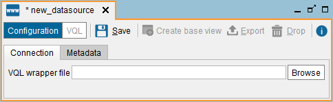

=================
Web Sources (WWW)
=================

Web data sources use wrappers created with the Denodo ITPilot Wrapper
Generator Tool.

.. note:: You can only use these sources if Denodo ITPilot is installed.

To create a new Web (WWW) data source, right-click on the Server Explorer
and click **New** > **Data source** > **WWW**.

In this dialog, you have to provide a path to a VQL file generated with
the ITPilot Wrapper Generator Tool.
We can also deploy Web
wrappers into Virtual DataPort straight from the Wrapper Generator Tool.

In the **Metadata** tab, you can set the folder where the data source
will be stored and provide a description.

When editing the data source, you can also change its owner by clicking
the button |image0|.

   Importing a WWW VQL

Click **Save** to execute the VQL statements of the VQL file, which
should create an ITPilot wrapper. Then, click **Create base view**. This
dialog shows the fields of the new view. In it, you can rename the base
view and its fields. In the **Metadata** tab, click **Browse** to select
the folder where the new base view will be stored.

Then, click the button **Save** to create the base view.

If the ITPilot wrapper has two input parameters that were marked as
“pass-through session credentials”, by default these fields will not be
added to the base view. Instead, at runtime, the Server will set the
value of these parameters to the user name and password of the user that
queries the view.

After creating the WWW data source, you can edit it and clear the
**Pass-through session credentials** check box. After this change, the
views created over this data sources will have these two fields in their
schema.

.. |image0| image:: ../../common_images/edit.png
