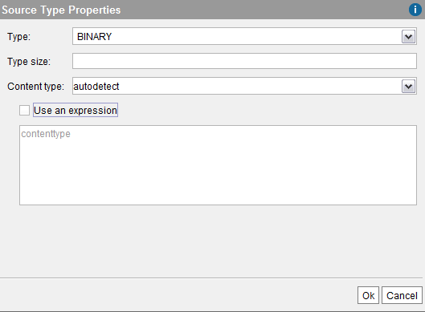

======================================
Working with Blob Fields of Base Views
======================================

When you create a base view with fields of type ``blob``, you can
specify the “content type” of these fields.

The RESTful Web service (see section :ref:`RESTful Web service`) will use
the content type set to these fields to display them appropriately.

The content type of a ``blob`` field can be either a constant (e.g.
``application/pdf``) or an expression (e.g. the value of another field
of the view, the result of a function, etc.).

When you create derived views over a base view with ``blob`` fields, the
content type information of the field is usually propagated to the
derived views. However, that is not always possible and, in this case,
the ``blobs`` are considered generic blobs without content type.

-  Flatten (see section :ref:`Creating Flatten Views`), Join (see section
   :ref:`Creating Join Views`) and Selection (see section :ref:`Creating Selection
   Views`) views propagate the content type if the content type is a
   constant or if the fields involved in the expression are projected as
   well.

-  Union (see section :ref:`Creating Union Views`) and Intersect views (see
   section :ref:`Creating Intersection Views`) propagate the content type only
   if:

   -  The content type is a constant and is the same in all the views that
      form the union or the intersection.
   -  Or, it is an expression but is equivalent in all the views that form
      the union or the intersection.

-  Minus views (see section :ref:`Creating Minus Views`) only propagate the
   content type of the first view.

-  Interface views (see section :ref:`Creating Interface Views`) always
   propagate the content type.

To set the content type of a ``blob`` field, click the button |image0|
beside the name of the type. Then, the Tool will open the “Field Content
Type” dialog.

To enter a constant, clear the **Use an expression** check box and enter
the value in the box in the top of the dialog.

To enter an expression, select the **Use an expression** check box and
enter the expression in the box below.

This expression can use any field of the view.

   Setting the content type of a blob field

The :ref:`JDBC driver <Retrieving the Content Type of Blob Values>` makes the content type of blob fields available to client applications.

.. |image0| image:: ../../common_images/edit.png
