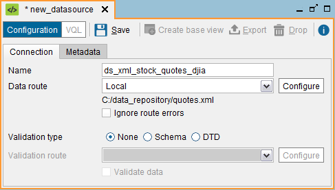
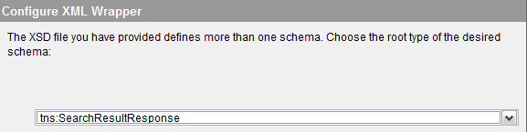
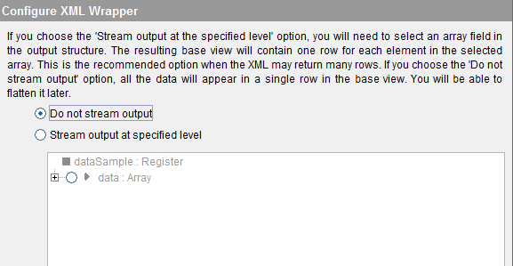

===========
XML Sources
===========

To create an XML data source to access an XML document, right-click on
the Server Explorer and click **New** > **Data source** > **XML**.

The Tool will display the dialog to create the data source.

   Creating an XML data source

The following data are requested in this dialog:

-  **Name**. Name of the new data source.
-  **Data Route**. Path to the XML file that contains the required data.
   This path can be parameterized by using *interpolation variables*
   (see section :ref:`Paths and Other Values with Interpolation Variables`).

-  **Ignore route errors**. If selected, the Server will ignore the errors occurred when accessing the file(s) to which the data source points.
   
   This option is not meant to be used when the data source reads a single file. Its main purpose is when the data source points to a collection of files and you know some of them may be missing. For example, you can create a JSON data source to read a set of log files with this local path: ``/opt/application/logs/log-^DateRange("yyyy/MM/dd",@start_date,@end_date,"yyyy-MM-dd").xml`` (see more about the function "DateRange" in the section :ref:`Paths Using Date Ranges`).

   When you query a base view created over this data source, the data source will read all the log files in order. For example, if in the query you put the condition ``start_date='2018/05/01' AND end_date = '2018/05/04'``, the data source will try to read the files "log_2018-05-01.xml", "log_2018-05-02.xml", "log_2018-05-03.xml" and "log_2018-05-04.xml". If one these files is missing, the query will fail.
   
   If you want to ignore this error, select the check box *Ignore route errors*. With this option if one of the files does not exist or cannot be read, the data source will skip it and read the next one. If you run the query from the administration tool, you can identify which files could not be read in the *Execution trace*. In the trace, click on the nodes with *Type = Route*. The ones that could not be read will have the attribute *Exception* followed by an error message.

-  **Validation type**. If selected, the structure of the input XML file
   will be obtained from a Schema or a DTD. If “None” is selected,
   Virtual DataPort will analyze the XML document to infer its schema.
-  **Validate route**. Path to the Schema (XSD) or DTD of the input XML
   document. If present, instead of obtaining the XML document from the
   “Data Route” to calculate the schema of the new base view, the Server
   will use the contents of the XSD or the DTD.
   
   The path to the Schema or DTD cannot contain interpolation variables. I.e. this path cannot be parameterized and therefore, you have to provide its path when creating the data source.
   
   If you select the option **Schema** and the schema has more than one root element, when you create a base view over this data source, 
   you will have to select the root type of the schema. That is, from which element the schema of the base view will be calculated from (see `Creating an XML data source with a Schema that has multiple root elements`_).
   
   
-  **Validate data**. If selected, Virtual DataPort will validate the
   input XML file every time the data source is accessed.

The path formats available are described in detail in the section :ref:`Path
Types in Virtual DataPort`.

In the **Metadata** tab, you can set the folder where the data source
will be stored and provide a description.

Click **Save** to create the data source.

When editing the data source, you can also change its owner by clicking
the button |image1|.

   Creating an XML data source with a Schema that has multiple root elements

After creating the data source, click **Create base view** to create a
base view over this data source. The Tool will display the “Configure
XML Wrapper” dialog where you have to select one of these options (see
`Creating an XML base view`_):

-  **Do not stream output**. With this option, the new base view
   represents the compound values with the compound types ``array`` and
   ``register``. Then, you can create a Flatten view (see section
   :ref:`Creating Flatten Views`) over this base view to transform the
   results in a way that is easy to combine with data from other
   sources.
-  **Stream output at the specified level**. With this option, the
   Server optimizes the processing of the XML document so it does not
   require the entire response to be realized in memory before
   processing it. Therefore, the memory consumption is much lower. When
   the base view is created with the first option (“Do not stream
   output”), the Server reads the entire XML document and then parses it
   thus having to store the entire message in memory.
 
   The drawback of using the “Stream output at the specified level”
   option over the other one is that with this option, the fields of the
   XML document “below” the selected level are ignored.
   
   The section :ref:`Dealing with Web Service Operations that Return Compound
   Values` explains this issue in detail.

   Creating an XML base view

After clicking **Ok**, the Tool will display the schema of the base view
associated with the source. At this stage, you can do the following:

-  Change the name of the view.
-  Change the name of each field by double-clicking it and its type, by
   using the drop-down list to the right.
-  Set the primary key of the new view (see the section :ref:`Primary Keys of
   Views`).
-  In the **Metadata** tab, you can set the folder where the base view
   will be stored and provide a description.
-  When editing the base view, you can also change its owner by clicking
   the button |image1|.

After this, click **Save** (|image4|) to create the base view.

In the Server Explorer, double-click the new base view to display its
schema (see section :ref:`Creating Derived Views`).

You can edit the schema of the view by clicking **Edit**.

.. |image1| image:: ../../common_images/edit.png
.. |image4| image:: ../../common_images/save.png

